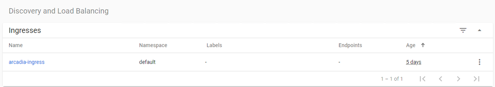

Step 11 - Deploy NGINX Plus Ingress Controller
###################################################################

If you have a Kubernetes cluster availible, it is logical to run all your containers in it, including App Protect. Kubernetes is desinged to orchestrate the creation, maintenance and availibility of our containers.

The previous excercises were designed to show what is possible and give examples of how to configure NAP. Using these principles, we can move our NAP configurations to Kubernetes.

In this step, instead of using a VM or docker container with NGINX App Protect to proxy to a NodePort on our cluster, we will deploy the NGINX Kubernetes Ingress Controller (KIC) which will proxy to a ClusterIP of the Acradia services.

Generally, we would deploy KIC behind a L4/L7 load balancer to spread the load to all of the KIC PODs, as depicted on the right side of this image. In this lab, we will target the NodePort of the KIC directly (without the LTM/L4 LB in red).

.. image:: ../pictures/arcadia-topology.png
   :align: center

To do so, we will:

#. Use helm to deploy the Ingress controller that has been saved to the registry running on our docker host
#. Deploy a new ingress configuration using a Custom Resource Definition (CRD) specifically created by NGINX to extend the basic capability of the standard Kubernetes "Ingress Definition." This "VirtualServer" will tell the KIC pods to create the configuration neccessary to accces and protect our applications.

.. note:: In this lab, we will not learn how to build the NGINX Ingress image. There are other labs that address that. You can follow the docs from docs.nginx.com to learn how to pull the docker image from the NGINX registry or build your own. 

**Steps**

    #.  SSH to the CICD VM
    #.  Run this command in order to pull and install NGINX KIC from NGINX Repo

        .. code-block:: BASH

            helm install nginx-ingress nginx-stable/nginx-ingress  \
            --namespace nginx-ingress  \
            --set controller.kind=deployment \
            --set controller.replicaCount=2 \
            --set controller.nginxplus=true \
            --set controller.appprotect.enable=true \
            --set controller.image.repository=registry.gitlab.com/mattdierick/nginxpluskic-nap \
            --set controller.image.tag=1.10.0 \
            --set controller.service.type=NodePort \
            --set controller.service.httpPort.nodePort=30274 \
            --set controller.service.httpsPort.nodePort=30275 \
            --set controller.serviceAccount.imagePullSecretName=gitlab-token-auth \
            --set controller.ingressClass=ingressclass1

        .. note:: This command uses HELM in order to download all the required config files from Nginx repo (CRD ...). What's more, you can notice, it downloads the Ingress image (the NGINX Plus image with NAP) from a private repo in Gitlab.com

    #.  After running the command, we need to wait for the KIC pod to become availible. you can use a command like 

        ..code-block:: BASH
            ``kubectl get pods --all-namespaces --watch``

    #.  Once it is "ready" you can press ``ctrl-c`` to stop the watch.
    #.  At this moment, the Ingress pod is up and running. But it is empty, there is no configuration (ingress, nap policy, logs).
    #.  Run this commands in order to create the NAP policy, the log profile and the ingress object (the object routing the traffic to the right service)

        .. code-block:: BASH

            kubectl apply -f /home/ubuntu/k8s_ingress/deploy_policy_and_logs.yaml
            kubectl apply -f /home/ubuntu/k8s_ingress/ingress_arcadia_nap.yaml

        .. note:: This 2 commands will create the WAF policy and the log profile for Arcadia App, and will create the Ingress resource (the config to route the traffic to the right services/pods)

    #.  Open ``Kubernetes Dashboard`` bookmark in Edge Browser 
    #.  Scroll down on the left to ``Discovery and Load Balancing`` and click on ``Ingresses`` 
    #.  Check the Ingress ``arcadia-ingress`` (in the ``default`` namespace) by clicking on the 3 dots on the right and ``edit``
    #.  Scroll down and check the specs

As you can notice, we added few lines in our Ingress declaration. To do so, I followed the guide (https://docs.nginx.com/nginx-ingress-controller/app-protect/installation/)

    #. I added NAP specifications (from the guide)

    #. I added NAP annotations for Arcadia app (see below)

.. code-block:: YAML

    ---
    apiVersion: extensions/v1beta1
    kind: Ingress
    metadata:
    name: arcadia-ingress
    annotations:
        appprotect.f5.com/app-protect-policy: "default/dataguard-blocking"
        appprotect.f5.com/app-protect-enable: "True"
        appprotect.f5.com/app-protect-security-log-enable: "True"
        appprotect.f5.com/app-protect-security-log: "default/logconf"
        appprotect.f5.com/app-protect-security-log-destination: "syslog:server=10.1.20.11:5144"

    spec:
    rules:
    - host: k8s.arcadia-finance.io
        http:
        paths:
        - path: /
            backend:
            serviceName: main
            servicePort: 80
        - path: /files
            backend:
            serviceName: backend
            servicePort: 80
        - path: /api
            backend:
            serviceName: app2
            servicePort: 80
        - path: /app3
            backend:
            serviceName: app3
            servicePort: 80

Please a make a new test by clicking on ``Arcadia k8s`` Edge Browser bookmark.

    #. Open ``Edge Browser``
    #. Click on ``Arcadia k8s`` bookmark
    #. Now, you are connecting to Arcadia App from a new KIC with NAP enabled
    #. Send an attack (like a XSS in the address bar) by appending ``?a=<script>``
    #. Attack is blocked
    #. Open ``Kibana`` bookmark and click on ``Discover`` to find the log

.. image:: ../pictures/lab1/kibana_WAF_log.png
   :align: center

.. note:: if you want to delete/uninstall this Ingress Controller, you have to run this command ``helm uninstall nginx-ingress -n nginx-ingress`` This command will delete the Ingress Controller only. You have to delete the YAML deployments as well

        .. code-block:: BASH

            helm uninstall nginx-ingress -n nginx-ingress
            kubectl delete -f /home/ubuntu/k8s_ingress/deploy_policy_and_logs.yaml
            kubectl delete -f /home/ubuntu/k8s_ingress/ingress_arcadia_nap.yaml
