Protect Arcadia API with NGINX App Protect
==========================================

The Arcadia micro-services offer several REST APIs in order to:

- Buy stocks
- Sell stocks
- Transfer money to friends

In this lab, we'll deploy an NGINX App Protect WAF policy to protect the API.

Lab Tasks
---------

1. Click the **Applications** drop-down in the top menu bar and select **Postman**.

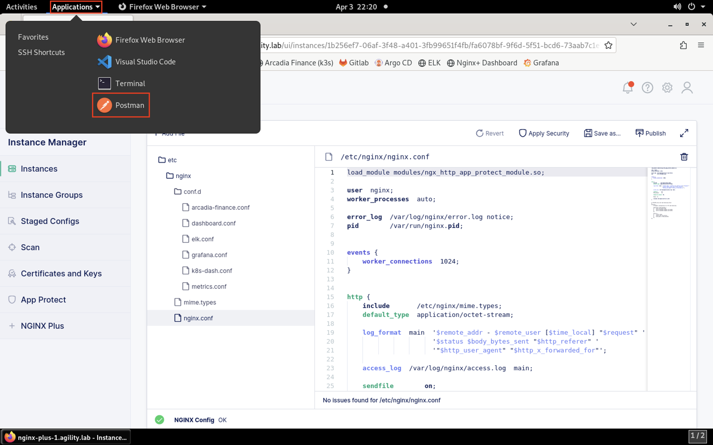

.. caution:: It may take a moment for Postman to launch the first time.

2. In the **Collections** tab, select the **Arcadia API** and then the **GET Transactions** item. Click **Send** and notice the response data that the API returns in the **Body** section of the window.

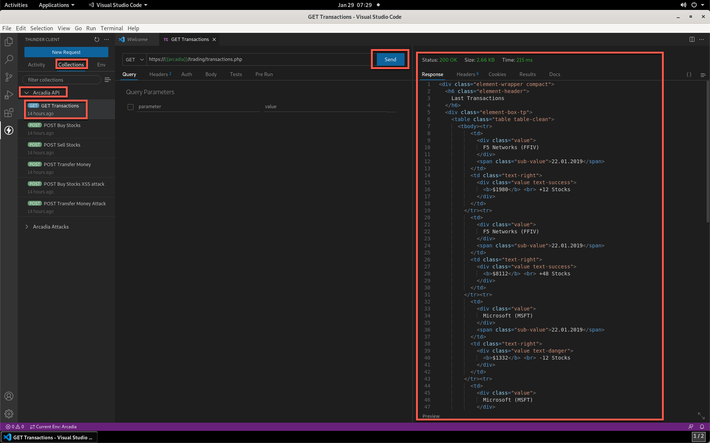

3. Click the **POST Buy Stocks** item, then click **Send**. Again, notice the API is functioning properly. 

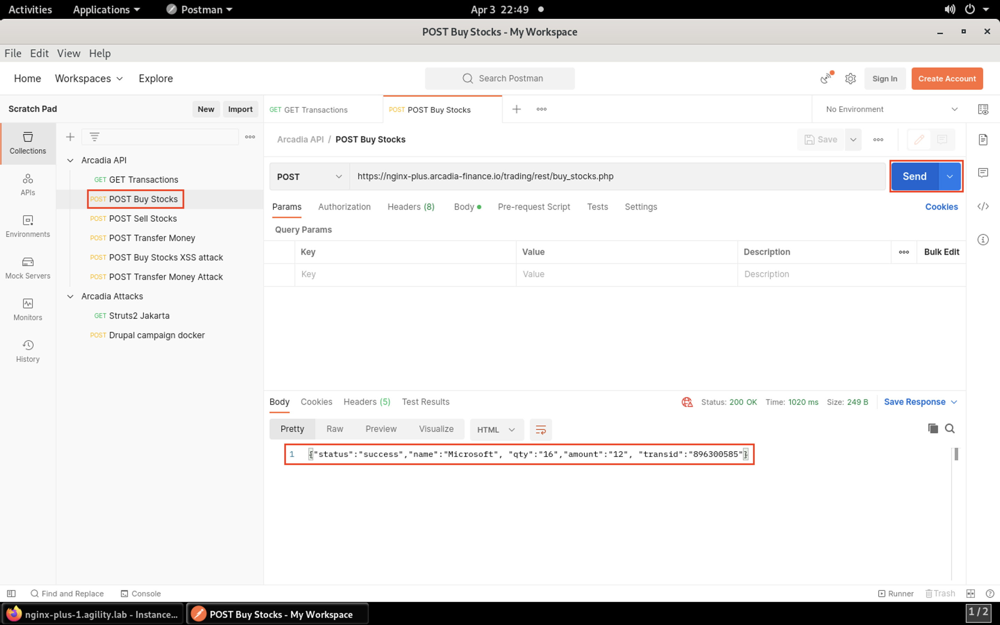

4. Click the drop-down where **POST** is selected, and change to **OPTIONS**. Click **Send**. Notice that the API responded to this request.

5. Return to **Firefox**. Click the **NMS** bookmark and log in using **lab** as the username and **AppWorld2024!** as the password. 

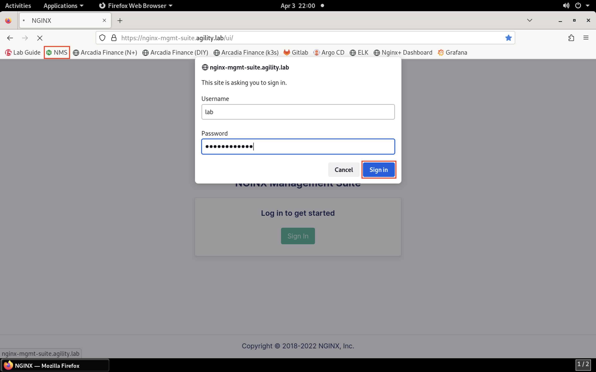

6. Click on the **Instance Manager** tile.

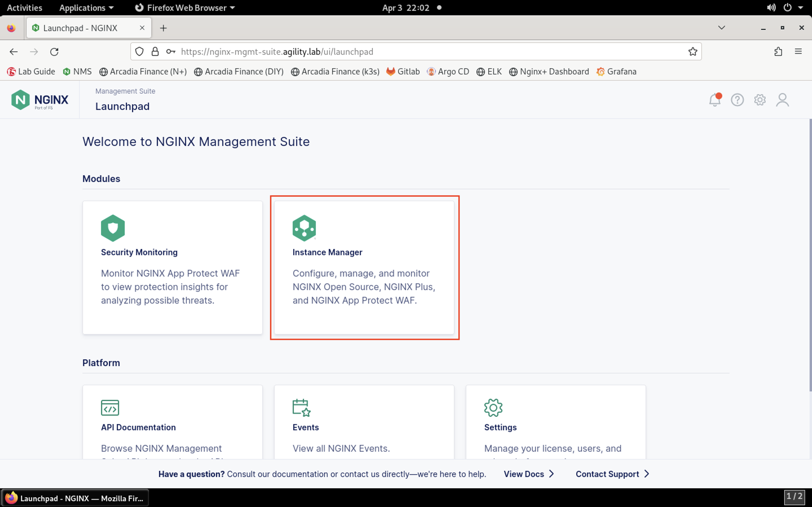

7. Click **App Protect** in the left menu.

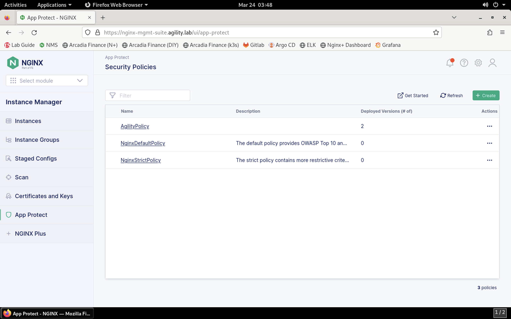

8. Select the **NginxApiSecurityPolicy** from the policy list.

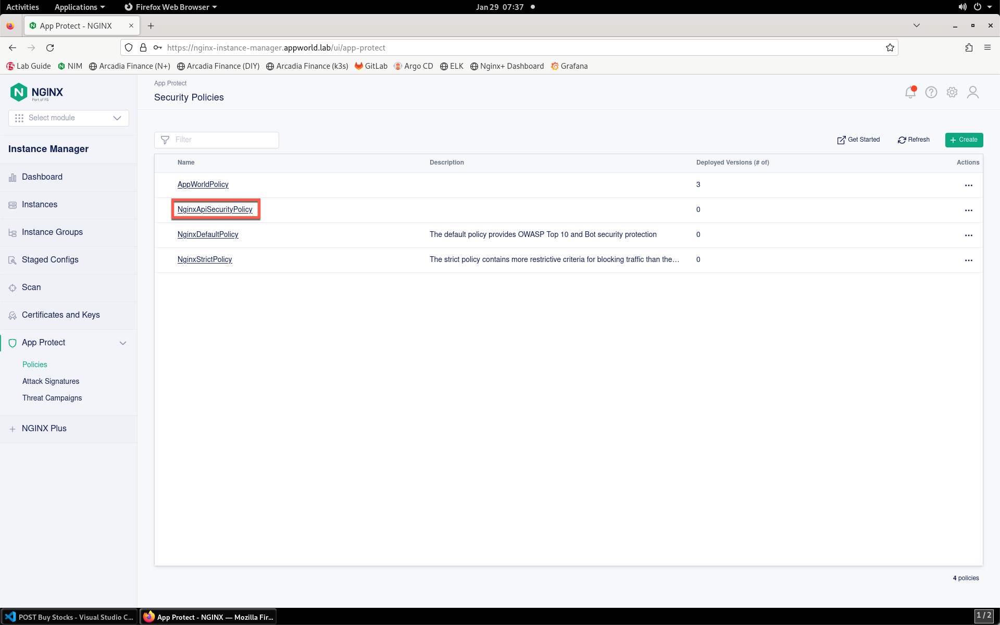

9. Click on the **Policy Versions** tab.

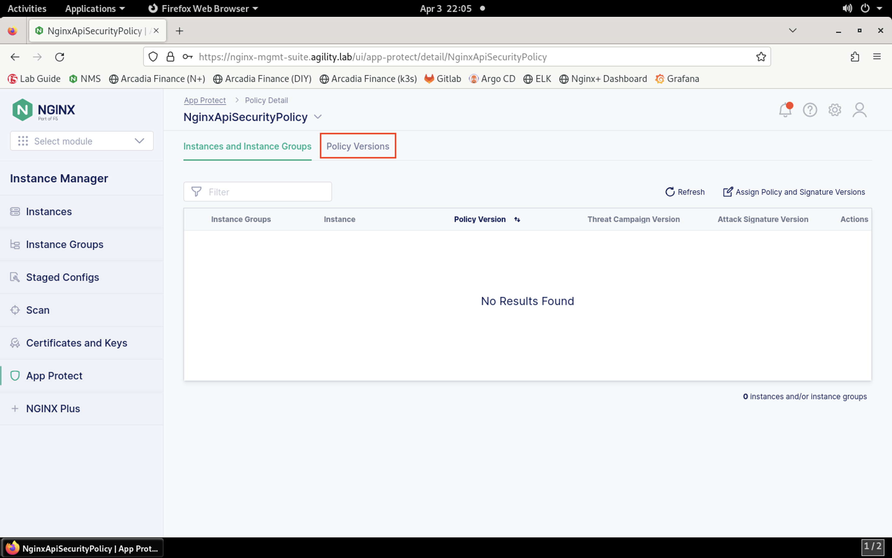

10. Click on the version in the list. 

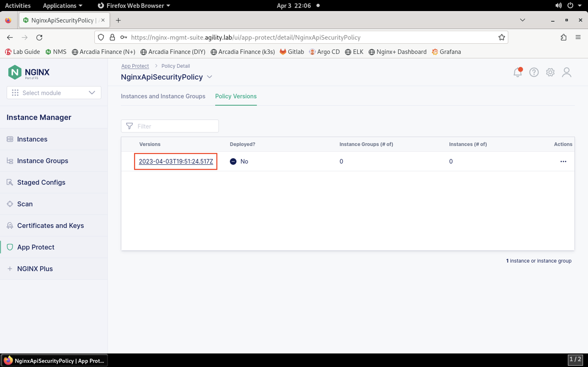

11. Review the configuration. Notice that this policy:

- Blocks the DELETE, OPTIONS and PUT HTTP operations, since the API does not utilize them
- includes a custom response via JSON to provide the support ID for easier troubleshooting
- Specifies actions to take on API-related violations
- Places a cap on XML payload lengths

.. note:: The full schema for the WAF policy can be found at [docs.nginx.com](https://docs.nginx.com/nginx-app-protect-waf/declarative-policy/policy/).

.. code-block:: text

  {
      "policy": {
          "name": "app_protect_api_security_policy",
          "description": "NGINX App Protect API Security Policy. The policy is intended to be used with an OpenAPI file",
          "template": {
              "name": "POLICY_TEMPLATE_NGINX_BASE"
          },
          "methods": [
              {
                  "name": "DELETE",
                  "$action": "delete"
              },
              {
                  "name": "OPTIONS",
                  "$action": "delete"
              },
              {
                  "name": "PUT",
                  "$action": "delete"
              }
          ],
          "response-pages": [
              {
                  "responseContent": "{\"status\":\"error\",\"reason\":\"policy_violation\",\"support_id\":\"<%TS.request.ID()%>\"}",
                  "responseHeader": "content-type: application/json",
                  "responseActionType": "custom",
                  "responsePageType": "default"
              }
          ],
          "blocking-settings": {
              "violations": [
                  {
                      "block": true,
                      "description": "Mandatory request body is missing",
                      "name": "VIOL_MANDATORY_REQUEST_BODY"
                  },
                  {
                      "block": true,
                      "description": "Illegal parameter location",
                      "name": "VIOL_PARAMETER_LOCATION"
                  },
                  {
                      "block": true,
                      "description": "Mandatory parameter is missing",
                      "name": "VIOL_MANDATORY_PARAMETER"
                  },
                  {
                      "block": true,
                      "description": "JSON data does not comply with JSON schema",
                      "name": "VIOL_JSON_SCHEMA"
                  },
                  {
                      "block": true,
                      "description": "Illegal parameter array value",
                      "name": "VIOL_PARAMETER_ARRAY_VALUE"
                  },
                  {
                      "block": true,
                      "description": "Illegal Base64 value",
                      "name": "VIOL_PARAMETER_VALUE_BASE64"
                  },
                  {
                      "block": true,
                      "description": "Illegal request content type",
                      "name": "VIOL_URL_CONTENT_TYPE"
                  },
                  {
                      "block": true,
                      "description": "Illegal static parameter value",
                      "name": "VIOL_PARAMETER_STATIC_VALUE"
                  },
                  {
                      "block": true,
                      "description": "Illegal parameter value length",
                      "name": "VIOL_PARAMETER_VALUE_LENGTH"
                  },
                  {
                      "block": true,
                      "description": "Illegal parameter data type",
                      "name": "VIOL_PARAMETER_DATA_TYPE"
                  },
                  {
                      "block": true,
                      "description": "Illegal parameter numeric value",
                      "name": "VIOL_PARAMETER_NUMERIC_VALUE"
                  },
                  {
                      "block": true,
                      "description": "Parameter value does not comply with regular expression",
                      "name": "VIOL_PARAMETER_VALUE_REGEXP"
                  },
                  {
                      "block": true,
                      "description": "Illegal URL",
                      "name": "VIOL_URL"
                  },
                  {
                      "block": true,
                      "description": "Illegal parameter",
                      "name": "VIOL_PARAMETER"
                  },
                  {
                      "block": true,
                      "description": "Illegal empty parameter value",
                      "name": "VIOL_PARAMETER_EMPTY_VALUE"
                  },
                  {
                      "block": true,
                      "description": "Illegal repeated parameter name",
                      "name": "VIOL_PARAMETER_REPEATED"
                  },
                  {
                      "block": true,
                      "description": "Illegal method",
                      "name": "VIOL_METHOD"
                  },
                  {
                      "block": true,
                      "description": "Illegal gRPC method",
                      "name": "VIOL_GRPC_METHOD"
                  }
              ]
          },
          "xml-profiles": [
              {
                  "name": "Default",
                  "defenseAttributes": {
                      "maximumNameLength": 1024
                  }
              }
          ]
      }
  }

12. You can apply this policy to the Arcadia Finance app, which includes an API. Click on **Instances** in the menu bar.

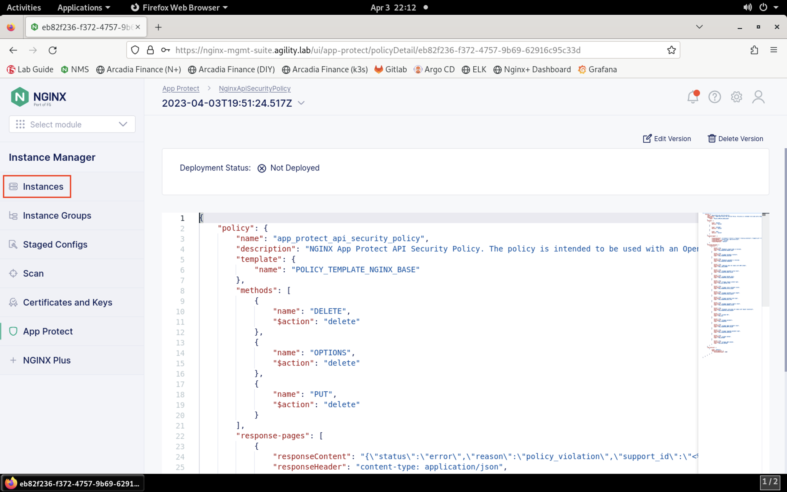

13. Select **nginx-plus-1** from the instance list.

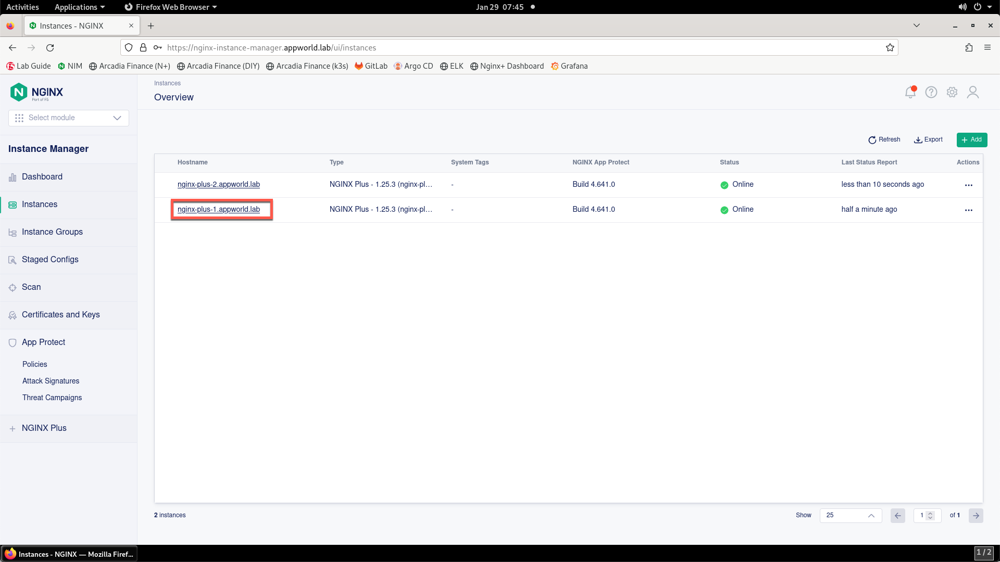

14. Click on **Edit Config** to enter the configuration mode.

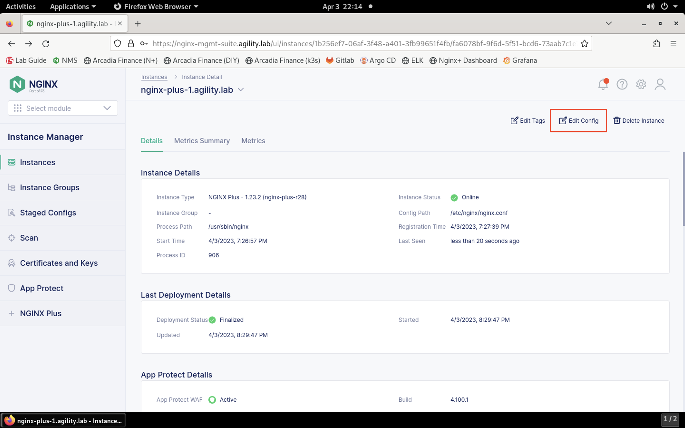

15. Click the **arcadia-finance.conf** file in the left navigation pane.

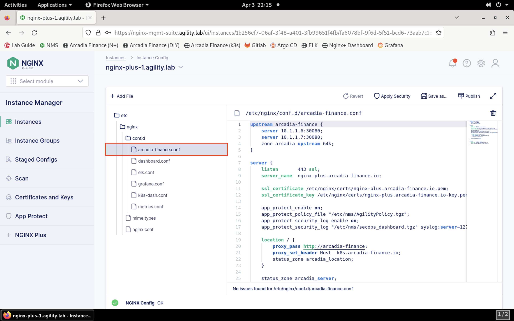

16. Modify the **arcadia-finance.conf** configuration file by adding the below code to the *ssl server block* listening on port 443 directly below the line ``status_zone arcadia_server;``.

.. code-block:: text

      location /trading/rest {
          proxy_pass http://arcadia-finance$request_uri;
          proxy_set_header Host  k8s.arcadia-finance.io;
          status_zone arcadia-api;
          app_protect_enable on;
          app_protect_policy_file "/etc/nms/NginxApiSecurityPolicy.tgz";
      }

      location /api/rest {
          proxy_pass http://arcadia-finance$request_uri;
          proxy_set_header Host  k8s.arcadia-finance.io;
          status_zone arcadia-api;
          app_protect_enable on;
          app_protect_policy_file "/etc/nms/NginxApiSecurityPolicy.tgz";
      }

Your screen should look like the screenshot below:

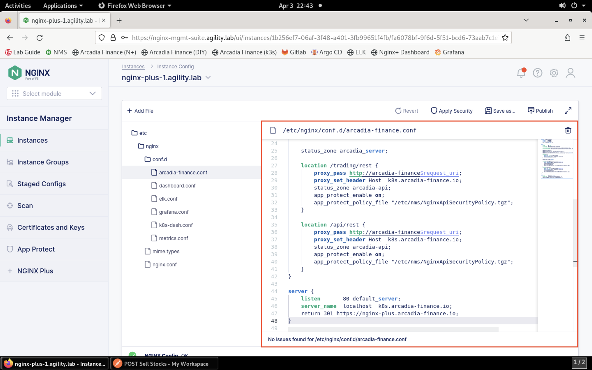

17. Click **Publish** to deploy the changes. Click **Publish** again when prompted. You'll see a notification that the changes were published. 

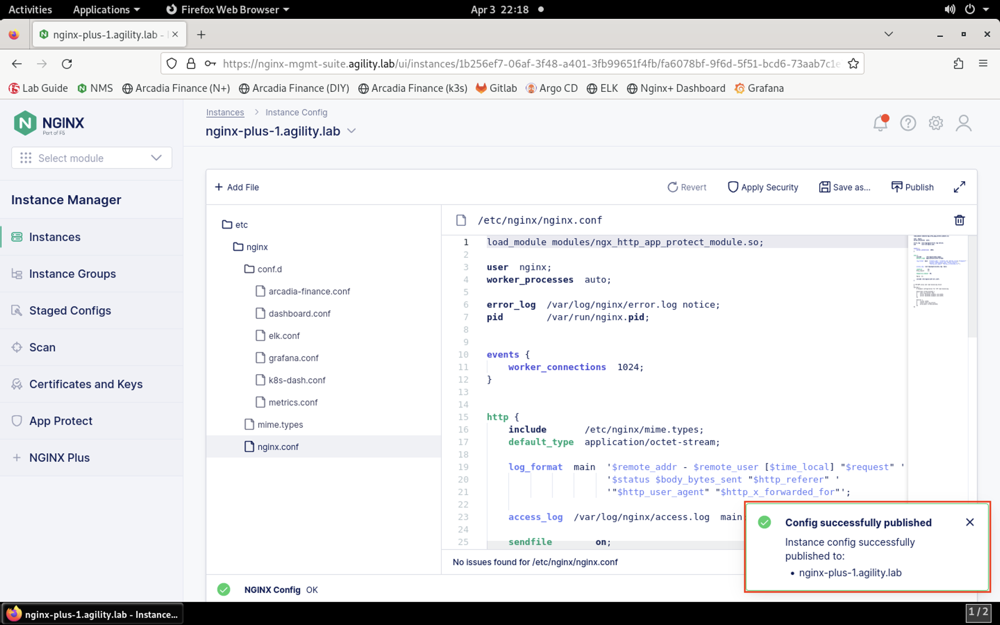

Test the App Protect Policy
---------------------------

18. Return to the  **Postman** app. Click the **GET Transactions** item in the **Arcadia API** collection.

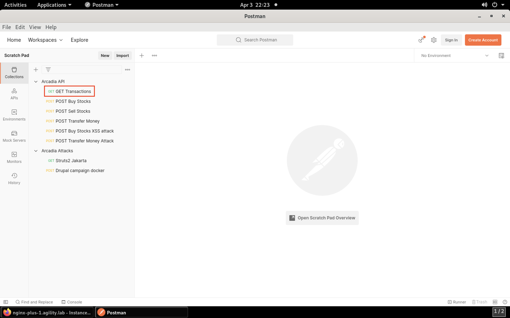

19. Click **Send**.

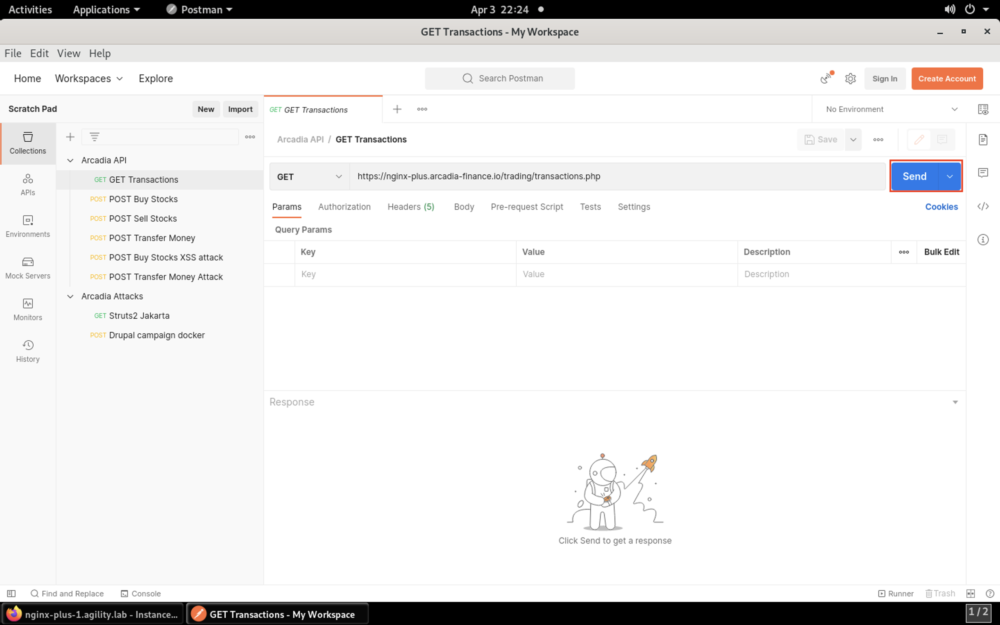

20. Notice from the response that the API is functioning properly. 

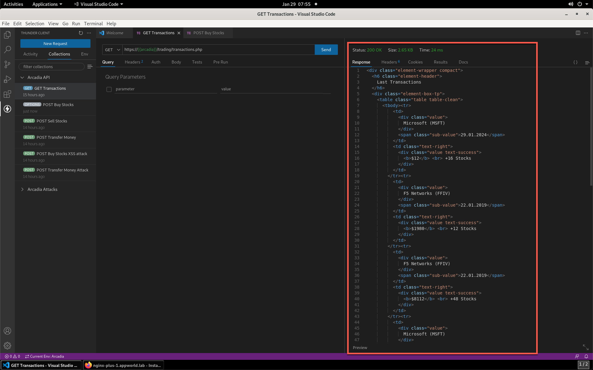

21. Now select the **POST Buy Stocks XSS Attack**, then select **Send**. The NAP WAF policy will block this attack, as the response shows. 

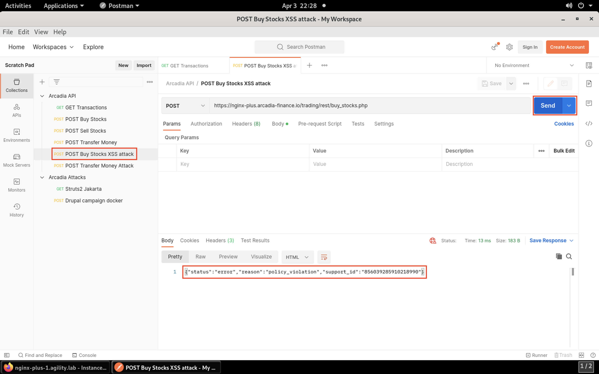

22. Run the **POST Buy Stocks** item again with the **OPTIONS** action selected. Notice that this request is now blocked as the policy does not permit OPTIONS operations.

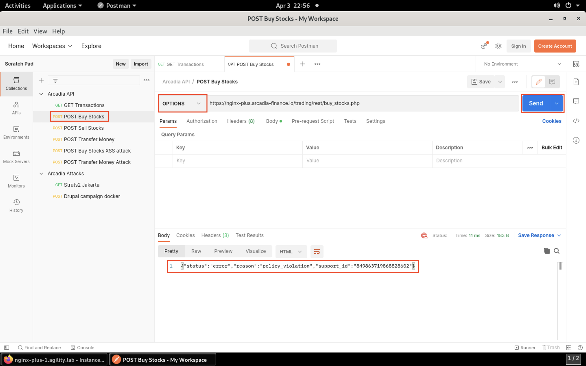

23. Now, from the **Arcadia Attacks Collections** select the **Struts2 Jakarta** item and then click **Send**. This attack is blocked, but not by the API WAF policy. Why? Because the URI is not a part of the location where you've added the policy, so this portion of the app is protected by the original NAP WAF policy.

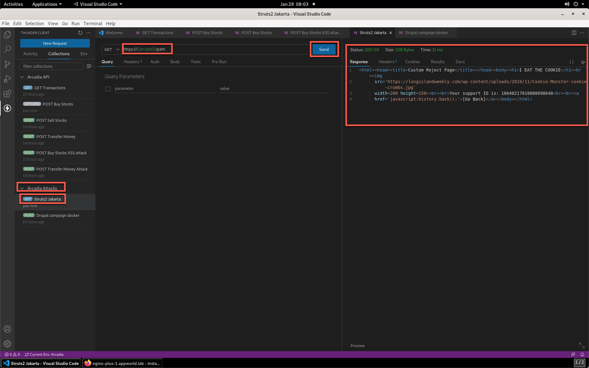

You've now completed the API WAF portion of the lab.