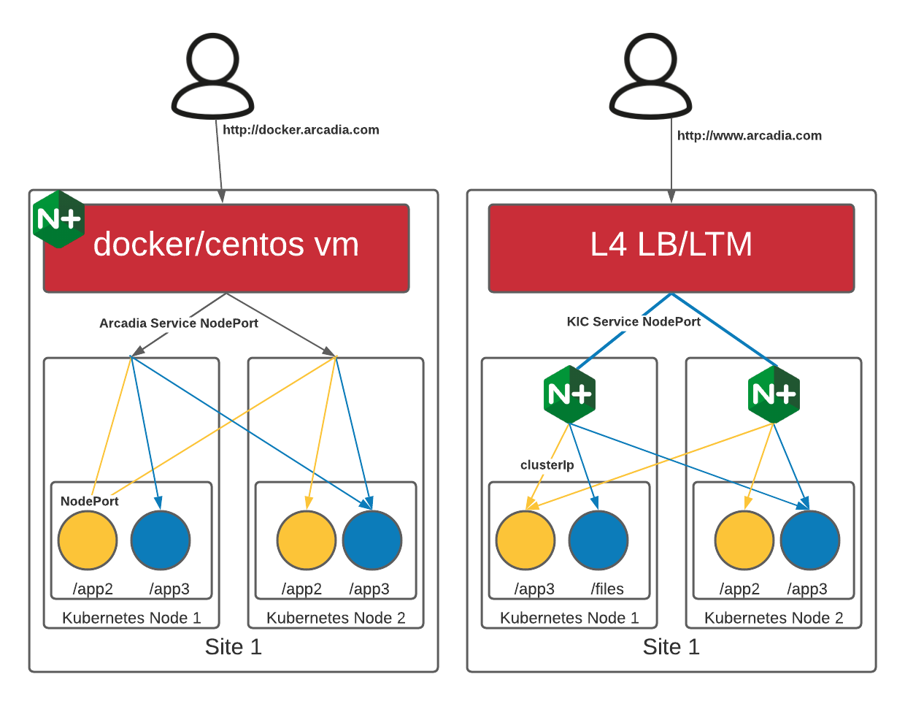

Step 11 - Deploy NGINX Plus Ingress Controller
##############################################

The previous excercises were designed to show what is possible and give examples of how to configure NAP. Using these principles, we can move our NAP configurations to Kubernetes.

In this step, instead of using a VM or docker container with NGINX App Protect to proxy to a NodePort on our cluster, we will deploy the NGINX Kubernetes Ingress Controller (KIC) which will proxy to a ClusterIP of the Acradia services. A ClusterIP is only accessible internally to the cluster. By using the ClusterIP, we force all requests to go through the KIC.

Generally, we would deploy KIC behind a L4/L7 load balancer to spread the load to all of the KIC PODs, as depicted on the right side of this image. In this lab, we will target the KIC Service NodePort directly with our browser (without the LTM/L4 LB in red).

At a high-level we will:

#. Use helm to deploy the Ingress controller that has been saved to the registry running on our docker host
#. Deploy a new "ingress configuration" using a Custom Resource Definition (CRD) specifically created by NGINX to extend the basic capability of the standard Kubernetes "Ingress" resource. This "VirtualServer" will tell the KIC pods to create the configuration neccessary to accces and protect our applications.

.. note:: In this lab, we will not learn how to build the NGINX Ingress image. There are other labs that address that. You can follow the docs from docs.nginx.com to learn how to pull the docker image from the NGINX registry or build your own. 

**Steps**

    #.  SSH to the CICD VM
    #.  This is the contents of the ``/home/ubuntu/lab-files/helm/values-plus.yaml`` file:

        .. code-block:: helm

            controller:
                nginxplus: true
                image:
                repository: docker.udf.nginx.rocks/debian-image-nap-plus
                tag: "1.12.0"
                setAsDefaultIngress: true
                ingressClass: nginx
                enableCustomResources: true
                enablePreviewPolicies: true
                healthStatus: true
                ## Support for App Protect
                appprotect:
                ## Enable the App Protect module in the Ingress Controller.
                enable: true
                nginxStatus:
                ## Enable the NGINX stub_status, or the NGINX Plus API.
                enable: true
                port: 8080
                ## Add IPv4 IP/CIDR blocks to the allow list for NGINX stub_status or the NGINX Plus API. Separate multiple IP/CIDR by commas.
                allowCidrs: "0.0.0.0/0"
                ## A list of custom ports to expose on the NGINX ingress controller pod. Follows the conventional Kubernetes yaml syntax for container ports.
                service:
            
                ## Creates a service to expose the Ingress controller pods.
                create: true
            
                ## The type of service to create for the Ingress controller.
                type: NodePort
            
                ## The externalTrafficPolicy of the service. The value Local preserves the client source IP.
                externalTrafficPolicy: Cluster
            
                ## The annotations of the Ingress controller service.
                annotations: {}
            
                ## The extra labels of the service.
                extraLabels: {}
            
                ## The static IP address for the load balancer. Requires controller.service.type set to LoadBalancer. The cloud provider must support this feature.
                loadBalancerIP: ""
            
                ## The list of external IPs for the Ingress controller service.
                externalIPs: []
            
                ## The IP ranges (CIDR) that are allowed to access the load balancer. Requires controller.service.type set to LoadBalancer. The cloud provider must support this feature.
                loadBalancerSourceRanges: []
            
                ## The name of the service
                ## Autogenerated if not set or set to "".
                # name: nginx-ingress
            
                httpPort:
                    ## Enables the HTTP port for the Ingress controller service.
                    enable: true
            
                    ## The HTTP port of the Ingress controller service.
                    port: 80
            
                    ## The custom NodePort for the HTTP port. Requires controller.service.type set to NodePort.
                    nodePort: "30274"
            
                    ## The HTTP port on the POD where the Ingress controller service is running.
                    targetPort: 80
            
                httpsPort:
                    ## Enables the HTTPS port for the Ingress controller service.
                    enable: true
            
                    ## The HTTPS port of the Ingress controller service.
                    port: 443
            
                    ## The custom NodePort for the HTTPS port. Requires controller.service.type set to NodePort.
                    nodePort: "30275"
            
                    ## The HTTPS port on the POD where the Ingress controller service is running.
                    targetPort: 443
            
                ## A list of custom ports to expose through the Ingress controller service. Follows the conventional Kubernetes yaml syntax for service ports.
            
                customPorts:
                - name: dashboard
                    targetPort: 8080
                    protocol: TCP
                    port: 8080
                    nodePort: 30080
                - name: prometheus
                    targetPort: 9113
                    protocol: TCP
                    port: 9113
                    nodePort: 30113
            prometheus:
                create: true
                scheme: http
                port: 9113

        .. note:: Helm is a utility that allows application developers to package thier application and settings in a collection. We then use a values.yaml file to set values specific to our deployment. 

    #.  Run the following commands to install the NGINX Plus KIC helm chart:

        .. code-block:: bash
          :caption: helm install

            helm repo add nginx-stable https://helm.nginx.com/stable
            helm repo update
            helm install plus nginx-stable/nginx-ingress -f /home/ubuntu/lab-files/helm/values-plus.yaml --namespace nginx-plus --create-namespace
        
    #.  After running the command, we need to wait for the KIC pod to become availible. you can use a command like:

        .. code-block:: BASH

           kubectl get pods --all-namespaces --watch

    #.  Once it we have 1/1 ``plus-nginx-ingress`` ready. You can press ``ctrl-c`` to stop the watch.

        .. image:: ../pictures/ingress-ready.png

        .. note:: Tab completion is enabled for all commands. In the command below, press tab at the end to complete the name of the pod.

    #. View the logs, you will notice that they are similar to previous lab excercises with additional logs regarding the Kubernetes environment.
        
        .. code-block:: BASH

           kubectl logs --follow -n nginx-plus plus-nginx-ingress-
