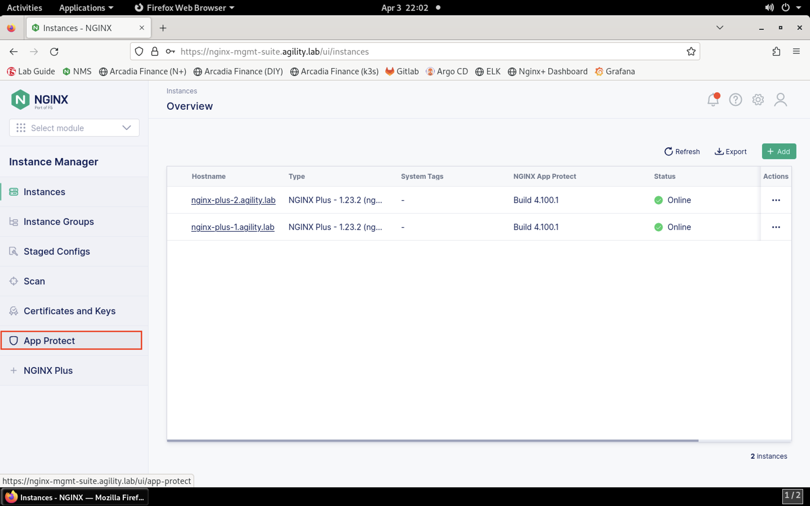

Protect Arcadia API with NGINX App Protect
==========================================

The Arcadia micro-services offer several REST APIs in order to:

- Buy stocks
- Sell stocks
- Transfer money to friends

NGINX App Protect can secure APIs by importing an OpenAPI spec file. This type of file describes how an API works, lists the endpoints, accepted oeprations, etc. Think of it as a blueprint for an API. Because we have an **OpenAPI specification file**, we can create a very specific, secure App Protect policy. 

App Protect allows you to reference the file on an external http server or locally on the file system of the NGINX instance. Since the **Arcadia Application OAS3** is available publicly at https://app.swaggerhub.com/apis/nginx5/api-arcadia_finance/2.0.2-oas3, we'll simply configure NGINX App Protect to pull the definition from the public source.

.. image:: images/swaggerhub.png
    :align: center

.. note :: Notice that the URI, method, and response type are all defined for each API. This also serves as a tool for developers to understand what the response should look like for a successful call.

Lab Tasks
---------

1. Log into the jump host via RDP and open Firefox. Click the **NMS** bookmark and log in using **lab** as the username and **Agility2023!** as the password. Click on the **Instance Manager** tile.

.. image:: images/nms_dashboard.png

2. Navigate to **Instance Manager** > **App Protect**.

3. Click the **Create** button.

.. image:: images/create_button.png

4. Name the policy **NginxApiSecurityPolicy**. 

.. caution:: This policy will be referred to by name and is case-sensitive. Ensure the policy name is exactly as shown below.

5. Paste the text below into the policy editor:

.. code-block:: js

    {
        "policy": {
            "name": "arcadia_finance_api_security_policy",
            "template": {
                "name": "POLICY_TEMPLATE_NGINX_BASE"
            },
            "applicationLanguage": "utf-8",
            "enforcementMode": "blocking",
            "open-api-files": [
                {
                    "link": "https://gitlab.com/cwise24/arcadiaspec/-/raw/main/arcadiaFinance2.02.yaml"
                }
            ]
        }
    }

Your screen should look similar to the screenshot below:

.. image:: images/json_policy_creation.png

1. Click **Save**.

**Result**

.. image:: images/saved_policy.png

7. Navigate to **Instances**. Click on the **nginx-plus-2** instance.

8. Click on **Edit Config**. 

.. image:: images/edit_config_button.png

9. Modify the NGINX configuration file **arcadia-finance.conf** to add the WAF policy to the API endpoints. Add this to the server block below the default location:

.. code-block:: text

    location /trading/rest {
        proxy_pass http://arcadia-finance$request_uri;
        status_zone arcadia-api;
        app_protect_enable on;
        app_protect_policy_file "/etc/nms/NginxApiSecurityPolicy.tgz";
    }

    location /api/rest {
        proxy_pass http://arcadia-finance$request_uri;
        status_zone arcadia-api;
        app_protect_enable on;
        app_protect_policy_file "/etc/nms/NginxApiSecurityPolicy.tgz";
    }

Your screen should look like the screenshot below:

.. image:: images/post_edit_config.png

10. Click **Publish** to deploy the changes. Click **Publish** again when prompted.

Test the App Protect Policy
---------------------------

11. Connect to the Jump Host. Navigate to **Applications** > **Favorites** > **Terminal**. Maximize the window.

.. image:: images/terminal.png

12. Pull a list of trading transactions by issuing a curl command from the terminal window:

.. code-block:: bash

  curl -sk http://k8s.arcadia-finance.io:30443/trading/transactions.php

**Result**

.. image:: images/trading_transactions.png

13. Now, attempt an illegal GET operation against the buy_stocks API endpoint. Notice that the request is blocked.

.. code-block:: bash

  curl -sk https://k8s.arcadia-finance.io:30443/trading/rest/buy_stocks.php

Notice that the request is blocked. This shows that the NGINX App Protect WAF policy is protecting the API.
