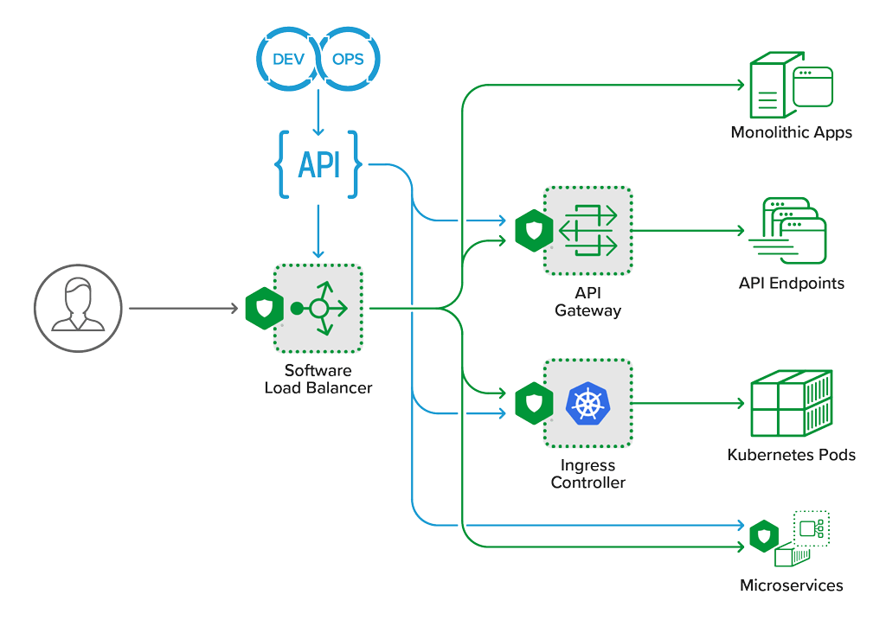

Module 4 - API Security
=======================

In this section,you will configure NGINX App Protect WAF to protect the Arcadia Finance app's API.

Estimated completion time: 23 minutes

NGINX App Protect can protect APIs in several ways:

 - Blocking malicious traffic: NGINX App Protect WAF uses a variety of techniques, such as signature-based detection, behavioral analysis, and machine learning, to identify and block malicious traffic before it reaches the API server.
 - Authentication and authorization: NGINX App Protect WAF can authenticate and authorize API requests based on various criteria, such as user credentials, IP address, or geographic location. It can also enforce rate limiting and access control policies to prevent API abuse.
 - Protocol validation: NGINX App Protect WAF can validate the format and content of API requests and responses to ensure they comply with the expected protocol standards. This can prevent attacks that exploit protocol weaknesses or vulnerabilities.
 - Encryption and decryption: NGINX App Protect WAF can encrypt and decrypt API traffic using industry-standard protocols, such as TLS/SSL, to prevent eavesdropping and tampering.

.. toctree::
   :caption: Content:
   :maxdepth: 1
   :glob:

   lab*/lab*
   recap
