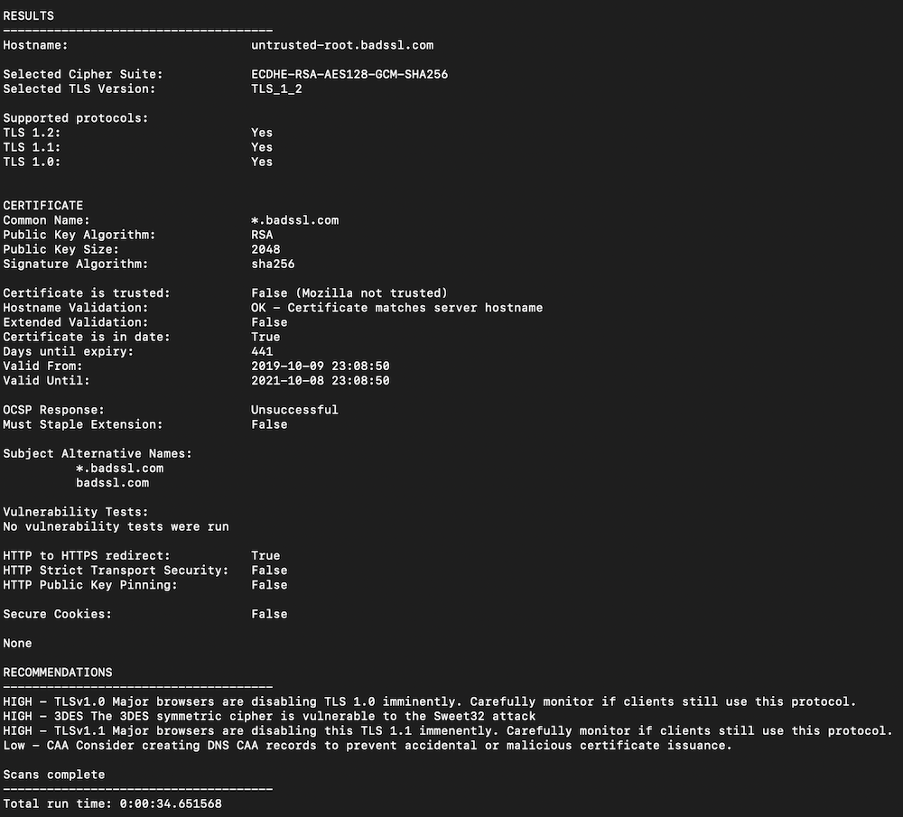

Step 14 - Cryptonice
####################

What is cryptonice ?
********************

Cryptonice is a command-line tool and Python library that allows a user to ``examine`` for one or more supplied domain names:

    #. the TLS configuration
    #. certificate information
    #. web application headers
    #. DNS records 
    
Cryptonice is built heavily upon the excellent SSLyze and Cryptography Python libraries.

You can find more information on how to use Cryptonice here : https://cryptonice.readthedocs.io/en/latest/

.. note :: The goal here, with NAP, is to examine all websites published by our CI/CD pipeline.

Steps for the lab
*****************

.. warning :: As we have only one website published, **Arcadia Finance** website, we will run tests with real public websites.

To do so, Cryptonice will run as a Docker container, and we will run a command inside this container. The command is 

.. code-block:: console

    docker exec -dit cryptonice-gitlab sh -c "cd /home && cryptonice {{ fqdn }}"

The variable ``fqdn`` will be replaced by the FQDN you will set in the pipeline. For the demo, you will set manually this variable, but in a real world, this variable is set by the pipeline itself.

**Steps**

#. RDP to Windows Jumphost with credentials ``user:user``
#. In ``Edge Browser``, open ``Gitlab`` tab or bookmark, and click on ``NGINX App Protect`` > ``Cryptonice`` repository
#. If you want, you can check the Gitlab CI pipeline and the Ansible playbook. To make it simple, Gitlab CI pipeline runs the ansible playbook

   .. code-block:: yaml

        ---
        - name: copy content to ELK
          hosts: elk

          tasks:
          - name: delete all JSON in ELK
            shell: rm -f /home/gitlab-runner/crypto/*

        - name: run Cryptonice
          hosts: localhost

          tasks:
          - name: Delete existing tests
            shell: rm -f /var/lib/gitlab-runner/crypto/*

          - name: Run cryptonice
            command: docker exec -dit cryptonice-gitlab sh -c "cd /home && cryptonice {{ fqdn }}"

          - name: WAIT
            wait_for:
            path: /var/lib/gitlab-runner/crypto/{{ fqdn }}.json

          - name: rename file
            shell: mv /var/lib/gitlab-runner/crypto/{{ fqdn }}.json /var/lib/gitlab-runner/crypto/{{ fqdn }}.bck

          - name: add EOL
            shell: awk '{printf "%s\r\n\r\n", $0}' /var/lib/gitlab-runner/crypto/{{ fqdn }}.bck > /var/lib/gitlab-runner/crypto/{{ fqdn }}.json

        - name: copy content to ELK
          hosts: elk

          tasks:
          - name: copy JSON to ELK
            copy:
            src: /var/lib/gitlab-runner/crypto/{{ fqdn }}.json
            dest: /home/gitlab-runner/crypto/{{ fqdn }}.json

   .. note :: As you can notice, running the command is not enough, we had to cleanup the environment and do some tricks so that ELK can read the outcomes. YES, all the outcomes will be readable in an ELK dashboard.

#. In the left menu, click on ``CI / CD`` and ``Pipelines``
#. Click ``Run Pipeline``

   .. image:: ../pictures/lab2/pipelines.png
      :align: center

#. Define the variable ``CI_FQDN`` with any FQDN you want to test. Some websites like www.f5.com, or Facebook will raise some recommandations.

   .. image:: ../pictures/lab2/run_pipeline.png
      :align: center

#. Click ``Run Pipeline`` and Wait :)

|

The outcomes
************

Now, it is time to see the results and what we can do with the information provided by ``Cryptonice``

#. You should still be connected to the Jumphost RDP
#. In ``Edge Browser``, open ``Kibana`` or use the Remote Access ``ELK`` in UDF if you prefer to connect from your laptop.
#. In ``ELK`` left menu, click on ``Discover``

   .. image:: ../pictures/lab2/discover.png
      :align: center

#. Then select ``Demo-crypto*``

   .. image:: ../pictures/lab2/discover_index.png
      :align: center

#. You should now see some logs. If not, change the time range on the top right corner. You can open a log and look at the content.
#. Now, go to the ``Dashbboards`` and click on ``Cryptonice`` dashboard

   .. image:: ../pictures/lab2/dashboards.png
      :align: center

#. Change the time range to ``Last 1 year`` so that you can see all tests done so far (I did some for you)
#. You can see now an example of a ``Cryptonice`` dashboard. Feel free to create your own.

   .. image:: ../pictures/lab2/outcomes.png
      :align: center

.. note :: In this Dashboard, you can see several information collected by ``Cryptonice``. If the report contents **High Recommandations**, the website appears at the bottom and the widget is updated accordingly.

.. note :: Goal is to provide an easy and automated way for SecOps and DevOps to see their level of Security for TLS/HTTP/DNS Layers.