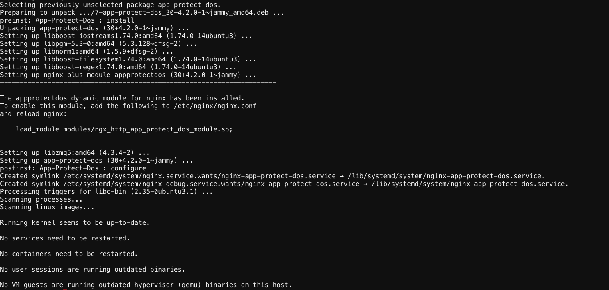
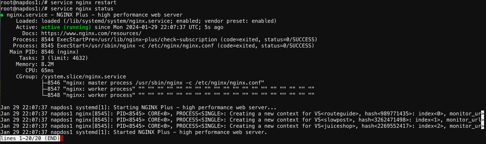

Module 7 - Install and Enable NGINX App Protect DoS
###################################################

In this module you will install and enable NGINX App Protect DoS on NAP DOS 1 and NAP DOS 2

NGINX App Protect DoS directives:

1. **load_module**  - This command will load the dynamic module into NGINX Plus.  Located in the main context 

2. **app_protect_dos_enable** - Enable/Disable App Protect DoS module. It can be located in the location, server or http contexts.

3. **app_protect_dos_monitor** - This directive is how App Protect monitors stress level of the protected resources. There are 3 arguments for this directive:

   - URI - a mandatory argument, this is the destination to the protected resources
   - Protocol - an optional argument, this is the protocol of the protected resource ( http1, http2, grpc) http1 is the default
   - Timeout - determines how many seconds App Protect waits for a response. The default is 10 seconds for http1 and http2 and 5 seconds for grpc
   
4. **app_protect_dos_security_log_enable** - Enable/Disable App Protect DoS security logger

5. **app_protect_dos_security_log** - This directive takes two arguments, first is the configuration file path and the second is the destination where events will be sent 

Install NGINX App Protect DoS 
-----------------------------
   
1. Open the WebShell of "NAP DOS 1" VM (UDF > Components > Systems > NAP DOS 1 > Access > Web Shell) 

2. Install NGINX App Protect 

   .. code:: shell

      apt install -y app-protect-dos

3. Enable NGINX App Protect DoS configuration by copying the /etc/nginx/nginx.conf.dos file over the existing /etc/nginx/nginx.conf file.

   .. code:: shell

      cp /etc/nginx/nginx.conf.dos /etc/nginx/nginx.conf

4. Optionally, view the contents of /etc/nginx/nginx.conf in a text editor. As a reminder, the NGINX App Protect DoS configuration directives start with app_protect_dos_*.

5. Restart NGINX

   .. code:: shell

      service nginx restart
      service nginx status

If NGINX restarted successfully, the restart command will complete successfully and status will return that NGINX is active (running).

6. Repeat steps 1 - 5 on the "NAP DOS 2" VM
