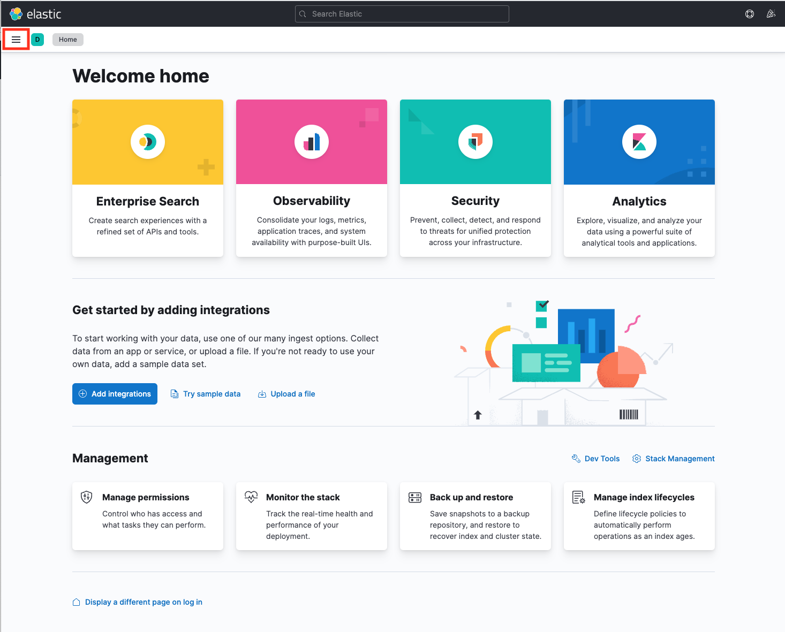
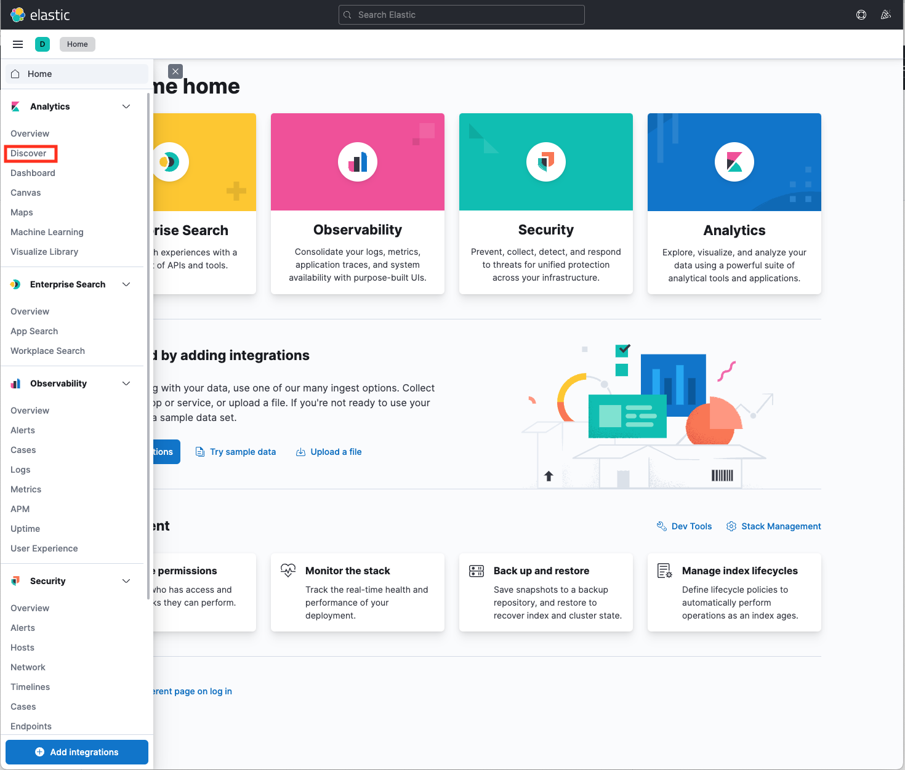
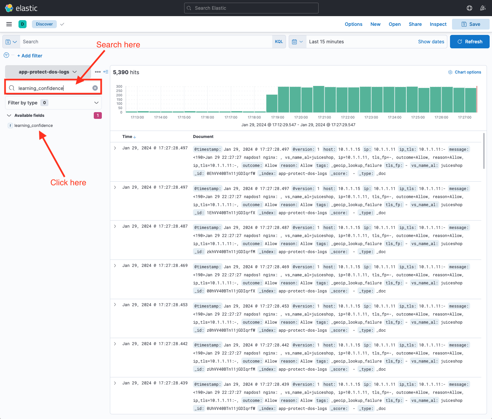
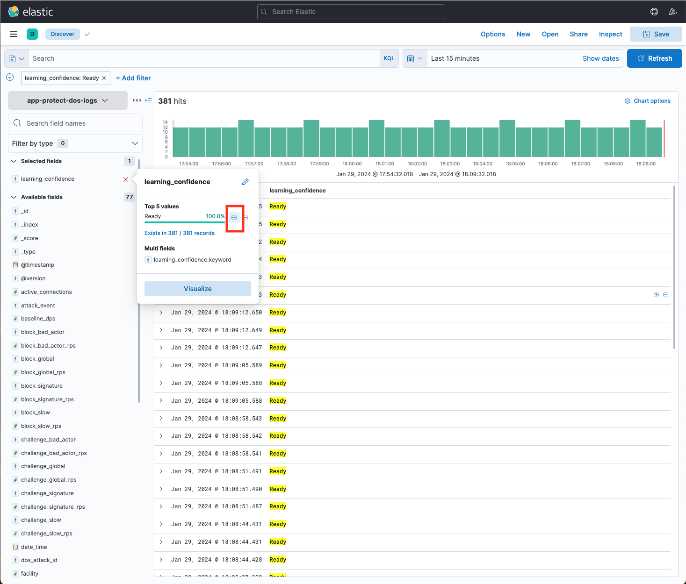
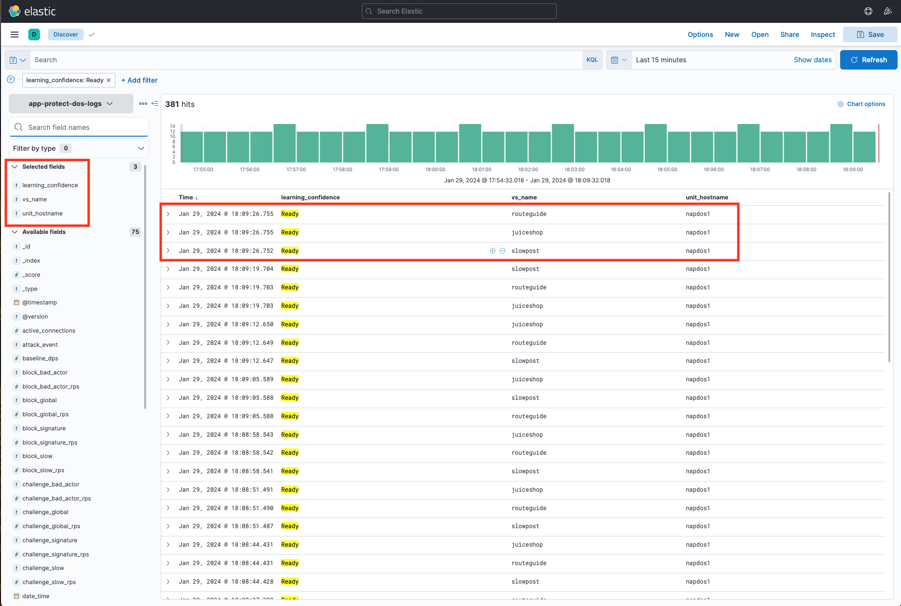

Module 8 - Establishing Application Traffic Baseline
####################################################

NGINX App Protect DoS is based on learning and analyzing all traffic to the web application. 
It builds baselines for what traffic should look like and identifies anomalies when server stress is detected.

Establish Baseline
------------------

1. Open WebShell to the **Legitimate Traffic Generator** VM (UDF > Components > Systems > Legitimate Traffic Generator > Access > Web Shell)

2. Run the good traffic script

.. code:: bash

    /good.sh

3. Allow good traffic to run, and proceed with the next steps

4. Click **Kibana** on the Access pulldown on the ELK VM (UDF > Components > Systems > ELK > Access > Kibana)

.. image:: ../../_static/class5_module8_elk_homepage.jpeg

5. Click the menu button in the upper left corner ( button with 3 horizontal lines)

6. Under **Analytics** click **Discover** (second option down)

7. In the search bar, type **learning_confidence**. Under *Available Fields*, Click the word **learning_confidence**.

8. Under the **Multi fields** section, Click the '+' button to the right of **learning_confidence.keyword**.

It will take a few minutes of running good to create a baseline traffic profile, you will see "Ready" and/or "Not ready" states indicated.

9. Repeat steps 7 & 8 adding **vs_name** and **unit_hostname** as additional selected fields.

.. Note::

    If after few minutes of running good traffic there is still a "Not ready" state indicated, click on **learning_confidence** located under the “Filter by type” column. Then, click on the '+' under "Top 5 values" and select "Ready".

