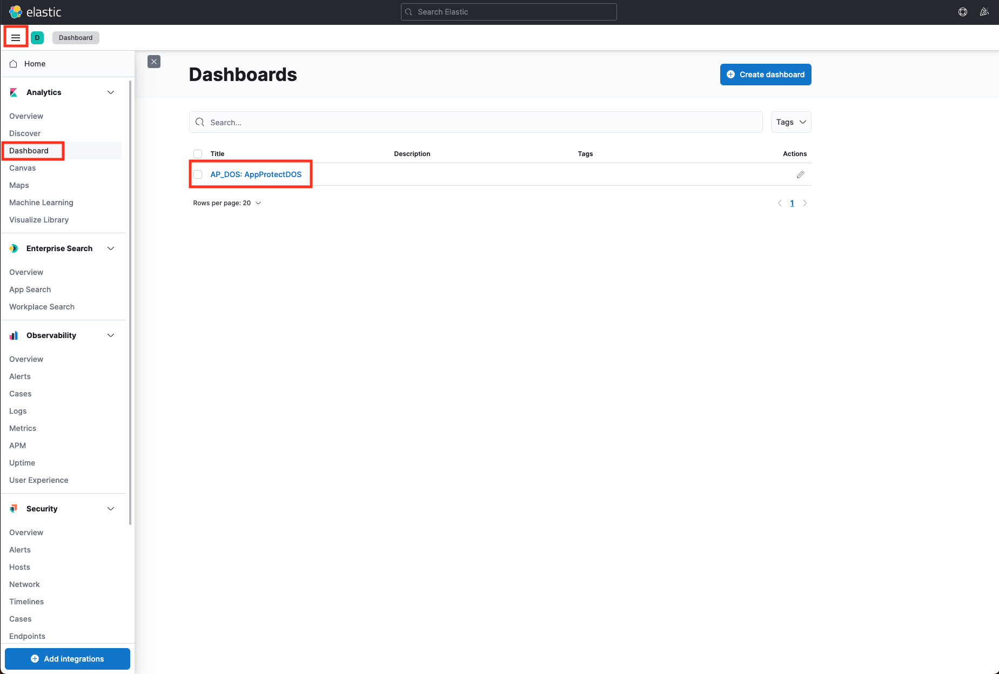
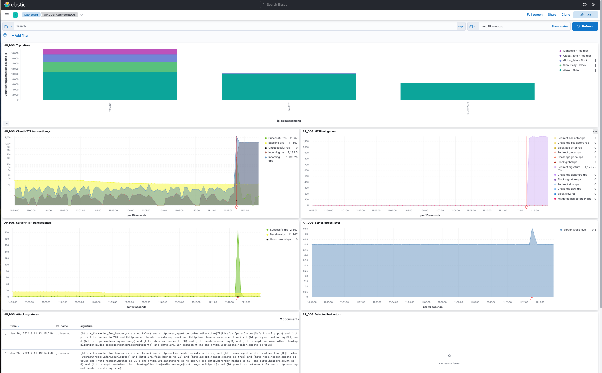
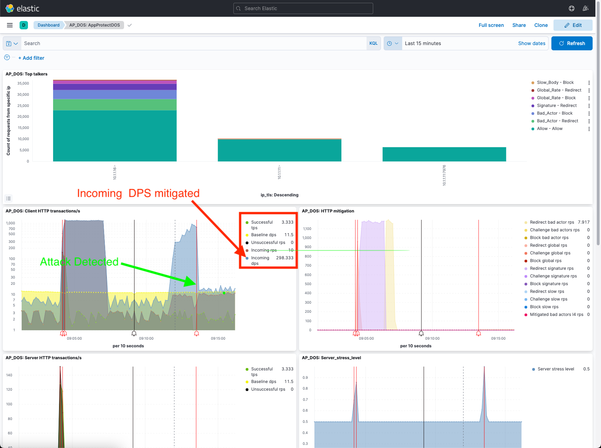
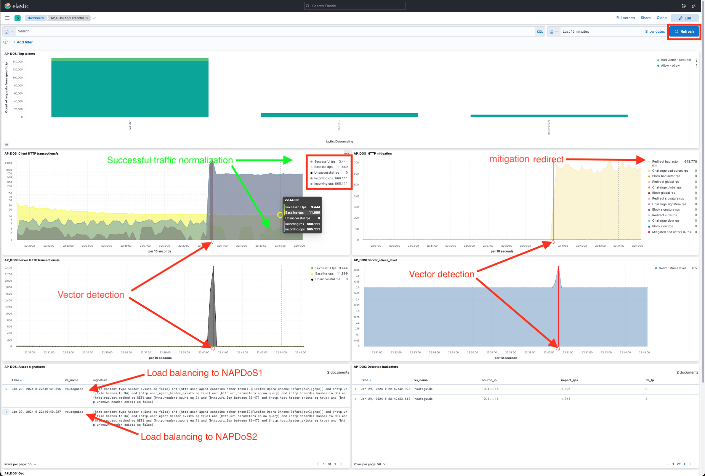

Module 9 - Protecting HTTP and gRPC Services from Application Layer DoS Attacks
###############################################################################

Launch HTTP Flood Attack
========================

We will be initiating a HTTP Flood Attack on the Juice Shop web site using Apache Benchmark.

1. Open WebShell to the **Attack Traffic Generator** VM (UDF > Components > Systems > Attack Traffic Generator > Access > Web Shell). Position this tab side-by-side with the **Legitimate Traffic Generator** WebShell tab that is already open so you can see both WebShells at the same time.

2. Launch L7 DoS attacks in the **Attack Traffic Generator** WebShell.

  .. code:: shell

    /scripts/http1flood.sh

3. Re-open and re-launch L7 DoS attacks in the **Attack Traffic Generator** WebShell.

  .. code:: shell

    /good.sh
  
  The good traffic script will report that the service is available:

  .. code:: shell

    JUICESHOP HTTP Code:200
    Finished trip with 10 points

    JUICESHOP HTTP Code:200
    Finished trip with 10 points

    JUICESHOP HTTP Code:200
    Finished trip with 10 points

  .. Note:: Upon initial launch of the http1flood.sh script, on the legitimate traffic terminal buffer you may see the following indicator of service disruption in the output of the legit traffic output prior to NAP-DoS mitigation. If you do not see this, it's likely that mitigation occurred very quickly, and it has already scrolled off of the terminal output.

  .. code:: shell

    Finished trip with 10 points

    Finished trip with 10 points

    Finished trip with 10 points

    JUICESHOP HTTP Code:000
    JUICESHOP HTTP Code:000
    JUICESHOP HTTP Code:000

4. Re-open the Kibana tab.

5. Click on the three lines in the far right corner, select **Dashboard**, then click **AP_DOS_AppProtect**.

6. As evidence of successful mitigation, the good traffic script will continue to report that the service is available as seen below.  However, you can see the attack detected in the AP_DOS:HTTP mitigation chart as seen above (the vertical red line on the chart).

Output:

  .. code:: shell

    JUICESHOP HTTP Code:200
    Finished trip with 10 points

    JUICESHOP HTTP Code:200
    Finished trip with 10 points

    JUICESHOP HTTP Code:200
    Finished trip with 10 points

7. Stop the attack. Use **Ctrl+C**.

.. note:: Click the refresh button several times after stopping the attack script and wait for the vertical black line in the ELK Dashboard before running the next attack script. The vertical black line indicates that the attack has stopped.

  .. image:: images/blackline.png

Perform Slow HTTP Attack with slowhttptest tool
===============================================

Slow HTTP attacks rely on the fact that the HTTP protocol, by design, requires requests to be completely received by the server before they
are processed.

If an HTTP request is not complete, or if the transfer rate is very low, the server keeps its resources busy waiting for the rest of the data.

If the server keeps too many resources busy, this creates a denial of service.

We will demonstrate a Slow POST attack using slowhttptest tool.

Slow POST attack: Slowing down the HTTP message body, making the server wait until all content arrives according to the Content-Length header; or until the final CRLF arrives.

1. Open WebShell into "Attack Traffic Generator (10.1.1.16)" VM (UDF > Components > Systems > Attack Traffic Generator > Access > WebShell)

2. Launch Slow POST Attack

  .. code:: shell

    cd /scripts
    ./slow_post_http1.sh

Wait 2 mins until the script establishes 10k connections.

As evidence of successful mitigation, the good traffic script will continue to report that the service is available.

Output:

  .. code:: shell

    JUICESHOP HTTP Code:200
    Finished trip with 10 points

    JUICESHOP HTTP Code:200
    Finished trip with 10 points

    JUICESHOP HTTP Code:200
    Finished trip with 10 points

Slowhttptest will report that NGINX App Protect DoS is closing the connection as seen below (note the slow HTTP test status output, somewhere around the 165th second):

  .. code:: shell

    initializing: 0
    pending: 1
    connected: 2
    error: 0
    closed: 14225
    service available: YES

3. Open the Kibana tab to verify that NGINX App Protect DoS is mitigating the attack. Click on the three lines in the far right corner, select **Dashboard**, then click **AP_DOS_AppProtect**.

4. Click the refresh button at the top left of the page. Review the output of the **AP_DOS: Client HTTP transactions/s** pane.

5. Stop the attack. Use **Ctrl+C**.

.. note:: Wait for the vertical black line in the AP_DOS: Client HTTP transactions/s graph in the ELK Dashboard before running the next attack script.

Launch HTTP/2 Flood attack on gRPC service
==========================================

We will be initiating a HTTP/2 Flood Attack on the "RouteGuide GRPC service" using h2load.

1. SSH (WebShell) into "Attack Traffic Generator (10.1.1.16)" VM.

2. Launch HTTP/2 Flood Attack.

  .. code:: shell

    cd /scripts/
    ./http2flood.sh

As evidence of successful mitigation, the good traffic script will continue to report that the service is available.

Output:

  .. code:: shell

    JUICESHOP HTTP Code:200
    Finished trip with 10 points

    JUICESHOP HTTP Code:200
    Finished trip with 10 points

    JUICESHOP HTTP Code:200
    Finished trip with 10 points

3. Open the Kibana tab to verify that NGINX App Protect DoS is mitigating the attack. Click on the three lines in the far right corner, select **Dashboard**, then click **AP_DOS_AppProtect**.

4. Click the refresh button. You should see a spike in traffic highlighted by a red line in the **Client HTTP transactions/s**, **HTTP mitigation**, **Server HTTP transactions/s**, and **Server_stress_level** panes. This denotes the beginning of the attack vector.

5. Stop the attack. Use **Ctrl+C**.

Module Recap
============

We covered a lot in our exploration of how to mitigate attacks with NGINX App Protect DoS, as well as the visualization aspects of the events in the Kibana dashboard.

The following is a brief review of the salient features of the dashboard:

- Once an attack begins, NGINX App Protect DoS will switch into attack mode due to the server health deteriorating - almost immediately. (Dashboard : AP_DOS: Server_stress_level).

- NGINX App Protect DoS will first mitigate with a global rate limit just to protect the upstream server. (Dashboard: AP_DOS: HTTP mitigation, Global Rate will marked Red).

- During this time, NGINX App Protect DoS identifies anomalous traffic and generates Dynamic Signatures matching only the malicious traffic. (Dashboard: AP_DOS: HTTP mitigation, Signatures will be marked Purple).

- It might take a few moments for a dynamic signature(s) to generate, but shortly after the attack has been detected a signature should be created.

- Dynamic Signatures will be displayed in (Dashboard:AP_DOS: Attack signatures).

- Once mitigation is in effect, the upstream server health will rapidly improve and application performance will return to normal. (Dashboard : AP_DOS: Server_stress_level returns to value 0.5).

- After a few minutes, you will begin to see transactions being mitigated with Blocked Bad Actor events. (Dashboard: AP_DOS: HTTP mitigation, Bad Actors will marked Yellow).

- Bad Actor IP addresses will be listed in (Dashboard: AP_DOS: Detected bad actors).
