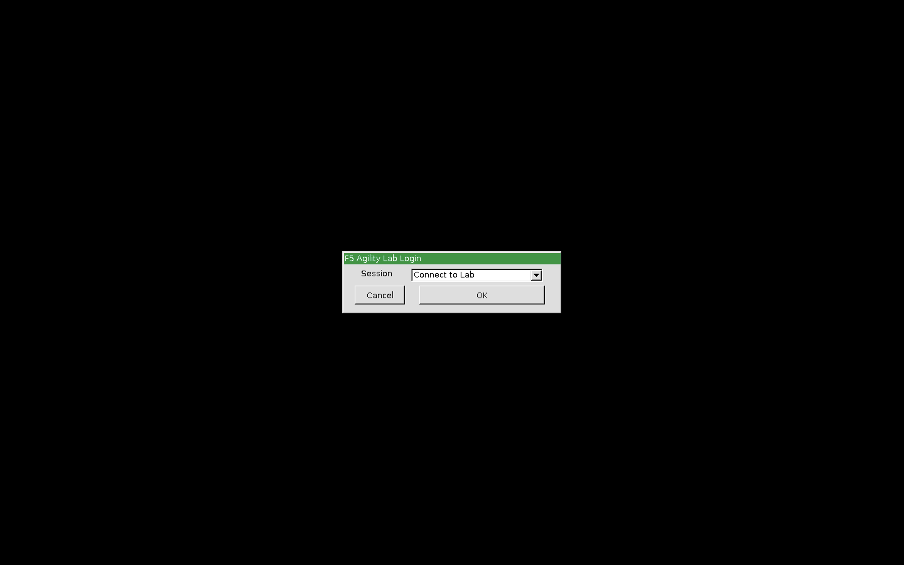
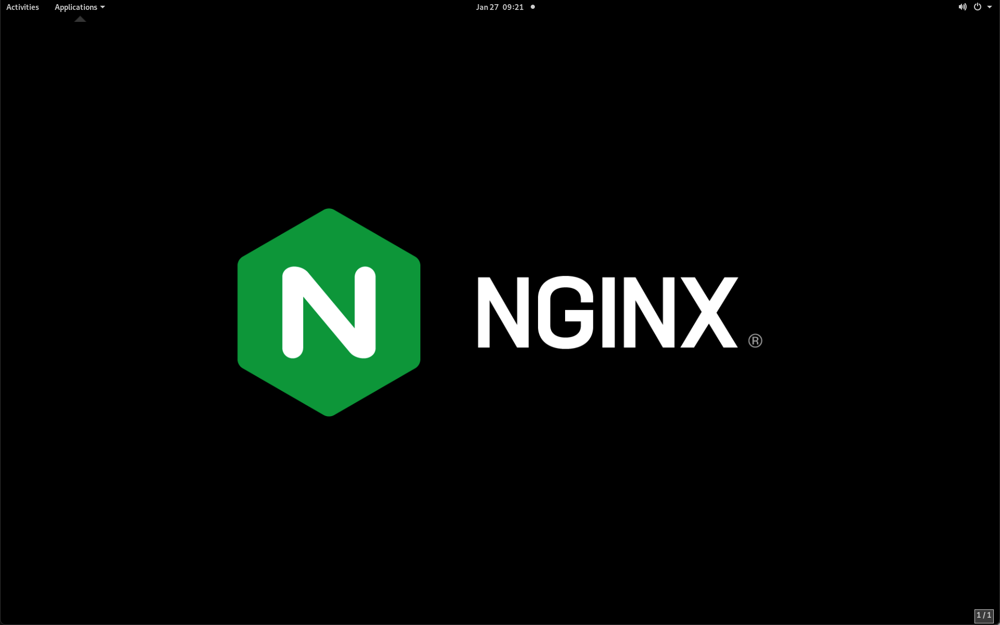
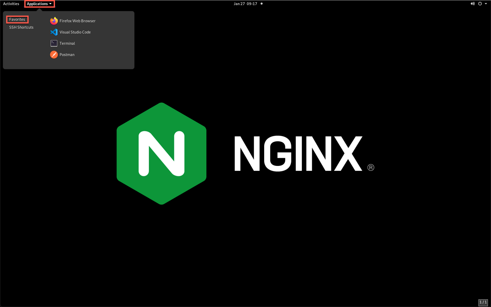
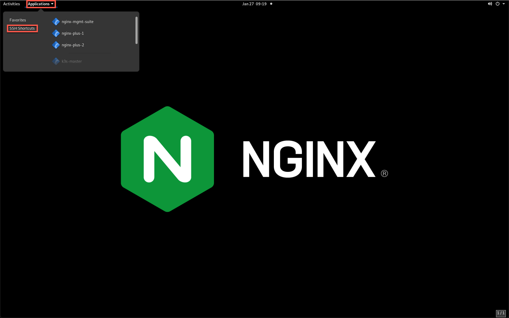

NGINX App Protect Overview
--------------------------

NGINX App Protect is a web application firewall (WAF) designed to protect web applications from a variety of threats such as DDoS attacks, SQL injection, cross-site scripting (XSS), and other common web application attacks.

NGINX App Protect is built on top of the NGINX web server and is deployed as a module within the NGINX Plus application delivery platform. It uses machine learning algorithms and other advanced techniques to detect and block malicious traffic in real-time.

NGINX App Protect provides comprehensive protection for web applications without sacrificing performance. It can be deployed on-premises, in the cloud, or in a hybrid environment and integrates with popular DevOps tools and platforms such as Kubernetes, AWS, and Azure.

Deployment Modes
----------------

NGINX App Protect can be deployed in a variety of ways depending on the specific use case and deployment requirements. Here are some of the most common deployment options:

- As a module within the NGINX Plus application delivery platform: NGINX App Protect can be deployed as a module within the NGINX Plus platform. This provides a unified solution for both load balancing and application security.
- As a standalone software: NGINX App Protect can also be deployed as a standalone software on a server or in a virtual machine. This option is suitable for organizations that do not require load balancing capabilities or have existing load balancing solutions.
- In a containerized environment: NGINX App Protect can be deployed in a containerized environment such as Docker or Kubernetes. This provides a scalable and flexible solution for cloud-native applications.
- As a managed service: NGINX App Protect is also available as a managed service through various cloud providers such as AWS, Azure, and Google Cloud Platform. This option is suitable for organizations that want a fully managed and automated WAF solution.

**Deployment Modes**

.. image:: images/deployment_modes.png
   :align: center
   :alt: Image showing deployment modes for NGINX App Protect

**Deployment Environments**

.. image:: images/deployment_environments.png
   :align: center
   :alt: Image showing diagran of support deployment environments for NGINX App Protect

Lab Overview
------------

This lab serves as an introduction to the NGINX App Protect WAF solution. In this lab, you will:

- review a fully deployed NGINX Plus instance with NGINX App Protect in place for an existing application
- test drive the NGINX Management Suite's Instance Manager and Security Monitoring modules to manage configurations and security posture
- identify false positives and perform policy changes to remedy
- deploy NGINX App Protect on an existing NGINX Plus instance 
- deploy NGINX App Protect in Kubernetes using modern apps methodologies
- Review NGINX App Protect API Security

Each of the modules in this lab are independent and can be performed in any order. 

NGINX Acronyms
--------------

The following are a few acronyms that you will encounter in this lab. 

- NAP – NGINX App Protect
- NMS – NGINX Management Suite
- NIM – NGINX Instance Manager (base NMS module)
- NMS-SM – NGINX Security Monitoring (optional NMS module)
- ACM – API Connectivity Manager (optional NMS module)
- ADM – App Delivery Manager (optional NMS module)
- NIC – NGINX Ingress Controller

Lab Inventory
-------------

.. list-table:: 
  :header-rows: 1

  * - **Instance**
    - **IP Address**
    - **OS**
    - **NGINX Services**
    - **Apps/Protocols**
  * - NGINX Management Suite
    - 10.1.1.4
    - Ubuntu 20.04 LTS
    - NMS, NIM, NMS-SM
    - SSH
  * - k3s Master Node
    - 10.1.1.5
    - Ubuntu 20.04 LTS
    - NIC
    - SSH, k3s
  * - k3s Worker Node 1
    - 10.1.1.6
    - Ubuntu 20.04 LTS
    - NIC
    - SSH, k3s, Arcadia Finance
  * - k3s Worker Node 2
    - 10.1.1.7
    - Ubuntu 20.04 LTS
    - NIC
    - SSH, k3s, Arcadia Finance
  * - NGINX Plus 1
    - 10.1.1.8
    - Ubuntu 20.04 LTS
    - Plus + NAP
    - SSH
  * - NGINX Plus 2
    - 10.1.1.9
    - Ubuntu 20.04 LTS
    - Plus
    - SSH
  * - DevOps Tools
    - 10.1.1.10
    - Ubuntu 20.04 LTS
    - none
    - SSH

Accessing the Lab
-----------------

In this lab, you will access all resources by connecting to a Linux jump host running XRDP. XRDP is an open-source version of the popular Remote Desktop Protocol and is compatible with all popular RDP clients.

When you first connect to the Jump Host via RDP, you will be prompted to click **OK** to connect to the remote session.

Once connected, you will see the desktop as shown below.

Clicking on the **Applications** drop-down in the menu bar will bring up a list of applications you will need to finish this lab.

**Favorites** includes Firefox, Visual Studio Code and Terminal.

**SSH Shortcuts** open SSH terminal windows to the command prompt of all machines in the lab.

Each section in this lab will begin with the assumption that you are connected via RDP, able to navigate the **Applications** menu and familiar with the available applications.

Remember these important tips:

- Lab modules are independent; feel free to tackle the modules in any order.
- The username **lab** and password **Agility2023!** will work for every login unless specifically noted.
- Traffic and attack generators are running to help generate statistics, events and attacks.

Tips for Installing NGINX Management Suite, NGINX App Protect and/or NGINX Plus in Your Own Environment
-------------------------------------------------------------------------------------------------------

If you're installing NGINX Management Suite, make sure that:
 - you use a supported version of NGINX Plus and Linux: https://docs.nginx.com/nginx-management-suite/admin-guides/installation/on-prem/install-guide/

If you're installing NGINX App Protect, make sure that:
 - you use a supported version of Linux: https://docs.nginx.com/nginx-app-protect-waf/admin-guide/install/

If you're installing NGINX Plus only, make sure that:
 - you use a supported version of Linux: https://docs.nginx.com/nginx/technical-specs/

.. caution:: NGINX App Protect supports fewer Linux distributions than NGINX Plus. You may need to migrate your NGINX configuration to a supported distro in order to install NAP.

Lab Maintainers
---------------

   Chad Wise - Senior Solutions Engineer <c.wise@f5.com>

   Greg Robinson - Senior Solutions Engineer <g.robinson@f5.com>

Please email us with any issues or suggestions.
