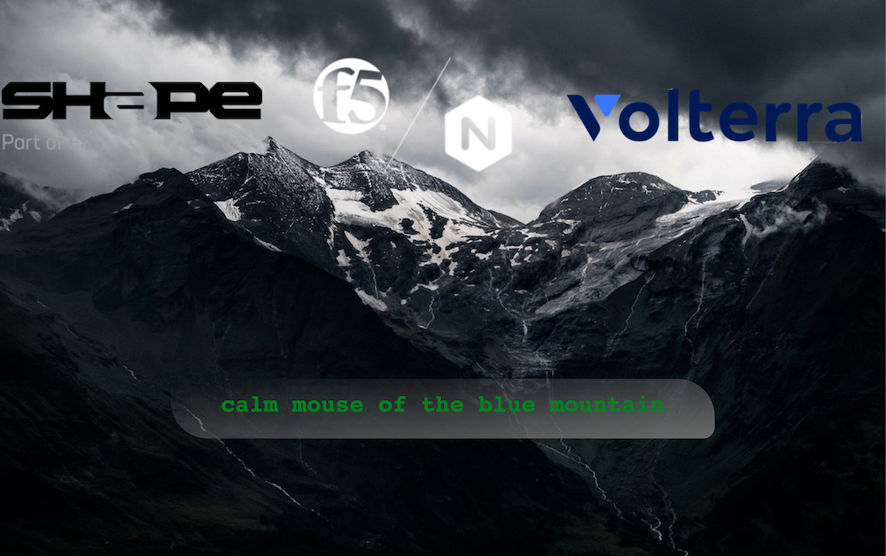
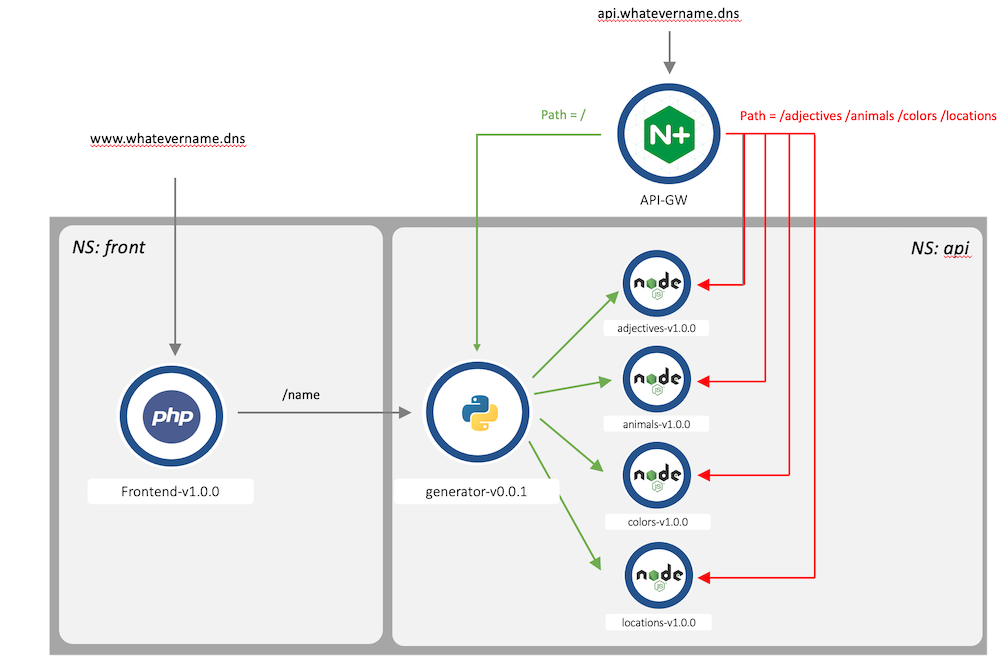

Architecture of API Sentence Application
########################################

You can use this application in your own environment if you want : https://github.com/fchmainy/nginx-aks-demo

First of all, it is important to understand how API Sentence app is split between micro-services

**This is what API Sentence FrontEnd looks like when all the microservices are up and running**

To make it simple, a ``FrontEnd`` app reaches a ``Generator`` micro-service, that reaches 4 different ``Words`` micro-services. Each ``Words`` micro-service generates a Word (an adjective, an animal, a color and a location)

Each ``Words`` microservice is a NodeJS API Server. It means, we can ``GET``, ``POST``, ``PATCH``, ``DELETE`` entries.
The ``FronEnd`` is just a web interface representing the outcomes of the APIs. On purpose, this FrontEnd page has a background and logos in order to make it "heavy" for Volterra demonstrations.

**And this is how the micro-services are meshed together**

As you can notice, we can ``Request`` all EndPoints
   * FrontEnd -> will display the Web Interface with the sentence
   * Generator -> will respond with a JSON payload and 4 words (one per ``Words`` micro-services)
   * Adjectives -> will respond with an adjective word
   * Animals -> will respond with an animal word
   * Colors -> will respond with a color word
   * Locations -> will respon with a location word

A direct API call to a ``Words`` micro-service (like /locations) will provide a JSON response as below:

.. code-block:: JSON

   [
      {
         "id": 1,
         "name": "lion"
      },
      {
         "id": 2,
         "name": "whale"
      },
      {
         "id": 3,
         "name": "mouse"
      }
   ]

A direct API call to the ``Generator`` micro-service will provide a JSON response as below:

.. code-block:: JSON

   {
      "adjectives": "kind",
      "animals": "mouse",
      "colors": "black",
      "locations": "park"
   }

**This is how the micro-services are used on the FrontEnd page**

From the previous example, this is how the sentence is generated when the ``Generator`` get the 4 words.

.. image:: ../pictures/lab1/webapp-containers.png
   :align: center

**In this lab, we will publish the Words micro-services through an NGINX API Gateway managed by a controller. Then, we will check through the FrontEnd web interface the outcomes.**

