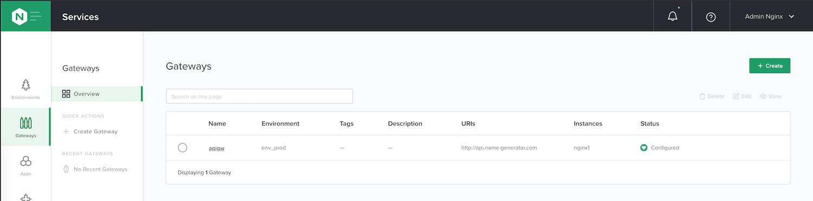

Step 3 - Create an API Gateway
##############################

The instance is adopted by controller, but it needs to be known as a ``Gateway`` to be used by the controller. A gateway is a controller object "grouping" instances.

In this lab, we will have only one instance per gateway. But we could have several instances for one gateway. For instance, I coudl have 3 Nginx Plus instances in front of my API app. All of these instances will have the same API definition configuration.

Steps:

#. In the controller UI, in the menu ``Services`` > ``Gateways``, create a new Gateway
    #. Name: ``apigw``
    #. Environment: ``env_prod``
    #. Placement: ``select here your nginx1 instance``
    #. Hostname: http://api.name-generator.com
    #. Click ``Submit``

    .. note:: The hostname value is the listener. This gateway will be dedicated for the API FQDN, so we set this FQDN at the Gateway level.

#. You can notice, before submitting, the API Spec call to create this Gateway (with a Postman for instance)

.. code-block:: js
   :caption: PUT /api/v1/services/environments/env_prod/gateways/apigw
   
    {
    "metadata": {
        "name": "apigw",
        "tags": []
    },
    "desiredState": {
        "ingress": {
        "placement": {
            "instanceRefs": [
            {
                "ref": "/infrastructure/locations/unspecified/instances/nginx1"
            }
            ]
        },
        "uris": {
            "http://api.name-generator.com": {}
        },
        "methods": [
            "POST",
            "GET",
            "PUT",
            "DELETE",
            "PATCH"
        ]
        }
    }
    }

|

You API Gateway is created and we can use it now in every ADC or APIm configuration settings.

