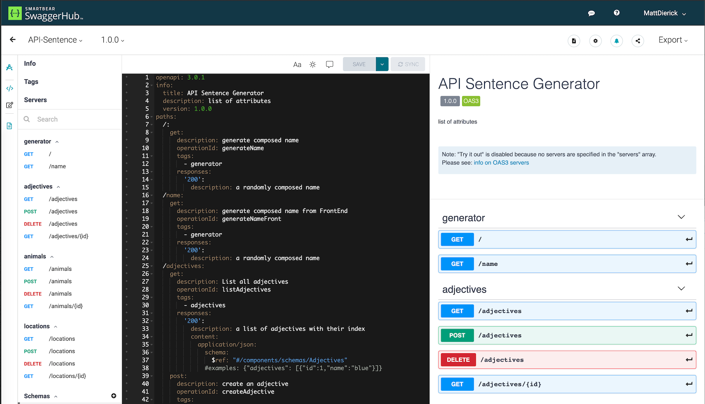
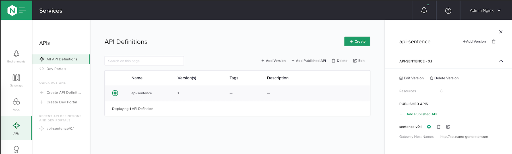

Step 4 - Publish API v1.0
#########################

Before publishing your first API, it is importnant to understand what the DevOps (or API dev) provided to us.

They provided us an OpenAPI spec file (OASv3), and this specification file is available on ``swaggerhub``. You can consult the ``version v1.0`` it here : https://app.swaggerhub.com/apis/F5EMEASSA/API-Sentence/1.0.0

.. note:: This is the version v1.0 of the API, and in this version, as you can notice, the ``COLORS`` micro-service is not yet available. It means, with this Specification File, we will publish the API Sentence application wihtout the COLORS.

.. note:: The sentence will look like ``calm mouse of the mountain`` for example.

|

Steps to publish the Version v1.0 of the API
********************************************

Create the API Definition
=========================

#. In the controller UI, in the menu ``APIs``, create an ``API Version``

   #. First, you need to create an ``API Definition``, to do so, click on ``CREATE NEW`` under the API Definition selection (which is empty)

      #. Name: ``api-sentence``, and click ``Submit``

   #. Select ``OpenAPI Specification`` and ``Copy and paste specification text``
   #. Copy and paste the YAML content from https://app.swaggerhub.com/apis/F5EMEASSA/API-Sentence/1.0
   #. Verify the version set by the controller is ``1.0``. This information is extracted from the Spec file
   #. Click ``Next``, and you can notice the controller imported all ``PATH`` and ``METHODS`` from the spec file.
   #. click ``Submit``

   .. note:: At this moment of the configuration, the Controller knows the API paths and methods, but does not know where to proxy the traffic to.

#. Click on the API Definition created, and on the right side you can see the ``version`` and the number of ``resources``

   .. image:: ../pictures/lab1/api-definition.png
      :align: center
      :class: with-border

|

Create a Published API for v1.0
===============================

#. Now, let's publish our API version v1.0. Click on ``Add Published API``
    #. Name: ``api-sentence-v1``, click ``Next``
    #. Environment: ``env_prod``
    #. App: ``api-sentence-app`` (already created by me)
    #. Gateways: ``apigw``
    #. Click ``Next``
       
       .. image:: ../pictures/lab1/deployment.png
          :align: center
          :class: with-shadow

#. In Routing, we will create one ``component`` per ``micro-service``
    #. Click ``Add New`` to create a new component for ``GENERATOR``
        #. Name: ``cp-generator``
        #. Click ``Next``
        #. Click ``Add a new Workload Group``
            #. Name: ``wl-generator``
            #. Click ``Add BackEnd Workload URI``
                #. URI: ``http://10.1.20.8:31200``
                
                .. note:: This URL is the FQDN and the NodePort used by the microservice running in the K3S.

                #. Click ``Done``
            #. Click ``Done``
        #. Click ``Next``

           .. image:: ../pictures/lab1/component-generator.png
              :align: center

        #. Click ``Submit``

    #. Now, we have to replicate the same steps for each micro-service (generator already done)

       .. list-table:: list of all micro-services and their component configuration
          :header-rows: 1

          * - Name
            - Workload Group Name
            - Backend Workload URI

          * - cp-generator
            - wl-generator
            - http://10.1.20.8:31200

          * - cp-locations
            - wl-locations
            - http://10.1.20.8:31103

          * - cp-animals
            - wl-animals
            - http://10.1.20.8:31101

          * - cp-adjectives
            - wl-adjectives
            - http://10.1.20.8:31100

    #. You should now have a list of 4 ``components`` but empty.
    #. On the left side, you can see all ``PATH`` imported from the OAS spec file.
    #. Drag and Drop each ``PATH`` to the right ``COMPONENT``

       .. image:: ../pictures/lab1/routing.png
          :align: center

#. Click ``Submit``

.. note:: Now, you API v1.0 is published and you can check if it is working as expected.

|

Test your API v1.0
==================

Steps:

#. RDP to Win10 machine as ``user`` and password ``user``
#. Open ``Edge Browser`` and click on ``Random Name Generator`` bookmark
#. The ``FrontEnd`` will display a sentence from ``words`` coming from the ``generator``

   .. image:: ../pictures/lab1/frontend-nocolors.png
      :align: center

   .. note:: As you can notice, there is no COLORS in the sentence as we didn't deploy and publish any color micro-service. The Workflow in this lab is as below, and the flow is not passing through the API Gateway yet, because it is a Web traffic. All the web traffic is routed by the k8s ingress.

   .. image:: ../pictures/lab1/api-workflow.png
      :align: center

#. Open ``Postman`` and the collection ``API Sentence Generator v1 and v2``
#. Send a request with the ``GET Locations`` call. The FQDN is different (from the FrontEnd webapp) and reaching the API GW which will route the request to the ``Locations`` micro-services, and will return all the entries (all the words)

   .. code-block:: js

        [
            {
                "id": 1,
                "name": "valley"
            },
            {
                "id": 2,
                "name": "park"
            },
            {
                "id": 3,
                "name": "mountain"
            }
        ]
    
#. Send a request with the ``GET a sentence from Generator``. This request will ask generator to get one word per micro-service.

   .. code-block:: js

        {
           "adjectives": "calm",
           "animals": "whale",
           "locations": "park"
        }

   .. note:: The above outcomes will generate the sentence ``calm whale of the park`` in the FrontEnd application

.. warning:: CONGRATS, you published the API v1.0 with Nginx Controller and an API Gateway