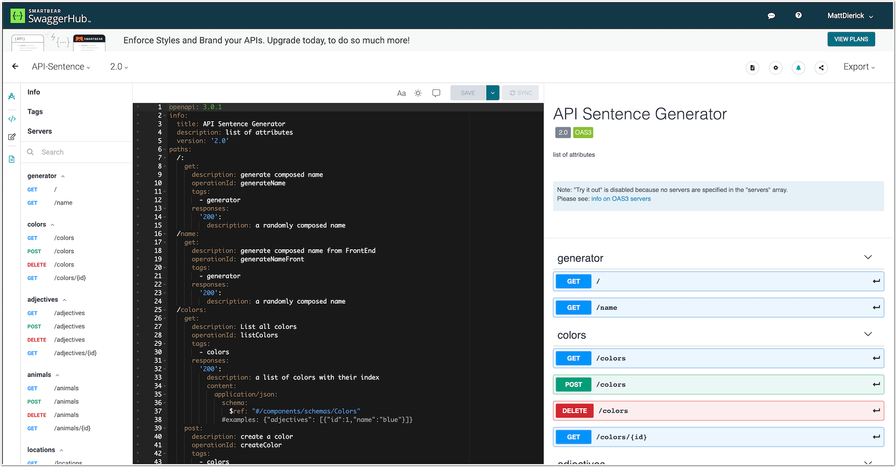

Step 5 - Update the API to v2.0
###############################

In the previous lab, we published version 1.0 of the API. As you noticed, the API Sentence application was not fully developed. The ``Colors`` micro-service was not yet available.

The API Dev team has finally finished the ``Colors`` micro-service app, and they want to push the app to the Kubernetes environment. They expect the DevOps team to publish this new version of the API Sentence app.

The API Dev team provided us a new version of the OAS spec file. This new version is available here: https://app.swaggerhub.com/apis/F5EMEASSA/API-Sentence/2.0

.. note:: You can notice a new PATH for ``Colors``

Steps to publish version 2.0 of the API
***************************************

Deploy the new ``Colors`` micro-service in k8s
==============================================

Let's deploy the ``Colors`` micro-service!

#. SSH (or WebSSH) to the ``Docker (k3s + Rancher + ELK)`` VM
#. Run the following ``kubectl`` command in order to deploy the ``Colors`` micro-service and its k8s service:

   .. code-block:: bash

      sudo su
      kubectl apply -f /home/ubuntu/k3s/attribut_add_colors.yaml -n api

   .. note:: As you can notice, this micro-service is deployed in the same ``NameSpace`` as the other ``Words`` micro-services (``api``)

#. RDP to the ``Win10`` VM (user/user).
#. Check in ``Rancher`` (admin/admin) that the new ``Deployment`` has been successful (both the ``Deployment`` and ``Service``)

   * Click on the ``Cluster Explorer`` yellow button on the top right corner.
   * On the left menu, select ``Deployments``. From here, you can see the ``Deployments`` running in each ``NameSpace``

   .. image:: ../pictures/lab2/rancher-deploy-colors.png
      :align: center

   .. image:: ../pictures/lab2/rancher-service-colors.png
      :align: center

#. Open the ``Edge Browser``, select the ``Random Name Generator`` bookmark, and check that the new micro-service is providing a ``color``.

   .. image:: ../pictures/lab2/frontend-color.png
      :align: center

.. warning:: Why is the Frontend publishing the ``Colors`` micro-service whereas the API Gateway is not yet configured with this new endpoint?

   The reason is that the Frontend is **directly connected** to all k8s micro-services. This is an ``Front to Back`` communication. Our NGINX API Gateway is publishing the API externally for other consumers (mobile app, partners...).

|

Update the API Definition to version 2.0
========================================

#. Connect to NGINX Controller, select your existing API Definition ``api-sentence``, and click ``Edit Version``:

   .. image:: ../pictures/lab2/edit-api-def.png
      :align: center

#. Select ``OpenAPI Specification`` -> ``Copy and paste specification text``.
#. Copy and paste the v2.0 OAS YAML content from https://app.swaggerhub.com/apis/F5EMEASSA/API-Sentence/2.0

   .. image:: ../pictures/lab2/oasv2.png
      :align: center

   .. note:: Note that the version of the API Definition did not change in the UI (it still shows as v1.0). This is a known bug, and will be fixed in the next release.

#. Click ``Submit``

   .. note:: You should now see two more resources -> ``Resources: 10``

      .. image:: ../pictures/lab2/10resources.png
         :align: center

|

Update the Published API with the new ``Colors`` endpoint
=========================================================

#. The ``Colors`` API endpoint is now known by our API Definition, let's publish it!
#. Select your existing API Definition ``api-sentence-v1``, and click the edit button:

   .. image:: ../pictures/lab2/edit-published.png
      :align: center

#. In the ``Routing`` menu, you should now see the API ``Paths`` for the ``Colors`` endpoint.
#. Click ``Add New`` to create a new component for the ``Colors`` micro-service.

   #. Name: ``cp-colors``
   #. Click ``Next``
   #. In ``Workload Groups``:

      * Name: ``wl-colors``
      * In ``Backend Workload URIs``:
         * URI: ``http://10.1.20.8:31102``
         * Click ``Done``
      * Click ``Done``

   #. Click ``Next``

   .. image:: ../pictures/lab2/workload.png
      :align: center

   #. Click ``Submit``

#. Drag and drop the two new unrouted ``Path`` resources for ``Colors`` into the ``cp-colors`` component
#. Click ``Submit``

|

Test the v2.0 API deployment
============================

Steps:

#. RDP to the ``Win10`` VM (user/user).
#. Open ``Postman`` and select the ``API Sentence Generator v1 and v2`` collection.
#. Send a request with the ``GET Colors`` call. The API Gateway will route the request to the ``Colors`` micro-service, and will return all the entries (all the words):

   .. code-block:: JSON

        [
            {
                "id": 1,
                "name": "red"
            },
            {
                "id": 2,
                "name": "blue"
            },
            {
                "id": 3,
                "name": "green"
            },
            {
                "name": "black",
                "id": 4
            },
            {
                "name": "yellow",
                "id": 5
            }
        ]

#. Send a request with the ``GET a Sentence from Generator`` call. This request will ask the ``generator`` to get one word per micro-service. As you can see, there is now a new entry for ``Colors``:

   .. code-block:: JSON

        {
           "adjectives": "calm",
           "animals": "whale",
           "colors": "yellow",
           "locations": "park"
        }

   .. note:: The above entries will generate the sentence ``calm whale of the yellow park`` in the ``Frontend`` application.

.. warning:: Congrats! You updated the published API to v2.0 with NGINX Controller and NGINX Plus as an API Gateway!
   As v2.0 does not break v1.0, we haven't created a dedicated v2.0 published API. We simply updated v1.0.

   In the next lab, we will update the API to v3.0, and this upgrade will break v2.0 as we will create a new parameter for an existing endpoint.
