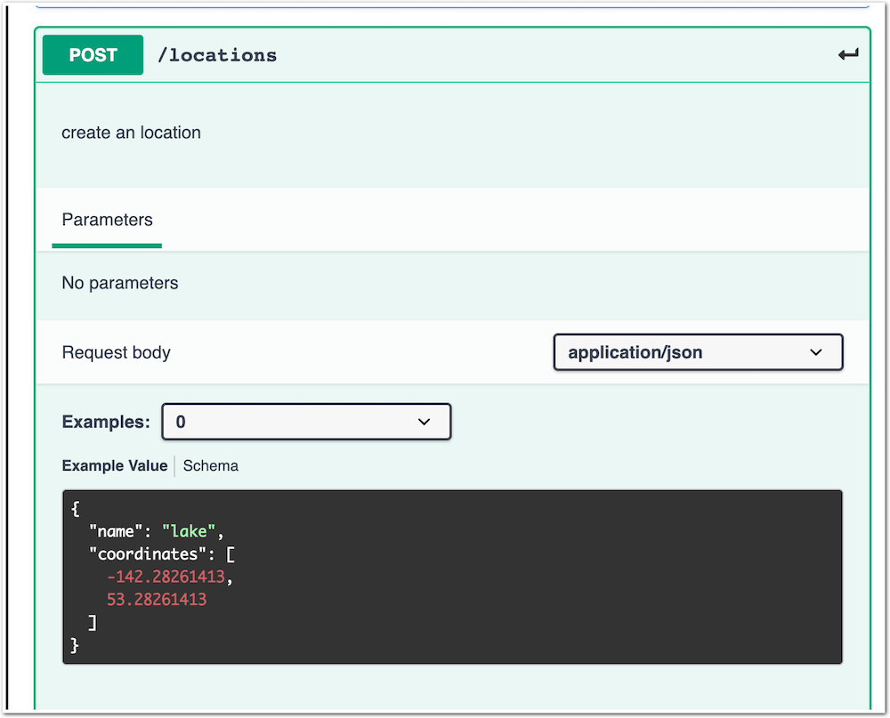

Step 6 - Update the API to v3.0
###############################

Now, the API Dev modified an existing EndPoint. They modified the ``Locations`` micro-services in order to add a new JSON object for the coordinates of the location.

To do so, they :

- Created a new micro-service container image, with a new tag (v3.0) : registry.gitlab.com/sentence-application/locations/volterra:v3.0
- Created a new version (v3.0) of the OAS spec file : https://app.swaggerhub.com/apis/F5EMEASSA/API-Sentence/3.0

As you can see in the OAS file version 3.0, the ``/locations`` PATH has a new JSON object.

.. warning:: Modifying an existing API endpoint means this will break the API v2.0. Any mobile application or API client using the ``LOCATIONS`` will receive an error if we don't create a dedicated version for this new API version

Steps to publish the Version v3.0 of the API
********************************************

Deploy the new LOCATIONS v3.0 micro-service in k8s
==================================================

Let's deploy LOCATIONS v3.0 micro-service like a DevOps.

#. SSH or WEBSSH to ``Docker (k3s + Rancher)`` VM
#. Run the Kubectl command in order to deploy the COLORS micro-service and its k8s service

   .. code-block:: bash

      sudo su
      kubectl apply -f attributs_locations_v3.yaml -n api

   .. note:: As you can notice, this micro-service is deployed in the same NameSpace as other WORDS micro-service (api), and the previous version of the ``LOCATIONS`` is stil there, because currently used by the current clients.

#. RDP to Win10 (user/user)
#. And check in Rancher (admin/admin) that the new deployment is deployed (deployment and service)

   .. image:: ../pictures/lab3/rancher-deploy-locationv3.png
      :align: center

   .. image:: ../pictures/lab3/rancher-service-locationv3.png
      :align: center

.. note:: Great, so now, the ``Location`` micro-service is running with 2 versions (v1.0) and (v3.0)

|

Create a new version for the existing API Definition
====================================================

#. In the controller UI, select your API Definition, and on the top right corner, create a new version.

   .. image:: ../pictures/lab3/addversion.png
      :align: center

#. Go to the SwaggerHub and copy the version 3 of the OAS spec file : https://app.swaggerhub.com/apis/F5EMEASSA/API-Sentence/3.0
#. Select ``Copy and paste specification text`` and paste the OAS v3.0 spec file content

   .. note:: You can notice the version is automatically set to ``3.0``

   .. image:: ../pictures/lab3/pasteoas.png
      :align: center

#. Click ``Next`` and ``Submit``

.. note:: You can see on the right sidebar, a new version ``3.0``

   It is time to publish this new version of the API for a sample of clients (early access, beta ...)
   
   .. image:: ../pictures/lab3/version3.png
      :align: center

|

Publish the version 3.0 of the API
==================================

.. note:: This new API version will listen on a specific path in order to differentiate the ``Production API (v2.0)`` from this ``Early Access API (v3.0)``

   We decided to use the PATH /v3/ for this Published API

#. In the Version 3.0 section, add a new ``Published API``

   .. image:: ../pictures/lab3/add-publish-v3.png
      :align: center

#. Start by setting the ``Base Path``. This is the path to differentiate the different Published API. Set with ``/v3`` and check the box ``Strip Base Path`` so tha the backend app does not receive this Path.
#. Name : api-sentence