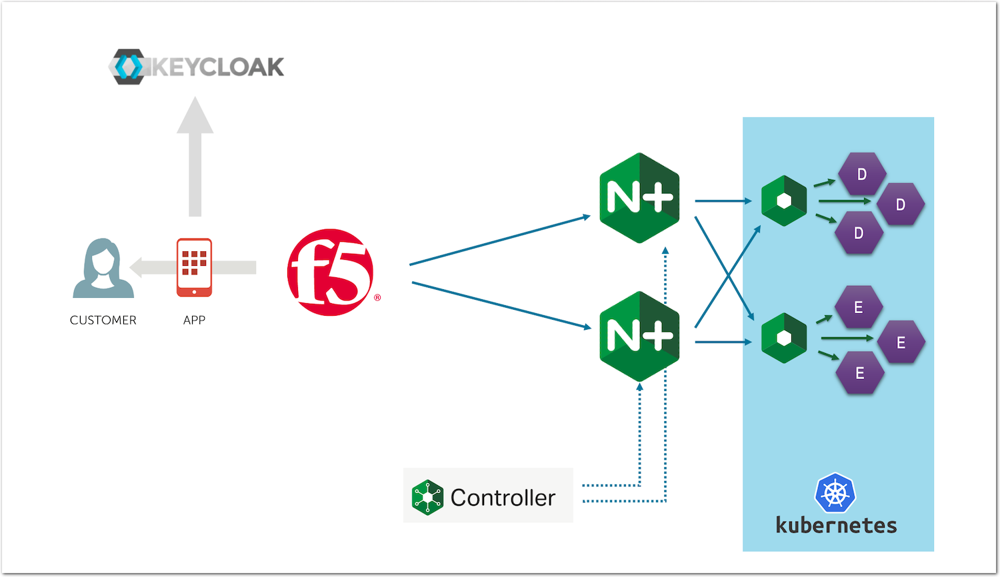

Step 7 - Set up authentication and authorization
################################################

In this lab, we will add a security layer in front of our API Gateway. To do so, we will:

* Add JWT token validation
* Add JWT claims authorization



.. note:: A JWT token needs to be issued by an OAuth Authorization Server (AS). There are several OAuth AS on the market. Some are IDaaS (Identity as a Service) like ``Azure AD`` or ``Okta``. Some others are OSS (Open Source Software) or commercial like **Keycloak**.

   In this lab, we will use ``Keycloak`` as our OAuth AS to issue the JWT tokens.

|

Steps to enable JWT token validation and authorization
******************************************************

Configure ``Keycloak`` as a JWT OIDC token issuer
=================================================

#. RDP to the ``Win10`` VM (user/user).
#. Open the ``Edge Browser`` and select the ``Keycloak HTTPS`` bookmark.
#. Click on ``Administration Console``.

   .. image:: ../pictures/lab1/admin_console.png
      :align: center

#. Login to Keycloak using ``admin`` as both the user and password.
#. On the top left corner, check that the realm selected is ``Api-app`` and click on the ``Clients`` menu.
#. Select ``my-postman``

   .. image:: ../pictures/lab1/clients.png
      :align: center

   .. note:: In order to avoid any mistakes during this lab, we created in advance the ``my-postman`` client and the ``secret key`` (``9cabf36d-8eda-4cf8-a362-ccc982408ba7``).

#. In the ``my-postman`` client, click on ``Credentials``. You should be able to see the secret key we will use to ask for a JWT token in postman.
#. Click on ``Users`` in the left menu, and click on ``View all users``

   .. image:: ../pictures/lab1/users.png
      :align: center

   .. note:: You should see 2 users, ``matt`` (password ``matt`)`, and ``fouad`` (password ``fouad``). At this stage, these users do not have any attributes assigned.

#. Click on the ``matt`` ID to edit it.
#. In the ``Attributes`` tab, add a new key ``groups`` with value ``employee``.
#. Click ``Add`` -> Click ``Save``

   .. warning:: You need to click on ``Add`` to add the attribute, and on ``Save`` to save the user settings.

   .. image:: ../pictures/lab1/matt_attributes.png
      :align: center

#. We will now create our own scope, ``groups``, so that a JWT claim is added into every JWT token with the respective attribute value(s):
    #. Click on ``Client Scopes`` -> ``Create``
    #. Name the scope ``groups`` -> Click ``Save`` -> Click the ``Mappers`` tab -> Click ``Create``
    #. Create a new mapper. Use the following values:
       #. Name: ``groups``
       #. Mapper Type: ``User Attribute``
       #. User Attribute: ``groups``
       #. Token Claim Name: ``groups``
       #. Claim JSON Type: ``String``
       #. Add to ID token: ``ON``
       #. Add to access token: ``ON``
       #. Add to userinfo: ``ON``
       #. Multivalued: ``OFF``
       #. Aggregate attribute values: ``OFF``

       .. image:: ../pictures/lab1/mapper.png
          :align: center

       .. note:: The configuration above says to add a claim with the name ``groups`` and assign it the value from the user attribute ``groups``

    #. Click ``Save``

#. Still in ``Keycloak``, add this new scope to the ``my-postman`` client:
    #. Click ``Clients`` -> ``my-postman`` and select the ``Client Scopes`` tab
    #. Before adding our new scope ``groups``, let's have a look in at how the generated JWT token looks like. Click on ``Evaluate`` and select ``matt`` as the ``user``, then click ``Evaluate``.

       .. image:: ../pictures/lab1/evaluate.png
          :align: center

    #. Click ``Generated Access Token``, and check the JWT content.

       .. image:: ../pictures/lab1/jwt_no_groups.png
          :align: center

       .. note:: As you can see, there is no ``groups`` claim in this JWT token

    #. Click on the ``Setup`` sub-menu (next to the ``Evaluate`` sub-menu), select the ``groups`` scope under ``Available Client Scopes`` and click ``Add Selected`` to move the scope into the ``Assigned Default Client Scopes``.

       .. image:: ../pictures/lab1/scopes.png
          :align: center

    #. Move back to the ``Evaluate`` sub-menu and check that ``matt`` now has a ``groups: employee`` attribute value

.. warning :: Congrats! We are now ready to configure NGINX Controller to check the groups claim values and conditionally grant access to our API endpoints.

|

Create an Identity Provider in NGINX Controller
===============================================

A JWT token is a readable token signed by a public/private key workflow. ``Keycloak`` (or any other Oauth AS) provide you with either a private secret key or a JWKS url.

A JWKS url is a public URL to retrieve and download the public keys used to sign the JWT token. The Keycloak JWKS url is http://10.1.1.8:8080/auth/realms/api-app/protocol/openid-connect/certs, and the content looks like:

.. code-block:: JSON

    {
        "keys": [
            {
                "kid": "as8gYx18yAyuzBOD9UiVp-ndr-aGmnSwfOqscHGuJUM",
                "kty": "RSA",
                "alg": "RS256",
                "use": "sig",
                "n": "nJY5azyX0e5ropzKVBmFH3kt3vftV1iG7O157WyxgFU8hd22wM5vJwmkodBy91Yc3M6qcag9Gi3YMvKnFQF6OrYeaOg7ePWnabAhyhMjATWtnypbRcqM9AyyBekphNhpuNT2Mlqo7eYIt85VUT9iv3upLNy2PZ1W_iAYTh5f-RQukWAagMX7vTWQ4mrUvKfKc7RCc-ikBToaSEte193ckjRqawSLYoHRs2vAeywZYaPFXeIuBaFKglpV051dNwcJFfWMCNmbIJ0xTlXJP2HfQ1AaY7u5SFXnkcX-pkt2PBTDrWqPahZhDQjCstr3M_qbpYd6LUls5z-yhiaHQ4JW1w",
                "e": "AQAB",
                "x5c": [
                    "MIICnTCCAYUCBgF4fRp2jzANBgkqhkiG9w0BAQsFADASMRAwDgYDVQQDDAdhcGktYXBwMB4XDTIxMDMyOTA4MjgwOVoXDTMxMDMyOTA4Mjk0OVowEjEQMA4GA1UEAwwHYXBpLWFwcDCCASIwDQYJKoZIhvcNAQEBBQADggEPADCCAQoCggEBAJyWOWs8l9Hua6KcylQZhR95Ld737VdYhuztee1ssYBVPIXdtsDObycJpKHQcvdWHNzOqnGoPRot2DLypxUBejq2HmjoO3j1p2mwIcoTIwE1rZ8qW0XKjPQMsgXpKYTYabjU9jJaqO3mCLfOVVE/Yr97qSzctj2dVv4gGE4eX/kULpFgGoDF+701kOJq1LynynO0QnPopAU6GkhLXtfd3JI0amsEi2KB0bNrwHssGWGjxV3iLgWhSoJaVdOdXTcHCRX1jAjZmyCdMU5VyT9h30NQGmO7uUhV55HF/qZLdjwUw61qj2oWYQ0IwrLa9zP6m6WHei1JbOc/soYmh0OCVtcCAwEAATANBgkqhkiG9w0BAQsFAAOCAQEARr5/4RxFeHMtQxa3soEgQdQ6nCMqUiAKM0V7Upnoo3lTorMiujsi3Iog2olq1r/z4+xdOXTNL6WqNWdGr+z1OFnqzmUl1l+xESNSXBYTUZyeIbLYCjLGCfrzqYJBQvs/ECJ8Rk4mabL1tLDAUOiEUhvlJgiiNLWrqhwrpOrdJtlU8rlGk5TRjv+lpWkex9ZqpYKZ4ewHlZSTlAri9Jb+WuxFmw8ksrufmqn4IQ5Oee9O3HL8nadbqgeokY6Rb8U5HKaNDyvuCERfC/wLph+DVJQd1ubG1XvnfRcdGW8e79US+uIxJUQZCY2BN01Y0f89rRmgk5tZ15Fxl6FYeT2Y/Q=="
                ]
                ,
                "x5t": "_qPH5MQIPZ4EmoWlTHv7Ciq28EY",
                "x5t#S256": "V5zhNTYsKPltmTdF9j_LnZfaIgMHCnLJoiNwxpEBUc8"
            }
        ]
    }

#. In NGINX Controller -> Select ```Services`` -> ``Identity Providers`` -> ``Create Identity Provider``. Use the following values:
   #. Name: ``keycloak``
   #. Environment: ``env_prod``
   #. Type: ``JWT``
   #. JWT Settings: ``Enter a URL for the file's location``
   #. URL: ``http://10.1.1.8:8080/auth/realms/api-app/protocol/openid-connect/certs``
#. Click ``Submit``


|

Add authentication to the ``/colors`` API endpoint
==================================================

#. In NGINX Controller -> Select ``APIs`` -> ``api-sentence`` -> Edit the ``api-sentence-v3`` published API

   .. image:: ../pictures/lab1/edit_auth_colors.png
      :align: center

#. In the ``Routing`` menu, edit the ``Security Settings`` for the ``cp-colors-v3`` component

   .. image:: ../pictures/lab1/edit_sec_colors.png
      :align: center

#. Click ``Add Authentication``

   .. image:: ../pictures/lab1/add_auth.png
      :align: center

#. Use the following values:
   #. Identity Provider: ``Keycloak``
   #. Credential Location: ``BEARER``
   . note:: This setting means that the JWT token is expected to be present in the ``Authorization: Bearer`` HTTP header
#. Click ``Submit`` -> ``Submit`` again to validate the config and push it to the NGINX instance.

.. note:: We have not enabled ``conditional access`` for now.

|

Test the authentication protected API
=====================================

#. RDP to the ``Win10`` VM (user/user).
#. Open ``Postman``, select the ``API Sentence Generator v3`` collection, and select the ``GET Colors v3`` request.
#. Run the request, you should get a ``401 Authorization Required`` response. This is because there is no JWT token in the request.
#. Request a JWT token from Keycloak
    #. In the ``Authorization`` tab, under ``Type``, select ``OAuth 2.0``, and click the orange ``Get New Access Token`` button (at the bottom of the right side menu).

       .. note:: We already configured Postman as our OAuth client behind the scenes. You can retrieve the ``Client ID and secret`` from the ``my-postman`` Keycloak client configuration.

       .. image:: ../pictures/lab1/postman_client.png
          :align: center

    #. Authenticate as ``matt`` (password ``matt``).

       .. image:: ../pictures/lab1/auth.png
          :align: center

    #. Click on ``Use Token`` orange button. The JWT token is now saved and ready to be used.
    #. Send the request again. It should pass.

|

Add conditional access to the ``/colors`` API endpoint
======================================================

The next step is to add Conditional Access for employee users only. This way, any JWT token without the claim ``groups`` and the value ``employee`` can't reach the ``/colors`` API Endpoint.

#. In NGINX Controller -> Select ``APIs`` -> ``api-sentence`` -> Edit the ``api-sentence-v3`` published API.
#. In the ``Routing`` menu, edit the ``Authentication`` setting for the ``cp-colors-v3`` component.
#. Turn on ``Enable Conditional Access``.

   .. image:: ../pictures/lab1/cond_access1.png
      :align: center

#. Configure it so that only a JWT with a ``group: employee`` claim is allowed. Use the following values:
   #. Policy Type: ``Allow when``
   #. Source Data Type: ``JWT claim``
   #. Source Data Value: ``groups``
   #. Comparison Type: ``Contains``
   #. Value: ``employee``
   #. Failure Response: ``403``

   .. image:: ../pictures/lab1/cond_access2.png
      :align: center

#. Click ``Submit`` -> ``Submit`` again to validate the config and push it to the NGINX instance.

|

Test the conditional access protected API
=========================================

#. RDP to the ``Win10`` VM (user/user).
#. Open ``Postman``, select the ``API Sentence Generator v3`` collection, and select the ``GET Colors v3`` request. If necessary, request a new token for user ``matt`` (password ``matt``).
. note:: Don't be surprised if you don't see the popup window asking for the credentials. It means Postman still has a session opened with Keycloak for ``matt``.
#. Use the token and send the request. It should pass.
#. Now, try with another user that's not part of the ``employee`` group.
    #. Click on ``Clear cookies`` (down next to the orange ``Get New Access Token`` button).

       .. image:: ../pictures/lab1/clear_cookies.png
          :align: center

    #. Request a new token but with ``fouad`` (password ``fouad``).
    #. Use the token and send the request. You will get a ``403 Forbidden``.
    #. The response code/message should be ``403 Forbidden``. Note that this is different from the response code ``401 Authorization Required`` we received when the JWT was not present.
    #. Go back to the ``Get New Access Token`` menu. Copy the token generated by Postman, and paste it in https://jwt.io (bookmark in ``Edge Browser``) in order to see the claims contained in the JWT.

       .. note :: As you can see, ``fouad`` is not part of the ``employee`` group, so he can't access the ``/colors`` endpoint.

       .. image:: ../pictures/lab1/jwtio.png
          :align: center

.. warning :: Congrats! You enabled authentication in front of the ``/colors`` API endpoint, and you then implemented conditional access based on a JWT claim!
