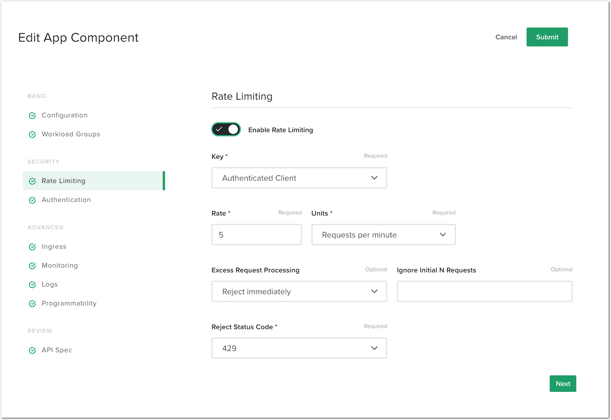

Step 8 - Set up a rate limiting policy
#########################################

In this lab, we will protect the API endpoint with a rate limiting policy. To do so, we will limit the endpoint per authenticated user.

Steps to enable rate limiting protection on the ``/colors`` API endpoint
************************************************************************

#. In NGINX Controller -> Select ``APIs`` -> ``api-sentence`` -> Edit the ``api-sentence-v3`` published API.
#. In ``Routing``, edit the security settings for the ``cp-colors-v3`` component.
#. Select ``Rate Limiting``.
#. Turn on ``Enable Rate Limiting``. Use the following values:
    #. Key: ``Authenticated Client``
    #. Rate: ``5 requests per minute``
       .. note:: 5 req/min does not mean that the client can send 5 requests during the first 5 seconds and then wait 55 seconds. Instead, 5 req/min means the client will be allowed to send a request every 12 seconds (60 / 5 = 12).
    #. Excess Request Processing: ``Reject Immediately``
#. Click ``Submit`` -> ``Submit`` again to validate the config and push it to the NGINX instance.

|

Simulate too many requests from the client
******************************************

#. RDP to the ``Win10`` VM (user/user).
#. Open ``Postman``, select the ``API Sentence Generator v3`` collection, and select the ``GET Colors v3`` request. If necessary, request a new token for user ``matt`` (password ``matt``).
#. Send the request, and instantaneously send a second request. Your request is blocked because you are only allowed to send one request every 12 seconds (5 req/min).

   .. image:: ../pictures/lab2/429.png
      :align: center

#. Re-do the test, but this time wait 12 seconds between each request. Your requests should succeed.

|

Improve the user experience with a delay
****************************************

.. note:: As you noticed, the second request sent is immediately rejected. There is an option to delay the response when the client sends too many request, and thus provide the client a better experience. You can find more info here: https://www.nginx.com/blog/rate-limiting-nginx/

#. In NGINX Controller -> Select ``APIs`` -> ``api-sentence`` -> Edit the ``api-sentence-v3`` published API.
#. In ``Routing``, edit the security settings for the ``cp-colors-v3`` component.
#. Select ``Rate Limiting``.
#. Modify ``Excess Request Processing`` from ``Reject Immediately`` to ``Delay``. Modify ``Ignore Initial N requests`` from 0 to 5.
#. Click ``Submit`` -> ``Submit`` again to validate the config and push it to the NGINX instance.

   .. image:: ../pictures/lab2/delay.png
      :align: center

#. Send two requests back to back in Postman. This time around, the second request is delayed but not dropped.
