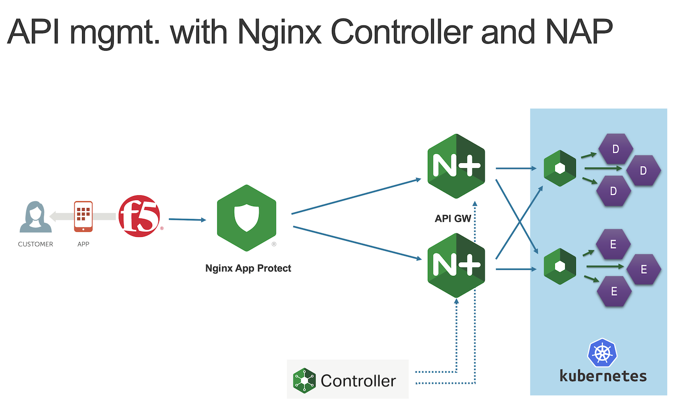

Step 9 - Add API WAF protection
###############################

So far, in the previous lab, the API Endpoint are not protected. There are published through a BIG-IP (hosting the Public IP addess and TLS certificates for instance).
Now it is time to protect the API with a WAF. And we will use an ``Nginx App Protect``.

The NAP (Nginx App Protect) is already deloyed in front of the Nginx API Gateways (managed by the controller).

**The current architecture is below**

.. image:: ../pictures/lab3/apim_archi.png
   :align: center

|

**The future architecture with Nginx App Protect is this one**

.. note:: We will update the BIGIP pool member in order to forward the API traffic to the NAP instead of the Nginx API Gw. We will do it at the end of this lab.

Steps to configure Nginx App Protect as an API firewal
******************************************************

#. SSH or WebSSH to ``Nginx App Protect`` virtual machine
#. Go to ``nginx`` folder with ``cd /etc/nginx``
#. Check the content of the folder

   .. code-block:: bash

      [root@377b61a8-6052-40b6-87fa-e47bab51cb07 nginx]# ls
      conf.d          koi-utf  log-default.json  modules                      nginx.conf      NginxDefaultPolicy.json  scgi_params   win-utf
      fastcgi_params  koi-win  mime.types        NginxApiSecurityPolicy.json  nginx.conf.old  NginxStrictPolicy.json   uwsgi_params

   .. note:: You can notice 3 important files

      - log-default.json <the log config file>
      - NginxApiSecurityPolicy.json <the WAF declarative policy file>
      - nginx.conf <the nginx config file>

#. The ``log-default.json`` file is already configure to log all requests (good and bad)
#. Edit the ``NginxApiSecurityPolicy.json`` in order to configure the NAP policy

   .. note:: As you notice, it is straight forward to configure a WAF Firewall when the API developpers provide with the OpenAPI Spec file. In the NAP policy, we will refer to the OAS file v3.0.1 provided by the API Dev.

   .. code-block:: bash

      sudo cp NginxApiSecurityPolicy.json api-sentence.json

   .. code-block:: bash
     
      sudo vi api-sentence.json

   Modify the NAP policy file by adding the OpenAPI file URL.

   .. code-block:: json
      :emphasize-lines: 10, 11, 12

      {
      "policy" : {
      "name" : "app_protect_api_security_policy",
      "description" : "NGINX App Protect API Security Policy. The policy is intended to be used with an OpenAPI file",
      "template": {
        "name": "POLICY_TEMPLATE_NGINX_BASE"
      },

      "open-api-files" : [
        {
         "link": "https://api.swaggerhub.com/apis/F5EMEASSA/API-Sentence/3.0.1"
        }
      ],

      "enforcer-settings" : {
         "enforcerStateCookies" : {
            "secureAttribute" : "always"
         }
      },
      ...

#. Now, we have to configure the ``nginx.conf`` to refere to this NAP policy

   .. code-block:: bash
     
      sudo vi nginx.conf

   .. code-block:: nginx
      :emphasize-lines: 31

      user  nginx;
      worker_processes  auto;
   
      error_log  /var/log/nginx/error.log notice;
      pid        /var/run/nginx.pid;
   
      load_module modules/ngx_http_app_protect_module.so;
   
      events {
         worker_connections 1024;
      }
   
      http {
         include          /etc/nginx/mime.types;
         default_type  application/octet-stream;
         sendfile        on;
         keepalive_timeout  65;
   
         log_format  main  '$remote_addr - $remote_user [$time_local] "$request" '
                        '$status $body_bytes_sent "$http_referer" '
                        '"$http_user_agent" "$http_x_forwarded_for"';
   
         access_log  /var/log/nginx/access.log  main;
   
         server {
         listen	  80;
            server_name  localhost;
            proxy_http_version 1.1;
   
            app_protect_enable on;
            app_protect_policy_file "/etc/nginx/api-sentence.json";
            app_protect_security_log_enable on;
            app_protect_security_log "/etc/nginx/log-default.json" syslog:server=10.1.20.8:5144;
   
            location / {
                  resolver_timeout 5s;
                  client_max_body_size 0;
                  default_type text/html;
                  proxy_pass http://10.1.20.6$request_uri;
            }
         }
      }

   .. note:: As you can notice, the Nginx configuration forwards logs to 10.1.20.8 (our ELK), and forward API requests to http://10.1.20.6 (the Nginx API Gateway managed by the Controller)

#. Reload the Nginx configuration

   .. code-block:: bash
     
      sudo nginx -s reload

#. Login to BIGIP TMUI as ``admin/admin``
#. In ``Local Traffic > Virtual Servers``, edit the ``vs_api`` virtual server
#. Click on ``Resources`` tab, and select ``pool-nap`` as default pool
#. Cick ``Update``

#. RDP to Windows 1O machine as ``user/user``
#. Open ``Postman`` and the collection ``API Sentence Generator v3``
#. Send any call and check the NAP is forwarding traffic to the API gateway
#. Now, send an attack with the call ``GET Locations v3 Attack``. The request is blocked and you can see the Violation Support ID.

   .. code-block:: json

      {
      "supportID": "15693173431452455024"
      }

#. In Win10, open Edge Browser and click on ``Kibana`` bookmark
#. You can see the NAP dashboard with the relevant violations metrics, and at the bottom, you can see the logs details. Extend the ``Blocked`` request.

   .. image:: ../pictures/lab3/ELK1.png
      :align: center

   .. image:: ../pictures/lab3/ELK2.png
      :align: center

.. warning:: Congrats, you deployed in few minutes a API Firewall with a Nginx App Protect in front of your API Gateway infrastructure.
