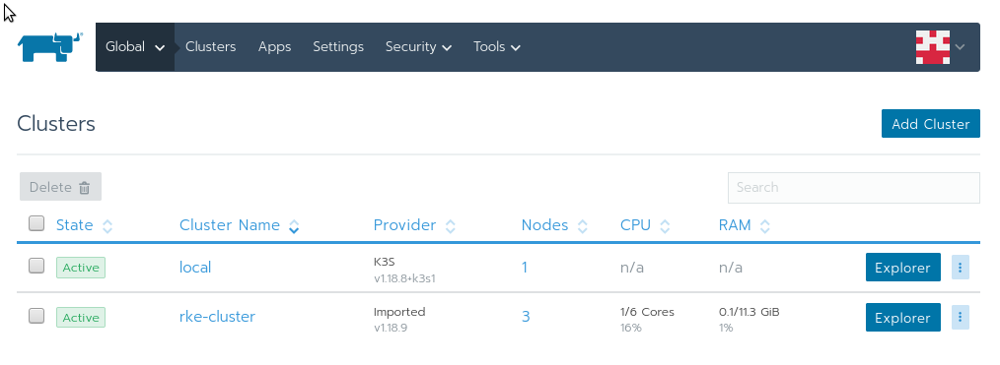
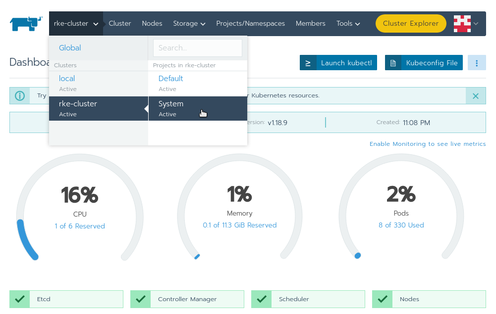
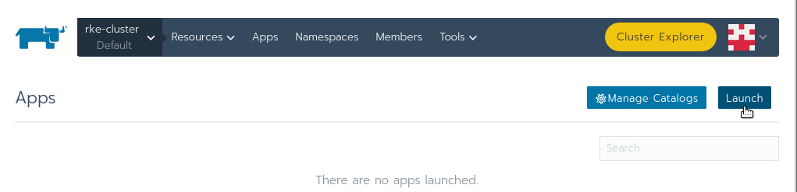
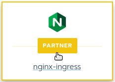

Lab 4.1 - Introduction to the Rancher Catalog
=============================================
Working with Rancher we have added the NGINX Plus ingress controller to the Rancher catalog please follow the steps below to access the Rancher catalog.

Complete the following
----------------------

After logging in or clicking on the Global > cClusters menu selections you should land on this page.

    - Click on the rke-cluster link.

This screen is the main landing page for any cluster in Rancher. Here you see overall cluster metrics as as some other useful information.

    - Follow the pop out menu items pictured below and select the system project link.

This screen sets you in the system context. From here the Apps Catalog can be launched. A good number of third party apps can be configured and added to the cluster. It is also where the NGINX OSS and Plus ingress controller can be found and configured.

    - Click on the Apps menu choice

...

- Next select the launch button to expose the catalogs.

In the lower right of the Helm 3 section you will find the NGINX KIC partner link select this to open the configuration page for NGINX for the next lab exercise.

Recap
-----
You now have the following:

- Followed the link progression to get to the Rancher App Catalog.
- Located and select the NGINX configuration page.

Next you will configure and add the NGINX ingress controller to the RKE system namespace.