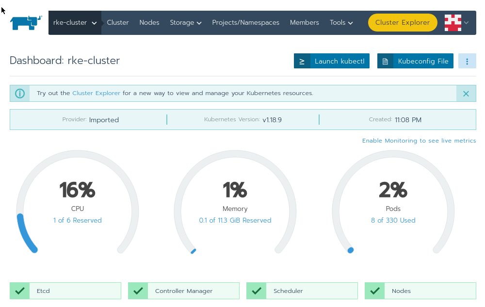

Lab 4.1 - Introduction to the Rancher Catalog
=============================================
In this lab you will be reviewing the RKE cluster Dashboard as well as deploying a supporting tool called Metal LB.

Complete the following
----------------------

After logging in or clicking on the Global > Clusters menu selections you should land on this page.

    - Click on the "rke-cluster" link.

This screen is the main landing page for any cluster in Rancher. Here you see overall cluster metrics along with some other useful information.

    - Take a few minutes to explore the main cluster interface.

Installing Metal Lb
-------------------

We are not going to spend a great deal of time on Metal LB. If you want to learn more about this project check out the Metal LB project it is open source. In this demonstration it is used to give our ingress controller an externally reachable IP. This will allow browsing to the demo app without the need for an external layer 4 load balancing solution.

Complete the following
----------------------

From the VSCode Rancher project terminal change directories to ensure you are in the "metallb" directory. from here run the following commands. These can also be found in the readme located in the Metal LB directory.

.. code-block:: bash

    kubectl apply -f https://raw.githubusercontent.com/metallb/metallb/v0.9.6/manifests/namespace.yaml

.. code-block:: bash

    kubectl apply -f https://raw.githubusercontent.com/metallb/metallb/v0.9.6/manifests/metallb.yaml

.. code-block:: bash

    kubectl create secret generic -n metallb-system memberlist --from-literal=secretkey="$(openssl rand -base64 128)"

Check to to see that Metal LB is running by using the following command

.. code-block:: bash

    kubectl get pods --all-namespaces

.. attention::

    result: You should see a new namespace called metallb-system with 4 running pods.

Next a config.yaml needs to be deployed to set up a small bank of IP addresses for Metal LB to use.

.. code-block:: bash

    kubectl apply -f config.yaml

Recap
-----
You now have the following:

- Followed the link progression to get to the RKE cluster dashboard page.
- Reviewed the RKE cluster dashboard.
- Deployed Metal LB in the cluster.

Next you will configure and add the NGINX Ingress Controller to the RKE system namespace.
