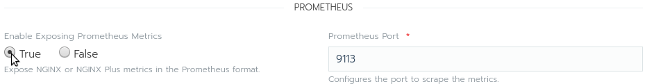
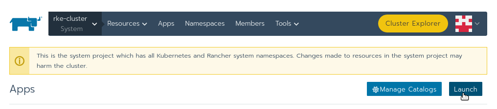

Lab 4.2 - Deploying NGINX KIC
=============================

In this lab you will be setting up the configuration page for NGINX Plus KIC and adding it to the RKE clusters system namespace as our default ingress provider.

Complete the following
----------------------

First locate the Template Version drop down menu and set the template version. The image you select should have been previously built and pushed to a private docker registry.

    - 0.7.1 = version 9
    - 0.8.0 = version 10

.. image:: ../images/version.png

While you are able to deploy NGINX KIC into any namespace for this lab you will be deploying it into the system project and kube-system namespace this sets up NGINX Plus KIC as our default ingress provider.

    - From the Namespace drop down menu locate and select kube-system

Scrolling down a bit locate the settings section of the config page. Looking at the provided screen cap ensure that all settings match what is pictured here. You will be changing the following items. All other items should be left at the defaults.

    - Installation Kind
    - Use Default image
    - Deploy NGINX Plus
    - NGINX Ingress Controller Image Repository

The last configuration item is to enable the prometheus metrics page and set it's port. Change the item below to true and make no other changes.

    - Enable Exposing Prometheus Metrics

The final step is to simply click the launch button

    - Enable Exposing Prometheus Metrics

When the deployment is complete it should look lick the image below. The controller is now deployed.

    - Enable Exposing Prometheus Metrics

Recap
-----
You now have the following:

- Configured the NGINX Plus ingress controller for launch.
- Enabled the Prometheus metrics page.
- Launched the NGINX Plus Ingress Controller into the kube-system namespace.

Next you will deploy a few simple pages running on NGINX webserver and Busybox.