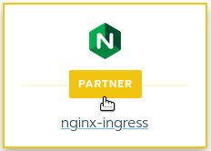

Lab 4.2 - Deploying NGINX KIC
=============================

In this lab you will be navigating the Rancher catalog to locate NGINX KIC. The you will be setting up the configuration page for NGINX Plus KIC and adding it to the RKE clusters system namespace as our default ingress provider.

The Rancher Catalog
-------------------

**Complete the following**

This screen sets the cluster context. Once you set your context you can select the Apps link to access and launch the Rancher Catalog. A good number of third party apps can be configured and added to the cluster. It is also where the NGINX OSS and Plus Ingress Controller can be found and configured.

- Click on rke-cluster then select the **Default** project

.. image:: ../images/default.png

From the top bar...

    - Click on the Apps menu choice

.. image:: ../images/apps.png

...

- Next select the launch button to expose the catalogs.

.. image:: ../images/launch.png

In the lower right of the Helm 3 section you will find the NGINX KIC partner link. Select this to open the configuration page for NGINX for the next lab exercise.

Deploying NGINX KIC
-------------------

**Complete the following**

First locate the Template Version drop down menu and set the template version. The image you select will be pulled from the public docker registry.

    - Please use version 0.7.1 = version 9

While you are able to deploy NGINX KIC into any namespace for this lab, you will be leaving the default namespace value of "nginx-ingress".

.. image:: ../images/namespace.png

In the first run you will deploy the OSS version. Scroll to the bottom of the page to locate the launch button you do not need to change anything in the template this time.

    - Select launch

This will launch the OSS version of the ingress controller. This step is to show how simple it is to get started for free with NGINX KIC OSS.  Next you will walk through an upgrade to illustrate the path from OSS to NGINX Plus.

.. note::
    The installation of the OSS version is not a required step. If desired the NGINX Plus version can be installed directly. We are going though this path merely as an exercise to show how it is done.

When the deployment is complete it should look like the image below. The OSS ingress controller is now deployed.

.. image:: ../images/installed.png

Upgrading or Installing NGINX Plus
----------------------------------

Scrolling down a bit, locate the settings section of the config page. Looking at the provided screen cap ensure that all settings match what is pictured here. You will be changing the following items. All other items should be left at the defaults.

    - Installation Kind
    - Use Default image
    - Deploy NGINX Plus
    - NGINX Ingress Controller Image Repository

.. note::
    As a helping hand the URL for the supplied Docker private repo can be found in the comments section of the cluster.yaml file in the Rancher VSCode project.

.. image:: ../images/config.png

The last configuration item is to enable the prometheus metrics page and set its port. Change the item below to true and make no other changes.

.. image:: ../images/prometheus.png

- The final step is to simply click the launch button

.. image:: ../images/launch.png

When the deployment is complete it should look like the image below. The Plus ingress controller is now deployed.

.. image:: ../images/installed.png

Recap
-----
You now have the following:

- Navigate to the Rancher catalog.
- Configured the NGINX Plus Ingress Controller for launch.
- Enabled the Prometheus metrics page.
- Launched the NGINX Plus Ingress Controller into the kube-system namespace.

Next you will deploy a few simple pages running on NGINX webserver and Busybox.
