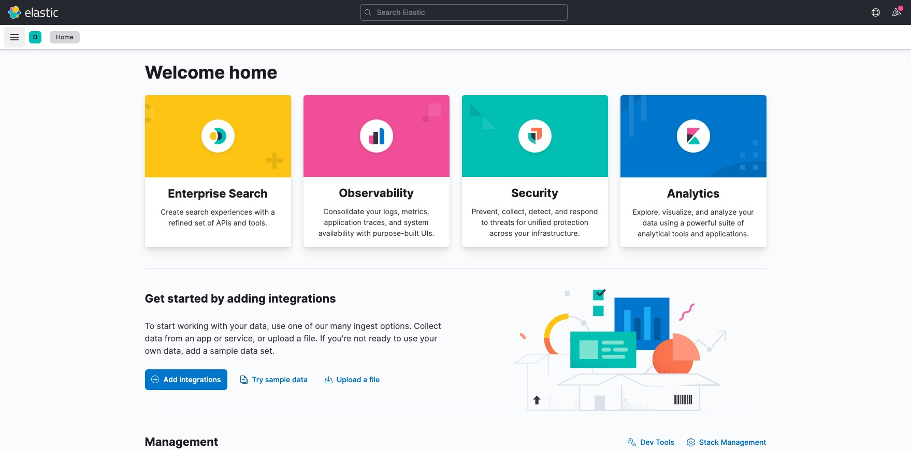
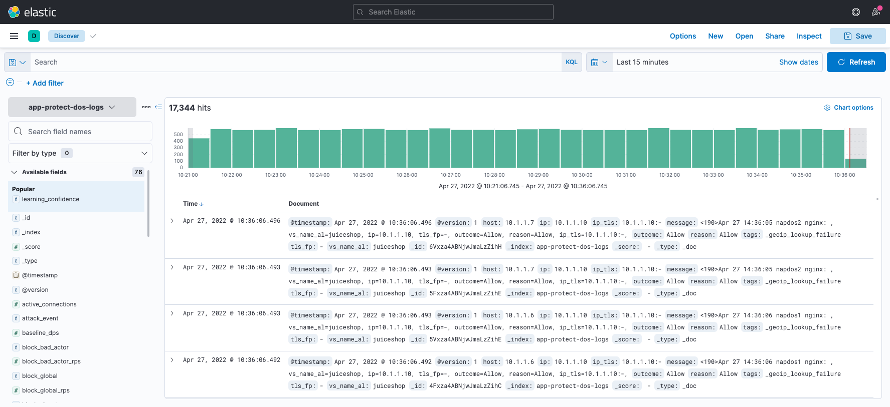

Module 3 - Protect HTTP Services from Application Layer DoS Attacks
###################################################################

NGINX App Protect DoS is based on learning and analyzing all traffic to the web application. 
It  builds baselines for what traffic should look like and identifies anomalies when server stress is detected.

Establish baseline
------------------

1. Open WebShell to the 'legitimate traffic VM'

2. Run the good traffic script

.. code:: shell

    ./good.sh 

3. Allow good traffic to run for 10 minutes 

4. Click **Kibana** on the Access pulldown on the ELK VM
   

5. Click the menu button in the upper left corner ( button with 3 horizontal lines)

6. Under **Analytics** click **Discover** (second option down)

7. Under Available Fields, Click **learning_confidence** 
8. Click the '+' button to the right of learning_confidence 
9. 

10. Click Save
11. 
