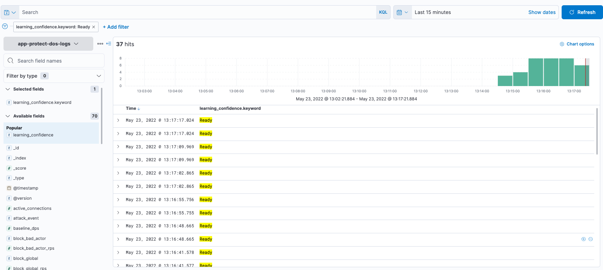

<<<<<<< HEAD
High Volume Testing, Identifying Break Points
#############################################

Now it is time to generate a high volume of traffic and see where the breaking points are.

|
|

1) **Run Locust test with a high volume of Users**
   
Number of Users: 2000

Spawn rate: 200

Host: http://10.1.1.9/

Advanced Options, Run time: 30s

.. image:: /class8/images/locus-2000-200-30.png  
   :width: 200 px
	
Review Locust Charts

.. note::  Any changes to the graphs?  Were there any failures?
	
If seeing failures, review the Failures tab on the top row

|
|

2) **Review the logs on NGINX Proxy cli for failure reasons**
   
  `sudo grep crit /var/log/nginx/error.log`

.. note :: What problem is identified in the nginx error logs?

|
|

3) **Fix the problem by increasing the rlimit**
This changes the limit on the number of open files that a worker process may have

In the NIM Console, edit nginx.conf file.

Increase rlimit to 4096, by uncommenting line 5

* worker_rlimit_nofile 4096; 

Publish the new configuration.

.. image:: /class8/images/nim-rlimit-4096.png  

|
|

4) **Run the same test again**
   
Review Locust graphs

.. note::  Were there improvements and were there still failures?
	
|

.. toctree::
   :maxdepth: 2
   :hidden:
   :glob:

=======
Module 3 - Establishing Application Traffic Baseline
###################################################################

NGINX App Protect DoS is based on learning and analyzing all traffic to the web application. 
It  builds baselines for what traffic should look like and identifies anomalies when server stress is detected.

Establish baseline
------------------

1. Open WebShell to the 'legitimate traffic VM' (UDF > Components > Systems > legitimate traffic > Access > Web Shell)

2. Run the good traffic script

.. code:: shell

<<<<<<<< HEAD:docs/class5/module8/module8.rst
    /good.sh
========
    ./good.sh 
>>>>>>>> origin/master:docs/class8/module3/module3.rst

3. Allow good traffic to run, and proceed with the next steps

<<<<<<<< HEAD:docs/class5/module8/module8.rst
4. Click **Kibana** on the Access pulldown on the ELK VM (UDF > Components > Systems > ELK > Access > Kibana)
========
4. Click **Kibana** on the Access pulldown on the ELK VM (UDF > Components > Systems > elk > Access > Kibana)

.. Note::

    - Contrary to the lab topology image and the description of the environment, the Kibana server IP address is 10.1.1.8.
   
>>>>>>>> origin/master:docs/class8/module3/module3.rst

.. image:: ../../_static/class8_module3_elk_homepage.jpeg

5. Click the menu button in the upper left corner ( button with 3 horizontal lines)

.. image:: images/kibana-3-lines.png

6. Under **Analytics** click **Discover** (second option down)

<<<<<<<< HEAD:docs/class5/module8/module8.rst
.. image:: images/kibana-analytics-discover.png
========
.. image:: ../../_static/class8_module3_kibana_search.png
>>>>>>>> origin/master:docs/class8/module3/module3.rst

7. In the search bar, type **learning_confidence**. Under *Available Fields*, Click the word **learning_confidence**.

.. image:: images/kibana-learning-confidence-search.png

8. Under the **Multi fields** section, Click the '+' button to the right of **learning_confidence.keyword**.

.. image:: images/multi-fields-plus-button.png

It will take a few minutes of running the good.sh script to create a baseline traffic profile, you will see "Ready" and/or "Not ready" states indicated.

9. Repeat steps 7 & 8 adding **vs_name** and **unit_hostname** as additional selected fields.

.. image:: images/unit_hostname.jpg

.. Note::

    If after few minutes of running good traffic there is still a "Not ready" state indicated, click on **learning_confidence** located under the “Filter by type” column. Then, click on the '+' under "Top 5 values" and select "Ready".

<<<<<<<< HEAD:docs/class5/module8/module8.rst
.. image:: images/ready_filter.jpg
========
10. Wait until learing confidence is **Ready** 

>>>>>>>> origin/master:docs/class8/module3/module3.rst

.. image:: images/vs_name-unit_hostname.png

10. On the **Legitimate Traffic Generator** WebShell, press **Ctrl+C** to exit the script and close the WebShell tab in your browser.
>>>>>>> origin/master
