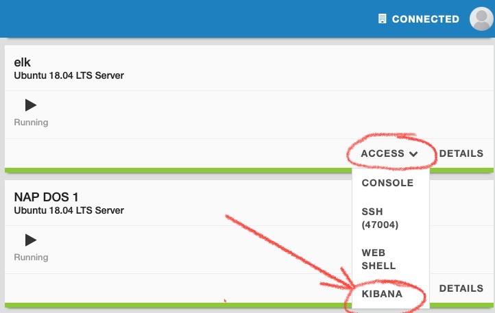

<<<<<<< HEAD
Tuning Buffers and Cache
########################

1) **Tune proxy_buffers in the NGINX Proxy**

Rather than initiating a subrequest to an upstream application server for each request received by the proxy, NGINX can buffer data in memory, serving it to the client without the need for a roundtrip to the backend. By default, this buffer is too small (8 buffers of 4k or 8k, depending on the system) to store our 1.5MB payload. Let's increase our buffer size and see how this impacts performance.

In NIM, edit nginx.conf.

Uncomment the proxy_buffers directive, line 39
`proxy_buffers 8 1638k;`

Publish changes

2) **Run a test and review performance**
Scale the number of users down to 100 with a Spawn Rate of 10/s
   
Number of Users: 100

Spawn rate: 10

Host: http://10.1.1.9/

Advanced Options, Run time: 30s

.. note::  Where you do see the performance improvement? Requests per Second or Latency?

Cache is a hardware or software component that is embedded in application or device memory. It is used to temporarily store data needed by the user, reducing the time and effort required for retrieving data that is accessed repeatedly. NGINX can act as a caching servers, storing files from backends on disk.

3) **Turn on file caching in the Nginx proxy**

.. note:: How do you think caching could help the performance of delivering applications?  

In NIM, edit nginx.conf, and publish changes

|

Uncomment proxy_cache_path, line 37

.. image:: /class8/images/line35.png

|

Uncomment proxy_cache, line 73

.. image:: /class8/images/nim-proxy-cache.png

|
Publish changes

4) Confirm cache is operational 
   
On NGINX Proxy cli

   `ps aux | grep nginx`

.. note:: Are there any new processes running? Look for cache manager and loader processes

|
|

.. image:: /class8/images/cacheprocess.png

|

Now review the NGINX Dashboard GUI, you should now see a Cache section 

|
|

5) **Run a test and review performance**
   
Number of Users: 100

Spawn rate: 10

Host: http://10.1.1.9/

Advanced Options, Run time: 30s

.. image:: /class8/images/locus-500-50-30.png  
   :width: 200 px

.. note::  Where you do see the performance improvement in the Locust chart?
	
.. note:: Review NGINX Dashboard cache section.  How much bandwidth was saved from going to upstream server?
(For a hint, refer to the HINTS section at the bottom of this page.)

6) **Improve reading from disk performance**

Turn on the sendfile linux system call

.. note:: What does Sendfile do?
(For a hint, refer to the HINTS section at the bottom of this page.)

In NIM, edit nginx.conf

Uncomment "sendfile on", line 30

Publish the changes.

|

.. image:: /class8/images/nim-sendfile.png  

	
Run the same test again.

.. note:: Were there any performance gains seen?

|
7) **Improve network packet packaging**

In NIM, edit nginx.conf

Uncomment "tcp_nopush on", line 31

This will cause NGINX to send the first part of the file in the same packet as the response header to the client, further improving performance.

Publish the changes and re-run the test.

.. note:: Were there any performance gains seen?

8) **Turn on open file cache**

.. image:: /class8/images/nim-open-file-cache.png  

In NIM, edit nginx.conf and publish

Uncomment open_file_cache, line 36

   `open_file_cache max=4096`

Doing so enables NGINX to track open file descriptors, which can have a positive impact on performance.

.. note:: Do you notice any improvements?  

|

HINTS:

_3. Review NGINX Dashboard cache section. How much bandwidth was saved from going to upstream server?_
Look at the numbers in the Traffic section in the upper-right.

_4. What does Sendfile do?_
The Sendfile option improves performance when copying data from disk to NGINX process memory. When this option is enabled, the Linux system call of the same name (sendfile) is used to copiy data between a source and destination entirely within kernel space. This is more efficient than issuing a write, followed by a read, which transfers data through the user space.
See https://man7.org/linux/man-pages/man2/sendfile.2.html

_5. Do you notice any improvements?_
If the performance improvement isn't immediate obvious, look at both the 50th percentile and 95th percentile curves. What do these values represent?

.. toctree::
   :maxdepth: 2
   :hidden:
   :glob:

   
=======
Module 4 - Protecting HTTP and gRPC Services from Application Layer DoS Attacks
###############################################################################

Launch HTTP Flood Attack
========================

We will be initiating a HTTP Flood Attack on the Juice Shop web site using Apache Benchmark.

<<<<<<<< HEAD:docs/class5/module9/module9.rst
1. Open WebShell to the **Attack Traffic Generator** VM (UDF > Components > Systems > Attack Traffic Generator > Access > Web Shell). Position this tab side-by-side with the **Legitimate Traffic Generator** WebShell tab that is already open so you can see both WebShells at the same time.

2. Launch L7 DoS attacks in the **Attack Traffic Generator** WebShell.

  .. code:: shell

    /scripts/http1flood.sh

3. Re-open and re-launch the good traffic generator in the **Legitimate Traffic Generator** WebShell.

  .. code:: shell

    /good.sh
  
  The good traffic script will report that the service is available:

  .. code:: shell

    JUICESHOP HTTP Code:200
    Finished trip with 10 points

    JUICESHOP HTTP Code:200
    Finished trip with 10 points

    JUICESHOP HTTP Code:200
    Finished trip with 10 points

  .. Note:: Upon initial launch of the http1flood.sh script, on the legitimate traffic terminal buffer you may see the following indicator of service disruption in the output of the legit traffic output prior to NAP-DoS mitigation. If you do not see this, it's likely that mitigation occurred very quickly, and it has already scrolled off of the terminal output.

  .. code:: shell

    Finished trip with 10 points

    Finished trip with 10 points

    Finished trip with 10 points

    JUICESHOP HTTP Code:000
    JUICESHOP HTTP Code:000
    JUICESHOP HTTP Code:000

========
1. Open WebShell to the 'Attacker VM' (UDF > Components > Systems > Attacker > Access > Web Shell)
2. Launch L7 DOS attacks.

   ``cd /scripts``
   
   ``./http1flood.sh``
>>>>>>>> origin/master:docs/class8/module4/module4.rst

4. Re-open the Kibana tab.

5. Click on the three lines in the far right corner, select **Dashboard**, then click **AP_DOS_AppProtect**.

.. image:: images/open-kibana-app-dos-dashboard.png

.. image:: images/dashboard-http1flood.png

6. As evidence of successful mitigation, the good traffic script will continue to report that the service is available as seen below.  However, you can see the attack detected in the AP_DOS:HTTP mitigation chart as seen above (the vertical red line on the chart).

Output:

  .. code:: shell

    JUICESHOP HTTP Code:200
    Finished trip with 10 points

<<<<<<<< HEAD:docs/class5/module9/module9.rst
    JUICESHOP HTTP Code:200
    Finished trip with 10 points
========
Navigate to Kibana > Dashboards > click on the "AP_DOS: AppProtectDOS" link Verify NAP DOS mitigation.
>>>>>>>> origin/master:docs/class8/module4/module4.rst

    JUICESHOP HTTP Code:200
    Finished trip with 10 points

7. Press **Ctrl+C** on the **Attack Traffic Generator** VM to stop the attack script. Leave the good script running.

.. note:: Click the refresh button several times after stopping the attack script and wait for the vertical black line in the ELK Dashboard before running the next attack script. The vertical black line indicates that the attack has stopped.

  .. image:: images/blackline.png

Perform Slow HTTP Attack with slowhttptest tool
===============================================

Slow HTTP attacks rely on the fact that the HTTP protocol, by design, requires requests to be completely received by the server before they
are processed.

If an HTTP request is not complete, or if the transfer rate is very low, the server keeps its resources busy waiting for the rest of the data.

If the server keeps too many resources busy, this creates a denial of service.

We will demonstrate a Slow POST attack using slowhttptest tool.

Slow POST attack: Slowing down the HTTP message body, making the server wait until all content arrives according to the Content-Length header; or until the final CRLF arrives.

1. Open WebShell into "Attacker (10.1.1.11)" VM (UDF > Components > Systems > Attacker > Access > WebShell)

2. Launch Slow POST Attack

  .. code:: shell

    cd /scripts
    ./slow_post_http1.sh

Wait a few mins until the script establishes 4-5k connections.

As evidence of successful mitigation, the good traffic script will continue to report that the service is available.

Output:

  .. code:: shell

<<<<<<<< HEAD:docs/class5/module9/module9.rst
    JUICESHOP HTTP Code:200
    Finished trip with 10 points
========
Slowhttptest will report that NAP DOS is closing the connection: slow HTTP test status on 165th second:
>>>>>>>> origin/master:docs/class8/module4/module4.rst

    JUICESHOP HTTP Code:200
    Finished trip with 10 points

    JUICESHOP HTTP Code:200
    Finished trip with 10 points

Slowhttptest will report that NGINX App Protect DoS is closing the connections similar to below:

<<<<<<<< HEAD:docs/class5/module9/module9.rst
.. image:: images/slow_http1_output.png
========
Navigate to Kibana > Dashboards > click on the "AP_DOS: AppProtectDOS" link Verify NAP DOS mitigation.
>>>>>>>> origin/master:docs/class8/module4/module4.rst

3. Open the Kibana tab to verify that NGINX App Protect DoS is mitigating the attack. Click on the three lines in the far right corner, select **Dashboard**, then click **AP_DOS_AppProtect**.

.. image:: images/open-kibana-app-dos-dashboard.png

4. Click the refresh button at the top left of the page. Review the output of the **AP_DOS: Client HTTP transactions/s** pane.

.. image:: images/dashboard-slow_post_http1.png

5. Stop the attack. Use **Ctrl+C**.

.. note:: Wait for the vertical black line in the AP_DOS: Client HTTP transactions/s graph in the ELK Dashboard before running the next attack script.

Launch HTTP/2 Flood attack on gRPC service
==========================================

We will be initiating a HTTP/2 Flood Attack on the "RouteGuide GRPC service" using h2load.

<<<<<<<< HEAD:docs/class5/module9/module9.rst
1. SSH (WebShell) into "Attack Traffic Generator (10.1.1.16)" VM.

========
1. SSH (WebShell) into "Attacker (10.1.1.11)" VM.
>>>>>>>> origin/master:docs/class8/module4/module4.rst
2. Launch HTTP/2 Flood Attack.

  .. code:: shell

    cd /scripts/
    ./http2flood.sh

<<<<<<<< HEAD:docs/class5/module9/module9.rst
As evidence of successful mitigation, the good traffic script will continue to report that the service is available.
========
You will notice that a good traffic script reports that service is unavailable
   
Output:
   
  details = "Received http2 header with status: 502"
  debug_error_string = "{"created":"@1639496137.06on":"Received http2:status header with non-200 OK
  status","file":"src/core/ext/filters/http/client,"file_line":134,"grpc_message":"Received
  http2 header with status: 502","grpc_status":14,"value":"502"}"\::

After success mitigation service is available and reports
   
Output:
   
  Finished trip with 10 points
  
  Finished trip with 10 points
  
  Finished trip with 10 points\:\:

Go to "ELK" VM, navigate to "Access" and select "KIBANA"

Navigate to Kibana > Dashboards > click on the "AP_DOS: AppProtectDOS" link Verify NAP DOS mitigation.

.. image:: access-dashboard1.jpg

Stop the attack. Use Ctrl+C.

**Wait for the vertical black line in the ELK Dashboards** before running the next attack script.

Launch Message flood DoS by gRPC
================================

Attacker sends requests to heavy URLs
     
We will be initiating a Message flood DoS by gRPC on the "RouteGuide GRPC service" using ghz tool.

1. SSH (WebShell) into "Attacker (10.1.1.11)" VM.
2. Launch GRPC Flood Attack.

!!!!!Make sure previous attack ended before launching Attack 

  ``cd /scripts/``
  
  ``./grpcflood.sh``

You will notice that a good traffic script reports that service is unavailable
>>>>>>>> origin/master:docs/class8/module4/module4.rst

Output:

  .. code:: shell

    JUICESHOP HTTP Code:200
    Finished trip with 10 points

    JUICESHOP HTTP Code:200
    Finished trip with 10 points

    JUICESHOP HTTP Code:200
    Finished trip with 10 points

<<<<<<<< HEAD:docs/class5/module9/module9.rst
3. Open the Kibana tab to verify that NGINX App Protect DoS is mitigating the attack. Click on the three lines in the far right corner, select **Dashboard**, then click **AP_DOS_AppProtect**.
========
GHZ tool will report HTTP status code 403 which indicates traffic is blocked by NAPDOS
>>>>>>>> origin/master:docs/class8/module4/module4.rst

.. image:: images/open-kibana-app-dos-dashboard.png

4. Click the refresh button. You should see a spike in traffic highlighted by a red line in the **Client HTTP transactions/s**, **HTTP mitigation**, **Server HTTP transactions/s**, and **Server_stress_level** panes. This denotes the beginning of the attack vector.

.. image:: images/dashboard-http2flood.png

<<<<<<<< HEAD:docs/class5/module9/module9.rst
5. Stop the attack. Use **Ctrl+C**.
========
Navigate to Kibana > Dashboards > click on the "AP_DOS: AppProtectDOS" link Verify NAP DOS mitigation.
>>>>>>>> origin/master:docs/class8/module4/module4.rst

Module Recap
============

We covered a lot in our exploration of how to mitigate attacks with NGINX App Protect DoS, as well as the visualization aspects of the events in the Kibana dashboard.

The following is a brief review of the salient features of the dashboard:

<<<<<<<< HEAD:docs/class5/module9/module9.rst
- Once an attack begins, NGINX App Protect DoS will switch into attack mode due to the server health deteriorating - almost immediately. (Dashboard : AP_DOS: Server_stress_level).
========
1. SSH (WebShell) into "Attacker (10.1.1.11)" VM.
2. Launch Slow gRPC POST Attack.
>>>>>>>> origin/master:docs/class8/module4/module4.rst

- NGINX App Protect DoS will first mitigate with a global rate limit just to protect the upstream server. (Dashboard: AP_DOS: HTTP mitigation, Global Rate will marked Red).

- During this time, NGINX App Protect DoS identifies anomalous traffic and generates Dynamic Signatures matching only the malicious traffic. (Dashboard: AP_DOS: HTTP mitigation, Signatures will be marked Purple).

- It might take a few moments for a dynamic signature(s) to generate, but shortly after the attack has been detected a signature should be created.

- Dynamic Signatures will be displayed in (Dashboard:AP_DOS: Attack signatures).

<<<<<<<< HEAD:docs/class5/module9/module9.rst
- Once mitigation is in effect, the upstream server health will rapidly improve and application performance will return to normal. (Dashboard : AP_DOS: Server_stress_level returns to value 0.5).
========
Navigate to Kibana > Dashboards > click on the "AP_DOS: AppProtectDOS" link Verify NAP DOS mitigation.
>>>>>>>> origin/master:docs/class8/module4/module4.rst

- After a few minutes, you will begin to see transactions being mitigated with Blocked Bad Actor events. (Dashboard: AP_DOS: HTTP mitigation, Bad Actors will marked Yellow).

- Bad Actor IP addresses will be listed in (Dashboard: AP_DOS: Detected bad actors).
>>>>>>> origin/master
