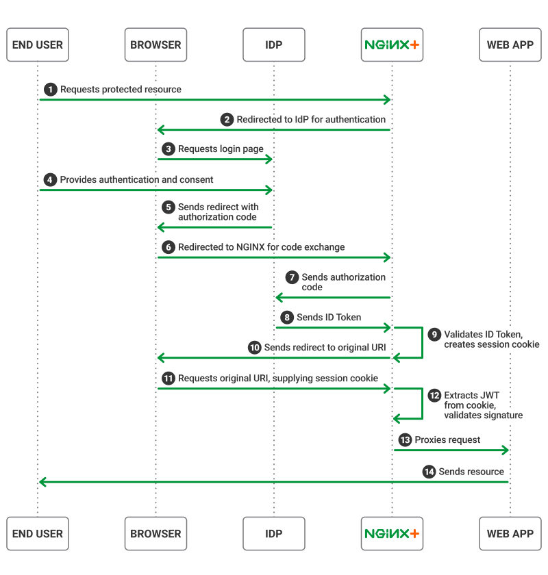

Getting Started
---------------

Please follow the instructions provided by the instructor to start your
lab.

.. NOTE::
	 All work for this lab will be performed exclusively from the udf session. No installation or interaction with your local system is
	 required.

Lab Topology
~~~~~~~~~~~~

The following components have been included in your lab environment:

- 1 x Infa Server Running the below Docker Containers (Ubuntu 20.04)

  - firefox
  - keycloak
  - juiceshop

- 1 x Linux Server (Ubuntu 20.04) running Nginx (nginx/1.21.5 (nginx-plus-r26))

Lab Components
^^^^^^^^^^^^^^

The following table lists IP Addresses, Ports and Credentials for all
components:

Lab Setup
---------
.. list-table::
   :header-rows: 1

   * - **Hostname**
     - **IP-ADDR**
     - **Credentials**
   * - nginx
     - 10.1.1.4
     - ubuntu/ubuntu
   * - infra
     - 10.1.1.5
     - admin/admin
       root/default
   * - container/keycloak
     - 10.1.1.5:8080
     - admin/admin
   * - container/juiceshop
     - 10.1.1.5:3000
     - 
   * - container/firefox
     - 10.1.1.5:5180
     -

High Level View of auth flow for the lab Environment
----------------------------------------------------

.. image:: images/ualab01.svg
  :width: 800
  
This implementation assumes the following environment:

The identity provider (IdP) supports OpenID Connect 1.0
The authorization code flow is in use
NGINX Plus is configured as a relying party
The IdP knows NGINX Plus as a confidential client or a public client using PKCE
With this environment, both the client and NGINX Plus communicate directly with the IdP at different stages during the initial authentication event.

