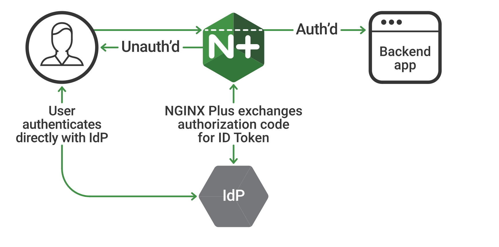
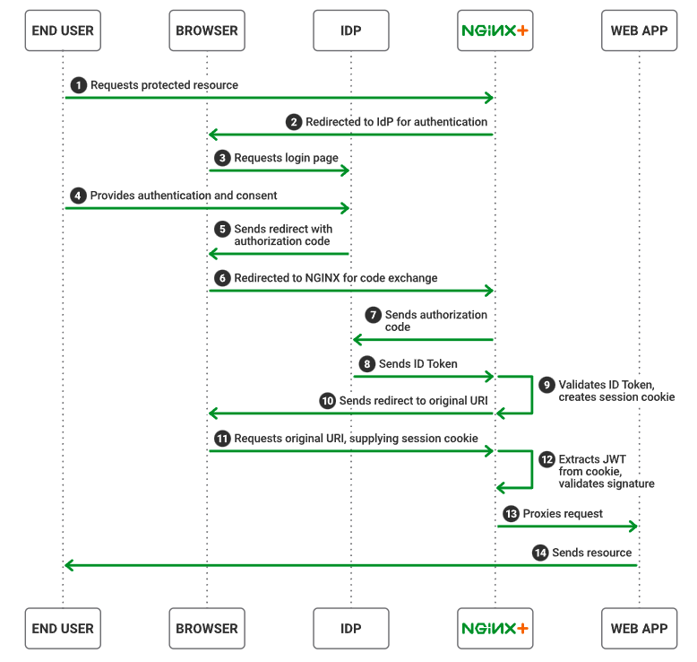

Introduction
------------

Welcome to Access on NGINX Plus - Authentication for Web Access. In this course we will learn the following:

•	How to install the Nginx Plus module njs, required for Authentication Proxy 

•   How to navigate and utilize the Nginx Plus configuration for OIDC authentication use cases 

•   How to configure Keycloak for use with NGINX Plus

•   How to create a synchronized Instance Group of NGINX Plus servers for load balancing

Please follow the instructions provided by the instructor to start your lab.

.. attention:: 
	 All work for this lab will be performed exclusively from the UDF session. No installation and only minimal interaction with your local system is required

Lab Topology
~~~~~~~~~~~~

The following components have been included in your lab environment:

- 1x Infa Server running the below Docker Containers (Ubuntu 22.04)
   - firefox
   - nginxhello (origin server)
- 1x Linux Server (Ubuntu 22.04) running Nginx Instance Manager (2.15.0)
- 3x Linux Servers (Ubuntu 22.04) running NGINX Plus (nginx-plus-r33)
- 1x F5 BIG-IP DNS virtual appliance (v17.1.0.1)

Lab Components
~~~~~~~~~~~~~~

The following table lists IP Addresses, Ports and Credentials for all
components:

Lab Setup
~~~~~~~~~
.. list-table::
   :header-rows: 1

   * - **Hostname**
     - **IP/PORT**
     - **Credentials**
   * - idp.f5lab.com (infra)
     - 10.1.1.4
     - 
   * - container/nginxhello
     - 10.1.1.4:8081
     - 
   * - container/firefox
     - 10.1.1.4:5180
     -
   * - nginx-1
     - 10.1.1.6
     - 
   * - nginx-2
     - 10.1.1.7
     - 
   * - nginx-3
     - 10.1.1.8
     -
   * - bigip.f5lab.com
     - 10.1.1.9:443
     - admin/f5r0x!
   * - nim.f5lab.com
     - 10.1.1.11:443
     - <cached>
  
High-Level View of auth flow for the lab environment
~~~~~~~~~~~~~~~~~~~~~~~~~~~~~~~~~~~~~~~~~~~~~~~~~~~~

  
This implementation assumes the following environment:

* The identity provider (IdP) supports OpenID Connect 1.0
* The authorization code flow is in use
* NGINX Plus is configured as a relying party
* The IdP knows NGINX Plus as a confidential client or a public client using PKCE

With this environment, both the client and NGINX Plus communicate directly with the IdP at different stages during the initial authentication event.

