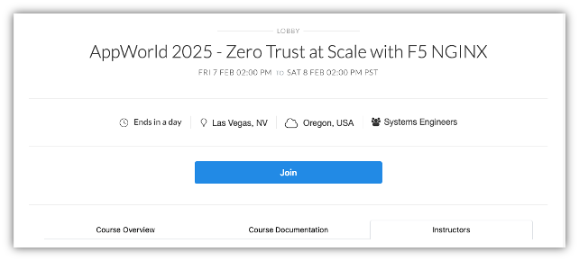
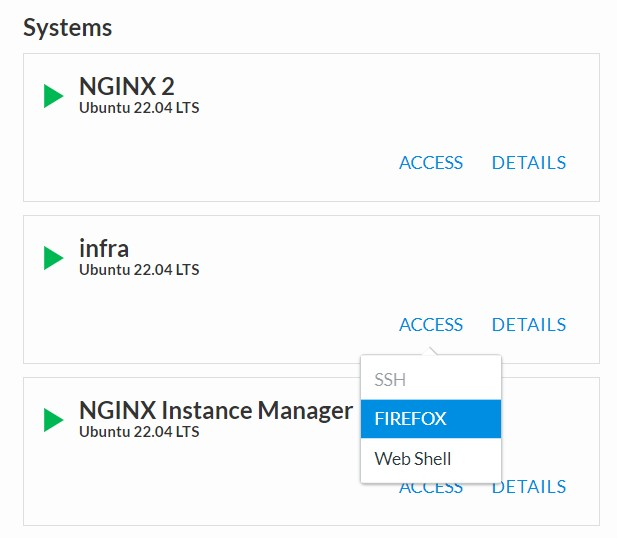

Let's Get Started - Join the UDF Course
=======================================

This lab will go through initial setup to add you the AppWorld 2024 class.  

Follow these steps to complete this lab:

**Exercise 1 - Setting Up Lab Workstation**

1. Open your web browser.

2. Navigate to https://udf.f5.com/courses, or click the direct link to the course in your UDF Course Registration email (see below).

3. Login using your UDF credentials. You should have received an email from: noreply@registration.udf.f5.com.

  
4. If this is your first login to UDF, you will be prompted to change your password. 

5. Review and accept the terms for using UDF.

6. Set up 2-Step Authentication, here using an email address.  Click 'Finish' and then 'Send me the code'.

.. image:: ../images/UDF_Send_Code.jpg
  :width: 300

7. Once you have received and entered the code you can click on 'Invited Users', 'Launch' the session, and you will be directed to the 'Lobby' where you will click 'Join'.

.. image:: ../images/Invited_Users.jpg
  :width: 300

8. The link for the lab guide  can be found in the description box on the Documentation tab: (https://clouddocs.f5.com/training/community/nginx/html/class9/class9.html).

9. Click on the 'Deployment' tab in the top left, and notice your lab environment is spinning up. Once up everything will have green arrow icon. 

**Exercise 2 - Open Web Shell to the Nginx Server and open Firefox browser**

In this exercise, we will connect to Firefox and the first NGINX Plus Server.   

First we will open the Firefox browser.

1. Under the 'Systems' column, locate the 'infra' block. 
    
2. Click 'Access' -> 'Firefox' and this will open a new tab on your local browser. 

.. attention:: 
  If you see a shared memory notification, click 'OK'. Lab resources have been allocated accordingly

3. Next, under the 'Systems' column, locate the 'NGINX 1' block. 
    
4. Click 'Access' -> 'Webshell' and this will open a new tab on your local browser. 

**You are now ready to start the lab!**