Installing Prerequisites:
=========================

This exercise will cover installing the Nginx JavaScript Module (njs) which is required for handling the interaction between NGINX Plus and the OpenID Connect provider (IdP). 

Install Nginx+ njs module
~~~~~~~~~~~~~~~~~~~~~~~~~

1. First step you'll need to access the Nginx Instance and locate the webshell option on the udf under the system nginx

   .. image:: ../images/9webshell.png
      :align: left
 
2. Copy and paste below command into nginx webshell

   .. code:: shell

      sudo apt install nginx-plus-module-njs

   **screenshot of expected output**

   .. image:: ../images/ualab03.png
      :align: left

3. verify modules are loaded into nginx with the below command.

   .. code:: shell
       
      sudo ls /etc/nginx/modules

   **screenshot of expected output**

   .. image:: ../images/ualab04.png
     :align: left
     :width: 800

4. now you will need to load the module in the nginx.conf 

The following directive needs to be included in the top-level (“main”) configuration context in /etc/nginx/nginx.conf, to load the NGINX JavaScript module:

**copy and run below command on the nginx server to open the nano editor and select the main nginx configuration file**

.. code:: shell
    
   nano /etc/nginx/nginx.conf

**below is the line of code that needs to be copied into /etc/nginx/nginx.conf file**

.. code:: shell
      
   load_module modules/ngx_http_js_module.so;

**screenshot of where to place line of code**

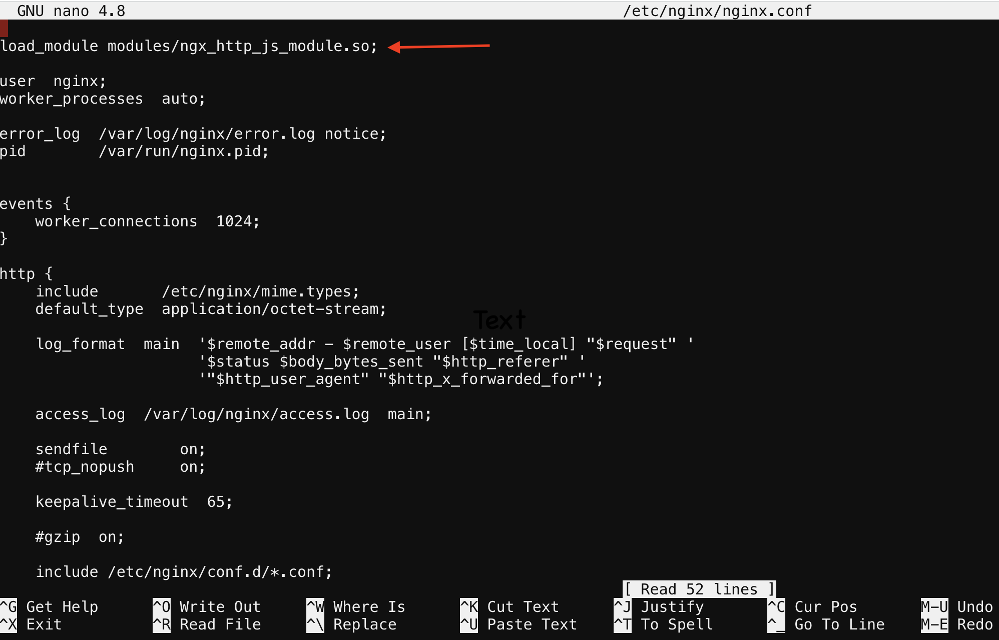

**save and exit file**

.. note:: 
   To quit nano, use the Ctrl+X key combination. If the file you are working on has been modified since the last time you saved it, you will be prompted to save the file first. Type y to save the file then press enter to confirm.

5. Verify nginx config is good and reload
     
**verify configuration is good**
     
.. code:: shell

   nginx -t

**reload the nginx config**

.. code:: shell
      
   nginx -s reload

Create a clone of the nginx-openid-connect GitHub repository
~~~~~~~~~~~~~~~~~~~~~~~~~~~~~~~~~~~~~~~~~~~~~~~~~~~~~~~~~~~~
.. attention:: 
   There is a branch for each NGINX Plus release. Switch to the correct branch to ensure compatibility with the features and syntax of each release. The main branch works with the most recent NGINX Plus and JavaScript module releases.

1. Verify version of nginx

.. code:: shell
        
   nginx -v

.. image:: ../images/ualab_nginxv.png

2. Now that we have the version number we are ready to clone the branch in github. Clone the branch in your home directory with the command 
below.

.. code:: shell
        
   cd /home/ubuntu && git clone --branch R28 https://github.com/nginxinc/nginx-openid-connect.git

3. Verify the clone has completed by running the follow command.

.. code:: shell

   ls | grep nginx-openid-connect
		
**screenshot of output**
	
.. image:: ../images/ualab_verifyclone.png
	

Configuring the IdP Keycloak:
=============================
   
.. note:: 
   These next steps will guide you through creating a keycloak client for NGINX Plus in the Keycloak GUI

1. Connect to firefox container via udf connection methods
   
   .. image:: ../images/ualab06.png

2. Login to keycloak

url:
http://idp.f5lab.com:8080

3. Click on Administration Console

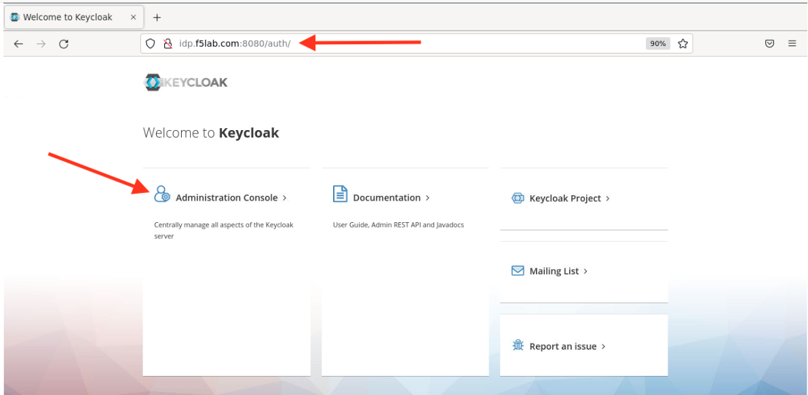

4. Now enter credentials provided and sign in.

.. note:: 
	Username: admin
	
	Password: admin

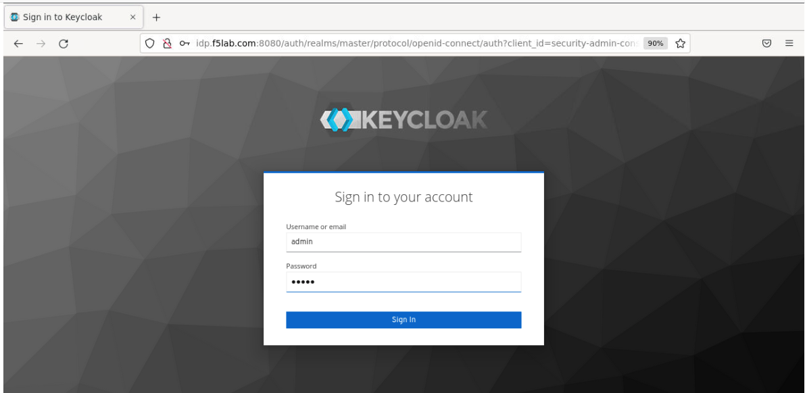
   
Create a Keycloak client for NGINX Plus in the Keycloak GUI:
~~~~~~~~~~~~~~~~~~~~~~~~~~~~~~~~~~~~~~~~~~~~~~~~~~~~~~~~~~~~
1. In the left navigation column, click Clients. 

.. image:: ../images/keycloak_click_clients.png
		
2. On the Clients page that opens, click the Create button in the upper right corner.
		
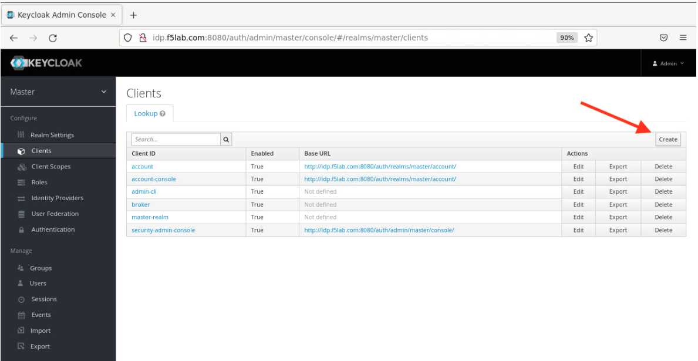
				
3. On the Add Client page that opens enter the below values then click the  Save  button.

**Client ID – agility2023**

**Client Protocol – openid-connect.**

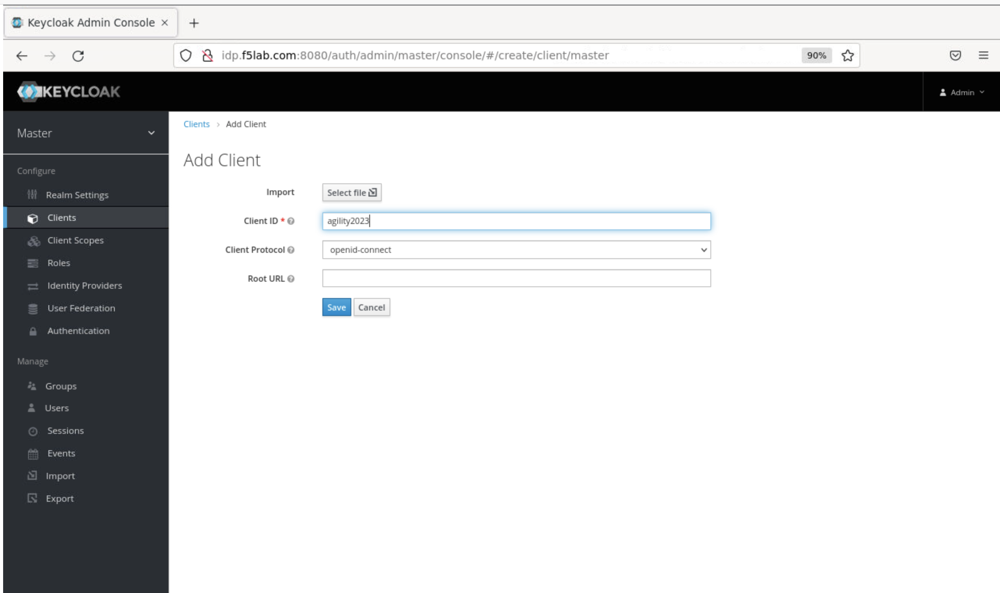

4. On the Agility2023 clients page that opens, enter or select these values on the Settings tab:

Client ID - agility2023
		
Access Type – confidential

Valid Redirect URIs - http://nginxdemo.f5lab.com:8010/_codexch

.. image:: ../images/ualab09.png

.. note::
	For production, we strongly recommend that you use **SSL/TLS (port 443)**. The port number is **mandatory** even when you’re using the default port for HTTP (80) or HTTPS (443). 
	Valid Redirect URIs – The URI of the NGINX Plus instance, including the port number, and ending in /_codexch

5. Click the Credentials tab and make a note of the value in the Secret field. You will copy it into the NGINX Plus configuration file.

.. image:: ../images/client_secret.png
	
6. While still under the Agility2023 Clients Page Click the Roles tab, then click the Add Role button in the upper right corner of the page that 
opens.

.. image:: ../images/keycloak_click_role.png
	
7. On the Add Role page that opens, type a value in the Role Name field (here it is nginx-keycloak-role) and click the  Save  button.

.. image:: ../images/keycloak_save_role.png
	
Creating a user in keycloak
~~~~~~~~~~~~~~~~~~~~~~~~~~~

1. In the left navigation column, click Users. On the Users page that opens, then click the Add user button in the upper right corner to create a new user.

.. image:: ../images/keycloak_add_user.png
	
2. Once create user is completed now click on the Credentials Tab at the top of the screen. 

3. Enter New Password agility2023 and confirm

4. Toggle Temporary to OFF

.. image:: ../images/keycloak_cred.png
	
5. On the management page for the user (here, user01), click the Role Mappings tab. On the page that opens, select agility2023 on the Client 
Roles drop‑down menu. Click nginx-keycloak-role in the Available Roles box, then click the Add selected button below the box. The role then appears in the Assigned Roles and Effective Roles boxes, as shown in the screenshot.

.. image:: ../images/keycloak_role_mappings.png

Configure NGINX Plus as the OpenID Connect relying party
========================================================

1. Now go back to the Nginx Web Shell connection you have open. You are going to run a configuration script.

Please copy and paste the below command into the webshell  **DON'T FORGET TO REPLACE THE CLIENT SECRET FOR THE CODE BELOW**

.. code:: shell

	./nginx-openid-connect/configure.sh -h nginxdemo.f5lab.com -k request -i agility2023 -s YOURCLIENTSECRET -x 
http://idp.f5lab.com:8080/auth/realms/master/.well-known/openid-configuration

Output:

.. image:: ../images/nginx_config_script.png
	:width: 800

.. note:: Information on switches being used in script

	 echo " -h | --host <server_name>           # Configure for specific host (server FQDN)"
    
	 echo " -k | --auth_jwt_key <file|request>  # Use auth_jwt_key_file (default) or auth_jwt_key_request"
    
	 echo " -i | --client_id <id>               # Client ID as obtained from OpenID Connect Provider"
	 
	 echo " -s | --client_secret <secret>       # Client secret as obtained from OpenID Connect Provider"
    
	 echo " -p | --pkce_enable                  # Enable PKCE for this client"
    
	 echo " -x | --insecure                     # Do not verify IdP's SSL certificate"

2. Change Directory

.. code:: shell
	
	cd /nginx-openid-connect/

3. Now that you are in the nginx-openid-connect directory copy the below files.

frontend.conf  openid_connect.js  openid_connect.server_conf  openid_connect_configuration.conf

.. code:: shell

	cp frontend.conf openid_connect.js openid_connect.server_conf openid_connect_configuration.conf /etc/nginx/conf.d/

4. After copying files change directory to /etc/nginx/conf.d/

.. code:: shell 

	cd /etc/nginx/conf.d/

5. Using Nano edit the frontend.conf file

.. code:: shell

	nano frontend.conf

6. Update the server to 10.1.1.4:8081

.. image:: ../images/frontend_conf.png
	
**save file and close**

7. Using Nano edit the openid_connect.server_conf file

.. code:: shell

	nano openid_connect.server_conf

8. Update the resolver to use local host file. 

.. image:: ../images/host_lookup.png

**save and close file**

.. note:: 

	using host file because this is a lab make sure to put in LDNS server for resolver.

9. Using Nano edit the openid_connect_configuration.conf

.. code:: shell

	nano openid_connect_configuration.conf

10. modify secret from 0 to "yourclientsecret"

.. image:: ../images/save_secret.png

**save and close file**

11. Reload Nginx

.. code:: shell

	nginx -s reload

Testing the config
==================

Now that everything is done lets test the config!

1. Clear recent history and cookies from the browser.

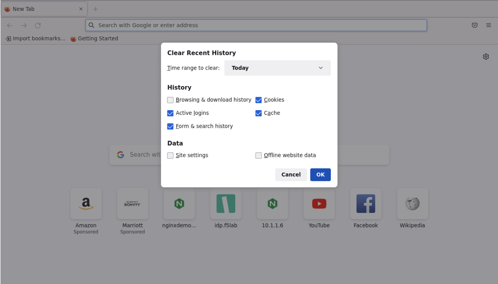

2. Go back to firefox and open a new tab and put http://nginxdemo.f5lab.com:8010 into the browser url field and launch the page.

.. image:: ../images/test_oidc.png

Notice you'll be redirected to the IdP for login. 

3. Once on the IdP page put in the credentials for the user you created. user01 with password agility2023

.. image:: ../images/auth_login.png

You should now see the webservice!!!!!! You've been logged in and the browser has been issued a JWT Token establishing identity!

.. image:: ../images/verificaion_webservice.png

Manage NGINX Plus with Instance Manager
=======================================

The OIDC authentication is working correctly. Now we will manage our NGINX Plus deployment with Instance Manager

1. Open a new tab in Firefox and put https://10.1.1.6 into the browser url field and launch the page.   

.. image:: ../images/nms_login.png

2. Sign into Instance Manager as admin. The username/password are saved in the browser so the fields should autopopulate.

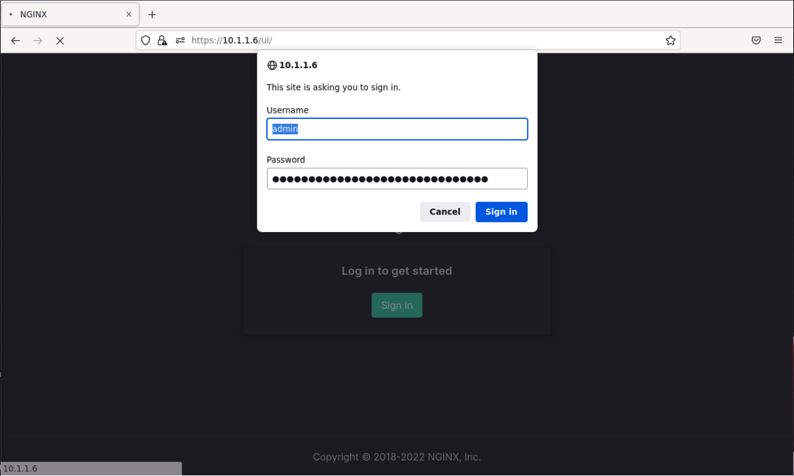

3. Once you are signed in, click on the instance manager module.

.. image:: ../images/nms_modules.png

4. Once directed to main console page of NGINX Instance Manager, you will see the instructions on how to add NGINX instances to Instance Manager.

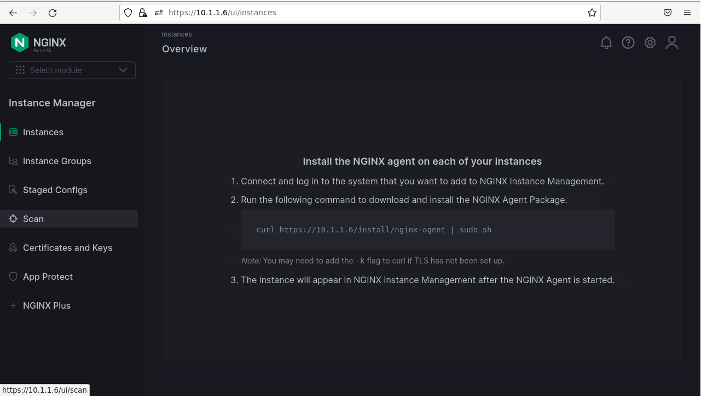

5. Copy and run the below command on the nginx server to install the agent

.. code:: shell

	curl -k https://10.1.1.6/install/nginx-agent | sudo sh

6. Once the installation is complete, start the nginx agent

.. code:: shell

	sudo systemctl start nginx-agent

7. Now let's revisit the instance manager console and refresh the page. We should see the instance under the 'Instances' tab. 

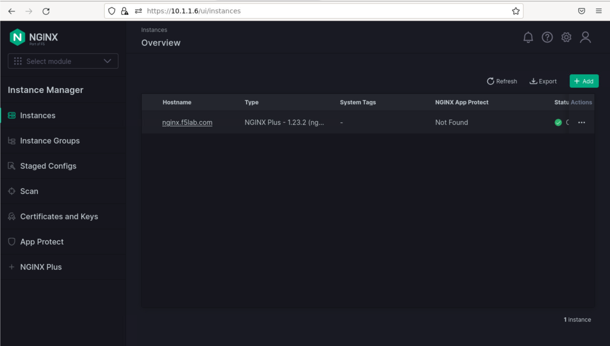

8. Clicking on the instance will show installation details and metrics

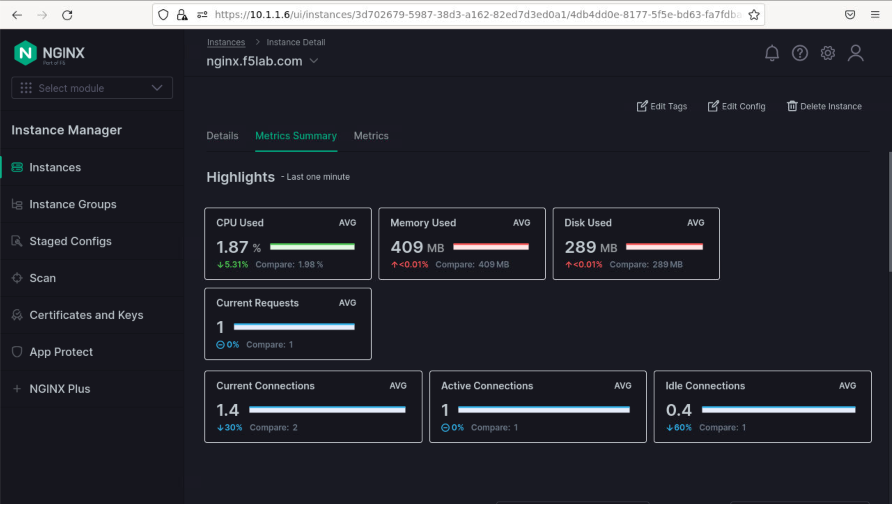

9. Now we can click on the Edit Config button to view and apply config changes to our NGINX Plus authenticator. We will update the frontend.conf config file to leverage JWT claims for Logging and Rate Limiting. First we will extend the logging format with two additional fields, $jwt_header_alg and $jwt_claim_aud. Then we will publish the config to the nginx instance.

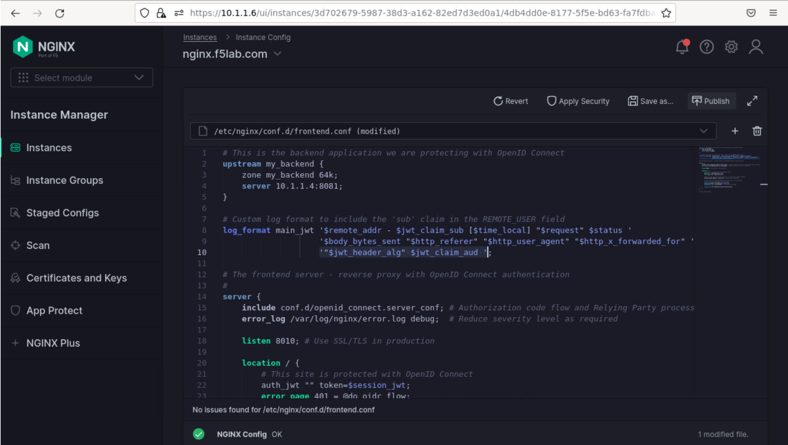

10. You should receive a green notification banner confirming the config publication was successful 

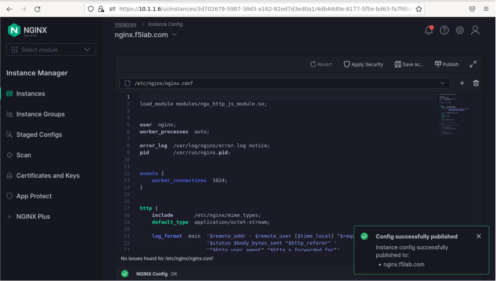

11. Now we can switch tabs and log back into our nginx backend application and hit the refresh button a few times

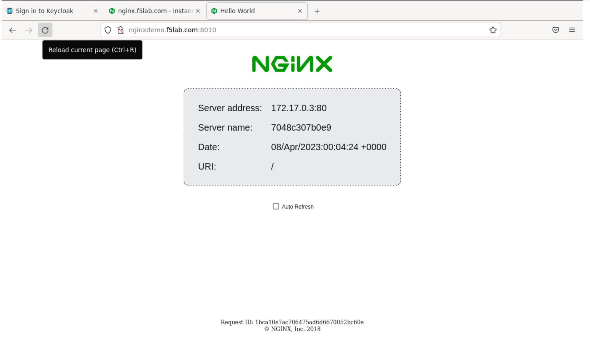

12. Now we if we check to see nginx log files, we will see new log entries including the two aditional fields added in the configuration. You should see RS256 and agility2023 as the signature algorithm and audience claim respectively.  

.. code:: shell

	tail -n 30 /var/log/nginx/access.log

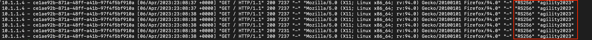

13. Next we will update the frontend.conf file to add rate limiting based on the audience JWT claim presented by the user. First we define the rate limit in the http context with the following line

.. code:: shell

	limit_req_zone $jwt_claim_aud zone=10rpm_per_aud:1m rate=10r/m;

And then we instantiate the rate limit in the location block where nginx will serve the authenticated users with the following lines 

.. code:: shell

	limit_req zone=10rpm_per_aud;

We will include both lines in the Instance Manager config manager console as such and publish the configuration

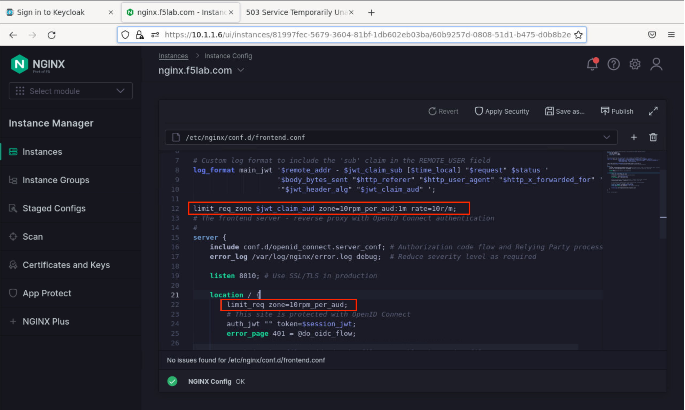

14. Once the config is successfully published, switch to the firefox browser and refresh the nginx application a few times. You should get 503 response pages triggered when you surpass the rate limit of 10 requests per minute.  

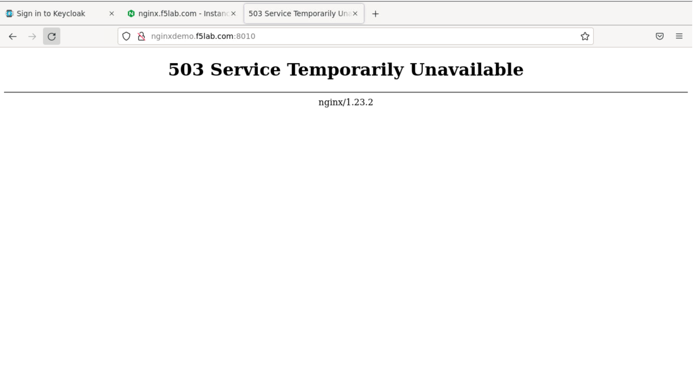

	
 

