Installing Prerequisites:
========================

This exercise will cover installing the Nginx JavaScript Module (njs) which is required for handling the interaction between NGINX Plus and the OpenID Connect provider (IdP). 

Install Nginx+ njs module
-------------------------

#. First step you'll need to access the Nginx Instance and locate the webshell option on the udf under the system nginx

  .. image:: ../images/9webshell.png
    :width: 800

 
#. Copy and paste below command into nginx webshell

   .. code:: shell

      sudo apt install nginx-plus-module-njs

   **screenshot of expected output**

      .. image:: ../images/ualab03.png
         :align: left
         :width: 800

#. verify modules are loaded into nginx with the below command.

   .. code:: shell
       
      sudo ls /etc/nginx/modules

   **screenshot of expected output**

   .. image:: ../images/ualab04.png
     :align: left
     :width: 800

#. now you will need to load the module in the nginx.conf 

  The following directive needs to be included in the top-level (“main”) configuration context in /etc/nginx/nginx.conf, to load the NGINX JavaScript module:

  **copy and run below command on the nginx server to open the nano editor and select the main nginx configuration file**

  .. code:: shell
    
    nano /etc/nginx/nginx.conf

  **below is the line of code that needs to be copied into /etc/nginx/nginx.conf file**

   .. code:: shell
      
      load_module modules/ngx_http_js_module.so;

   **screenshot of where to place line of code**

   .. image:: ../images/ualab05.png
      :width: 800

   **save and exit file**

   .. note:: 
      To quit nano, use the Ctrl+X key combination. If the file you are working on has been modified since the last time you saved it, you will be prompted to save the file first. Type y to save the file then press enter to confirm.

#. Verify nginx config is good and reload
     
    **verify configuration is good**
     
    .. code:: shell
       
      nginx -t

    **reload the nginx config**

    .. code:: shell
      
      nginx -s reload

Create a clone of the nginx-openid-connect GitHub repository
~~~~~~~~~~~~~~~~~~~~~~~~~~~~~~~~~~~~~~~~~~~~~~~~~~~~~~~~~~~~

**Note:** There is a branch for each NGINX Plus release. Switch to the correct branch to ensure compatibility with the features and syntax of each release. The main branch works with the most recent NGINX Plus and JavaScript module releases.

#. Verify version of nginx

    .. code:: shell
        
        nginx -v

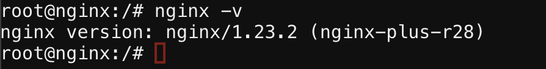

#. Now that we have the version number we are ready to clone the branch in github. Clone the branch with the command below.

    .. code:: shell
        
        git clone --branch R26 https://github.com/nginxinc/nginx-openid-connect.git

#. Verify the clone has completed by running the follow command.

	.. code:: shell

		ls | grep nginx-openid-connect
		
**screenshot of output**
	
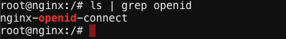

Configuring the IdP Keycloak:
============================
   
.. note:: 
   These next steps will guide you through creating a keycloak client for NGINX Plus in the Keycloak GUI

#. Connect to firefox container via udf connection methods
   
   .. image:: ../images/ualab06.png
      :align: left
      :width: 800 

#. Login to keycloak

url:
http://idp.f5labs.com:8080

	
Click on Administration Console

	.. image:: ../images/keycloak_admin_page.png
		:width: 800

Now enter credentials provided and sign in.

.. note:: 
	Username: admin
	
	Password: admin

   .. image:: ../images/ualab07.png
      :align: left
      :width: 800

Create a Keycloak client for NGINX Plus in the Keycloak GUI:
~~~~~~~~~~~~~~~~~~~~~~~~~~~~~~~~~~~~~~~~~~~~~~~~~~~~~~~~~~~
In the left navigation column, click Clients. On the Clients page that opens, click the Create button in the upper right corner.

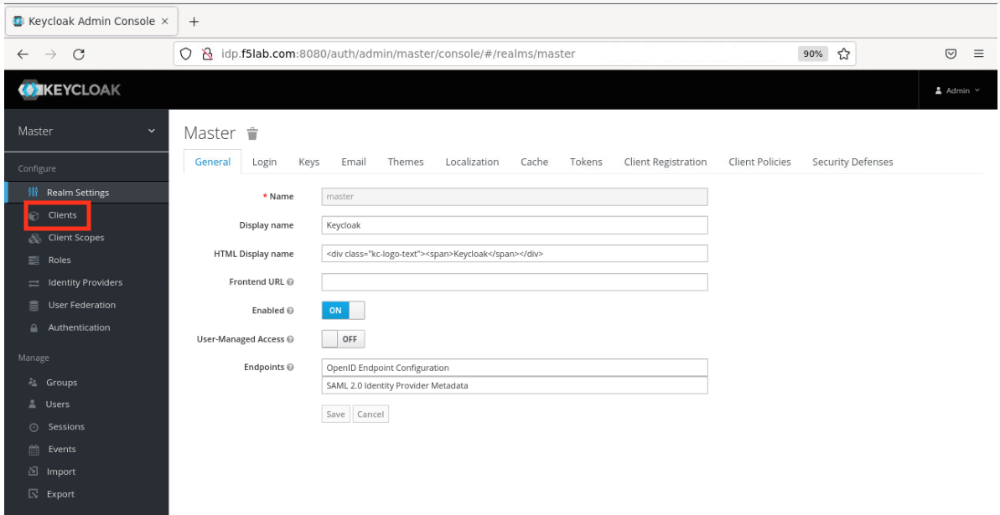

		
On the Add Client page that opens
		
	.. image:: ../images/keycloak_click_create.png
		:width: 800
		
		
		
Enter the below values then click the  Save  button.

**Client ID – agility2022**

**Client Protocol – openid-connect.**

   .. image:: ../images/ualab08.png
      :width: 800

  2) On the Agility2022 clients page that opens, enter or select these values on the Settings tab:

Client ID - agility2022
		
Access Type – confidential

Valid Redirect URIs - http://nginxdemo.f5lab.com:8010/_codexch

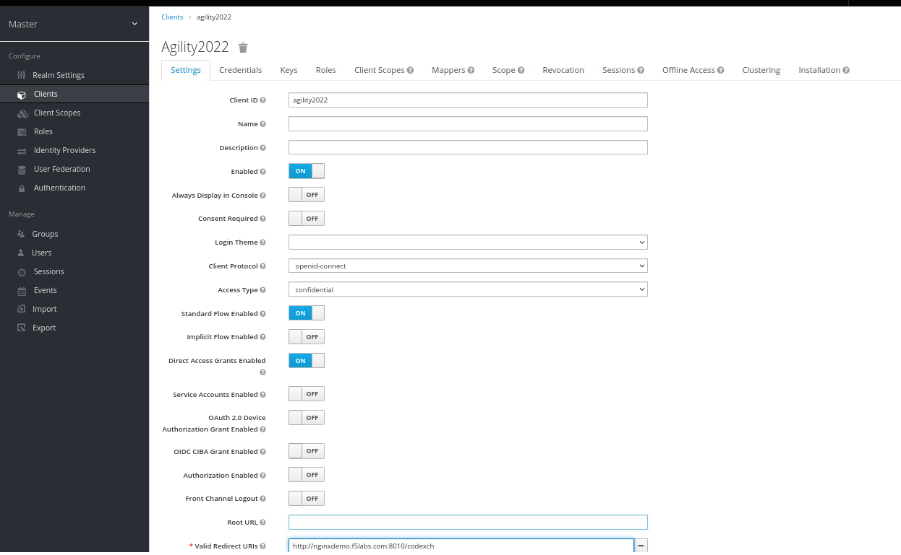

.. note::
	For production, we strongly recommend that you use SSL/TLS (port 443).*
   *The port number is mandatory even when you’re using the default port for HTTP (80) or HTTPS (443).*

	Valid Redirect URIs – The URI of the NGINX Plus instance, including the port number, and ending in /_codexch

Click the Credentials tab and make a note of the value in the Secret field. You will copy it into the NGINX Plus configuration file.

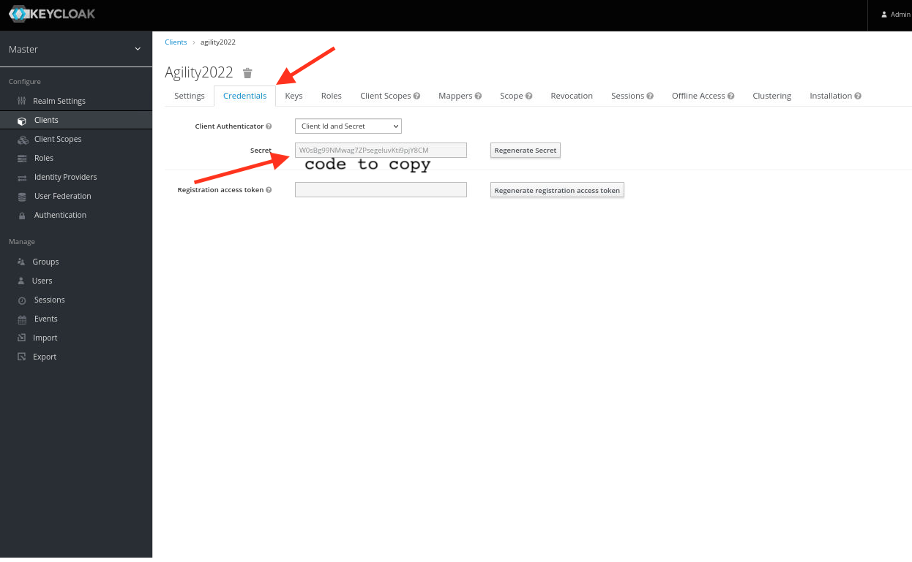

While still under the Agility2022 Clients Page Click the Roles tab, then click the Add Role button in the upper right corner of the page that opens.

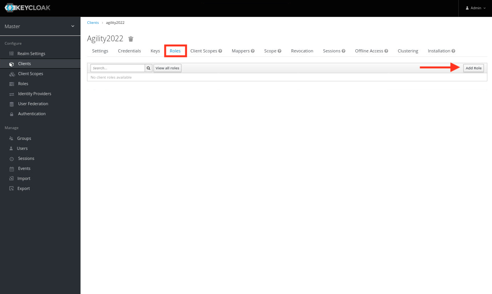

On the Add Role page that opens, type a value in the Role Name field (here it is nginx-keycloak-role) and click the  Save  button.

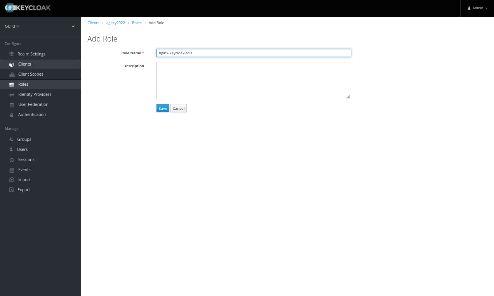

In the left navigation column, click Users. On the Users page that opens, then click the Add user button in the upper right corner to create a new user.

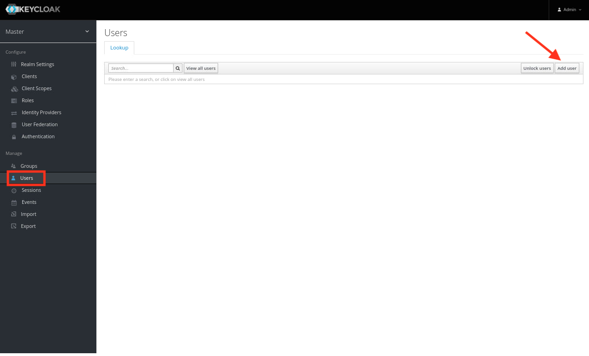

Once create user is completed now click on the Credentials Tab at the top of the screen. 

Enter New Password agility2022 and confirm

Toggle Temporary to OFF

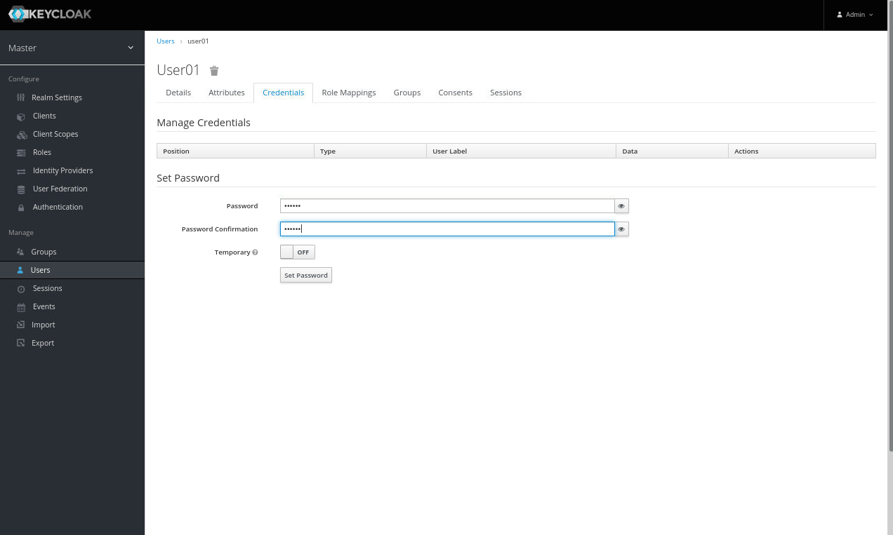
	

On the management page for the user (here, user01), click the Role Mappings tab. On the page that opens, select agility2022 on the Client Roles drop‑down menu. Click nginx-keycloak-role in the Available Roles box, then click the Add selected button below the box. The role then appears in the Assigned Roles and Effective Roles boxes, as shown in the screenshot.

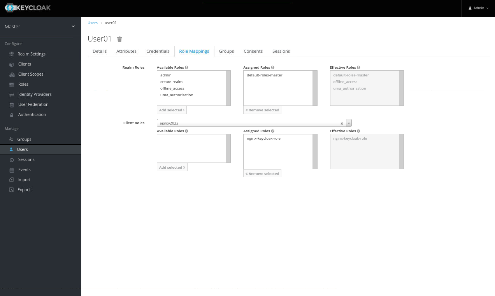

Configure NGINX Plus as the OpenID Connect relying party
========================================================

Now go back to the Nginx Web Shell connection you have open. You are going to run a configuration script.

Please copy and paste the below command into the webshell

.. code:: shell

	./nginx-openid-connect/configure.sh -h nginxdemo.f5lab.com:8010 -k request -i agility2022 -s W0sBg99NMwag7ZPsegeluvKti9pjY8CM -x http://idp.f5lab.com:8080/auth/realms/master/.well-known/openid-configuration

Output:

.. image:: ../images/nginx_config_script.png
	:width: 800

.. note:: Information on switches being used in script

	 echo " -h | --host <server_name>           # Configure for specific host (server FQDN)"
    
	 echo " -k | --auth_jwt_key <file|request>  # Use auth_jwt_key_file (default) or auth_jwt_key_request"
    
	 echo " -i | --client_id <id>               # Client ID as obtained from OpenID Connect Provider"
	 
	 echo " -s | --client_secret <secret>       # Client secret as obtained from OpenID Connect Provider"
    
	 echo " -p | --pkce_enable                  # Enable PKCE for this client"
    
	 echo " -x | --insecure                     # Do not verify IdP's SSL certificate"

Change Directory

.. code:: shell
	
	cd /nginx-openid-connect/

Now that you are in the nginx-openid-connect directory copy the below files.

frontend.conf  openid_connect.js  openid_connect.server_conf  openid_connect_configuration.conf

.. code:: shell

	cp frontend.conf openid_connect.js openid_connect.server_conf openid_connect_configuration.conf /etc/nginx/conf.d/

After copying files change directory to /etc/nginx/conf.d/

.. code:: shell 

	cd /etc/nginx/cond.d/

Using Nano edit the frontend.conf file

.. code:: shell

	nano frontend.conf

Update the server to 10.1.1.4:8081

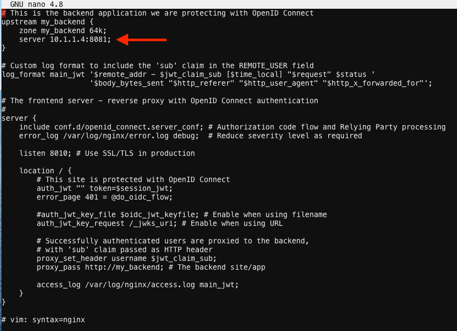

**save file and close**

Using Nano edit the openid_connect.server_conf file

.. code:: shell

	nano openid_connect.server_conf

Update the resolver to use local host file. 

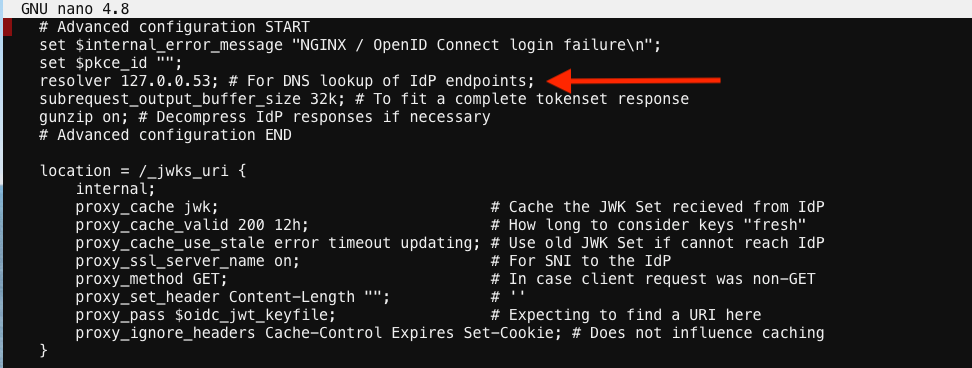

**save and close file**

.. note:: 

	using host file because this is a lab make sure to put in LDNS server for resolver.

Using Nano edit the openid_connect_configuration.conf

.. code:: shell

	nano openid_connect_configuration.conf

modify secret from 0 to "yourclientsecret"

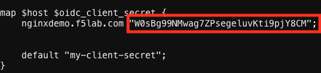

**save and close file**

Reload Nginx

.. code:: shell

	nginx -s reload

Testing the config
==================

Now that everything is done lets test the config!

Go back to firefox and open a new tab and put http://nginxdemo.f5lab.com:8010 into the browser url field and launch the page.

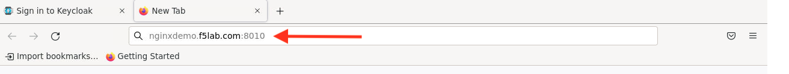

Notice you'll be redirected to the IdP for login. 

Once on the IdP page put in the credentials for the user you created. user01 with password agility2022

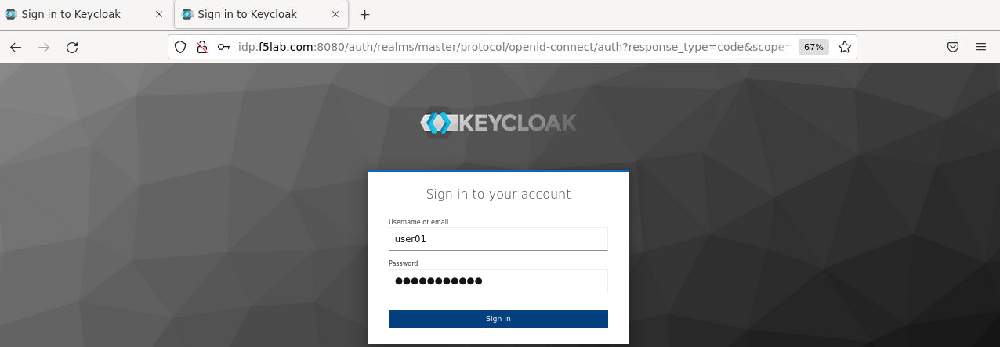

You should now see the webservice!!!!!! You've been logged in and the browser has been issued a JWT Token establishing identity!

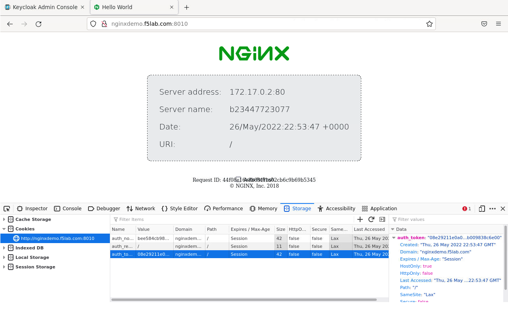

	
	

