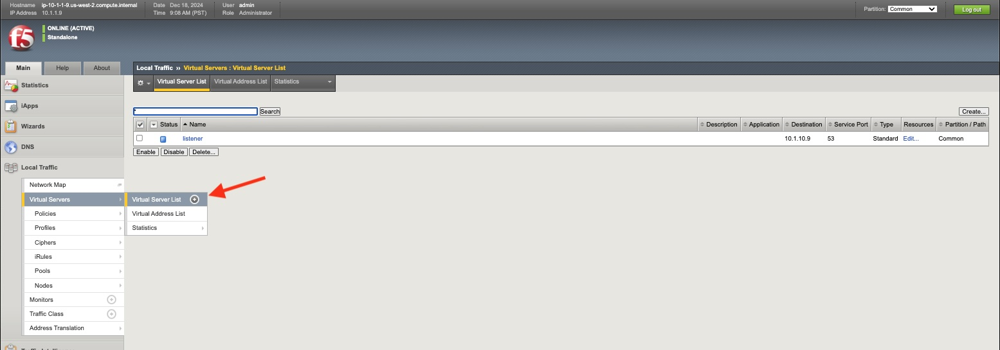
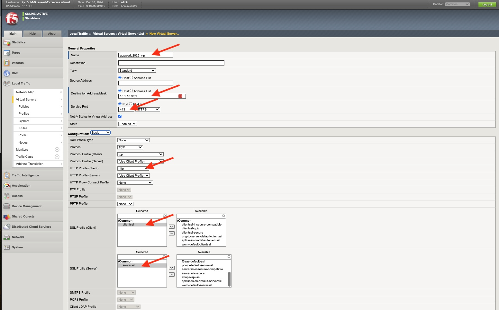
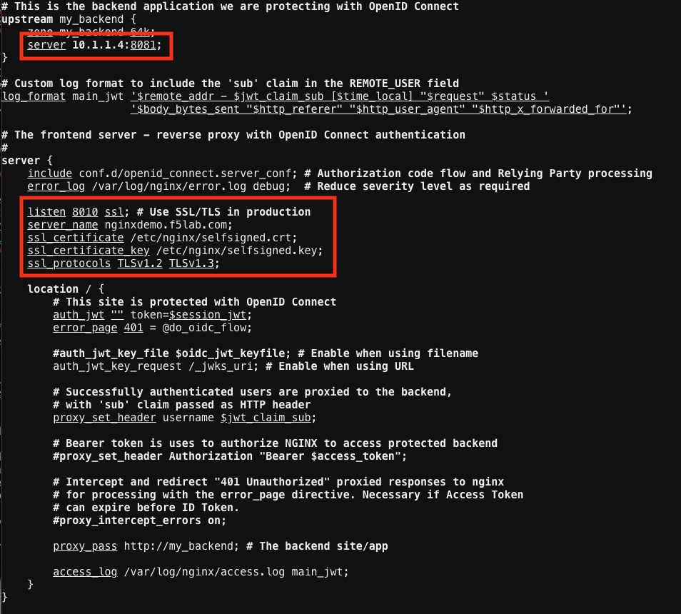

Installing Prerequisites:
=========================

This exercise will cover installing the Nginx JavaScript Module (njs) 
which is required for handling the interaction between NGINX Plus and the 
OpenID Connect identity provider (IdP). 

Install NGINX Plus njs module
~~~~~~~~~~~~~~~~~~~~~~~~~~~~~

1. Copy and paste below command into the NGINX 1 webshell (Use 
Ctrl/Shift+V to paste).

   .. code:: shell

      sudo apt install nginx-plus-module-njs

.. note:: 
   The njs module has already been installed on NGINX 2 and NGINX 3 for 
this lab exercise

   **screenshot of expected output**

   .. image:: ../images/ualab03.png
      :align: left

2. Verify that the modules are loaded into NGINX Plus with the below 
command (Use Ctrl/Shift+V to paste again).  

   .. code:: shell
       
      sudo ls /etc/nginx/modules

   **screenshot of expected output**

   .. image:: ../images/ualab04.png
     :align: left
     :width: 800

3. Now you will need to load the module into nginx.conf. 

The following directive needs to be included in the top-level (“main”) 
configuration context in /etc/nginx/nginx.conf, to load the NGINX 
JavaScript module.

**Copy and run below command on the NGINX 1 server to open the nano editor 
and select the main nginx configuration file**

.. code:: shell
    
   nano /etc/nginx/nginx.conf

**Below is the line of code that needs to be copied into 
/etc/nginx/nginx.conf file**

.. code:: shell
      
   load_module modules/ngx_http_js_module.so;

**screenshot of where to place line of code**

.. image:: ../images/ualab05.png

.. note:: 
   To quit nano, use the Ctrl+X key combination. If the file you are 
working on has been modified since the last time you saved it, you will be 
prompted to save the file first. Type 'y' to save the file then press 
enter to confirm

**Save and exit the file**

4. Verify nginx config is good and reload.
     
**verify configuration is good**
     
.. code:: shell

   nginx -t

**reload the nginx config**

.. code:: shell
      
   nginx -s reload

Create a clone of the nginx-openid-connect GitHub repository
~~~~~~~~~~~~~~~~~~~~~~~~~~~~~~~~~~~~~~~~~~~~~~~~~~~~~~~~~~~~

5. Clone the branch in your home directory with the command below.

.. code:: shell
        
   cd /home/ubuntu && git clone 
https://github.com/nginxinc/nginx-openid-connect.git

6. Verify the clone has completed by running the following command.  

.. code:: shell

   ls | grep nginx-openid-connect
		
**screenshot of output**
	
.. image:: ../images/OPENID_Connect_verify.jpg
   :width: 400 

Creating self-signed certificates to be used by Nginx Plus
~~~~~~~~~~~~~~~~~~~~~~~~~~~~~~~~~~~~~~~~~~~~~~~~~~~~~~~~~~

7. Use the openssl command below to create the certificate and key

.. code:: shell 

	openssl req -x509 -nodes -days 365 -newkey rsa:2048 -keyout 
/etc/nginx/selfsigned.key -out /etc/nginx/selfsigned.crt -subj 
"/C=US/ST=WA/L=Seattle/O=F5/OU=Appworld2025/CN=nginxdemo.f5lab.com"

**screenshot of output**

.. attention::
   
   **Please do not close the UDF Shell browser tab!**	

Configuring the BIG-IP APM as an Authorization Server
=====================================================
.. note::
   These next steps will guide you through creating a BIG-IP APM 
configuration to support Nginx Plus as a client.

   You will be using the BIG-IP that you previously opened in the browser.

   For all objects keep default configurations except what is specified in 
this guide. 
   

1. Open your browser tab with the BIG-IP GUI from the 'Getting Started' 
lab section and sign in using the BIG-IP username and password

**Username: admin**

**Password: f5r0x!**

2. You should be logged into the BIG-IP now, we start with the Access > 
Federation > OAuth Authorization Server section

   
Create scopes for the Oauth/OIDC communication
~~~~~~~~~~~~~~~~~~~~~~~~~~~~~~~~~~~~~~~~~~~~~~
.. note::
   You will be creating two scopes: profile and email

3. Navigate to Access > Federation > OAuth Authorization Server > Scope > 
click the + button or click create

4. Configure the profile scope as follows, click **repeat** when finished

**Name: appworld2025_profile_scope**

**Scope Name: profile**

**Caption: profile**

**Click Repeat**

5. After clicking repeat above (or click create again), enter in the 
information for the email scope. Be sure to update all the fields below:

**Name: appworld2025_email_scope**

**Scope Name: email**

**Caption: email**

**Click Finished**

6. Click Finished at the bottom of the screen

Create claims for the Oauth/OIDC communication
~~~~~~~~~~~~~~~~~~~~~~~~~~~~~~~~~~~~~~~~~~~~~~
.. note::
   You will be creating two claims: profile and email

7. Navigate to Access > Federation > OAuth Authorization Server > Claim > 
click the + button or click create

8. Configure the profile claim as follows

**Name: appworld2025_profile_claim**

**Claim Name: profile**

**Claim Value: User profile information here**

**Click Save**

9. Click Save at the bottom of the screen

10. After clicking save above, click create in the top right of GUI, then 
repeat step 9 and 10 and use the values below
.. note::
   See the Claim Value below, this will automatically populate the email 
address of the user

**Name: appworld2025_email_claim**

**Claim Name: email**

**Claim Value: %{session.logon.last.logonname}@appworld2025.com**

**Click Save**

11. Click Save at the bottom of the screen

Create the client application which is NGINX Plus in this lab
~~~~~~~~~~~~~~~~~~~~~~~~~~~~~~~~~~~~~~~~~~~~~~~~~~~~~~~~~~~~~
.. note::
   This will create a client ID and client secret that will be used in the 
Nginx Plus configuration 

12. Navigate to Access > Federation > OAuth Authorization Server > Client 
Application > click the + button or click create

13. Configure the client application as follows, click Finished when done

**Name: appworld2025_client_app**

**Application Name: appworld2025 Application**

**Grant Type: Authorization Code/Hybrid**

**Redirect URI(s): https://nginxdemo.f5lab.com:8010/_codexch** *BE SURE TO 
CLICK ADD

**Support OpenID Connect: Enabled Yes**

**Scopes: move both scopes previously created - appworld2025_email_scope & 
appworld2025_profile_scope**

**Click Finished**

14. Click Finished at the bottom of the screen

Create the JSON Web Token(JWT) Key configuration for the Oauth/OIDC 
communication
~~~~~~~~~~~~~~~~~~~~~~~~~~~~~~~~~~~~~~~~~~~~~~~~~~~~~~~~~~~~~~~~~~~~~~~~~~~~~~~~~

15. Navigate to Access > Federation > JSON Web Token > Key Configuration > 
click the + button or click create

16. Configure the Key Configurations as follows, click Save when finished

**Name: appworld2025_jwt_key**

**ID: 1021**

**Type: RSA**

**Signing Algorithm: RS256**

**Certificate File: default.crt**

**Certificate Key: default.key**

**Click Save**

17. Click Save at the bottom of the screen

Create the OAuth profile for the Oauth/OIDC communication
~~~~~~~~~~~~~~~~~~~~~~~~~~~~~~~~~~~~~~~~~~~~~~~~~~~~~~~~~

18. Navigate to Access > Federation > OAuth Authorization Server > OAuth 
Profile > click the + button or click create

19. Configure the OAuth profile as follows, click Save when finished

**Name: appworld2025_oauth_profile**

**Client Application: appworld2025_client_app**

**Click the Custom box on the right hand side of the screen**

**Support Opaque Token: Remove the check box selection**

**Support JWT Token: Select the check box**

**Support OpenID Connect: Select the check box**

**Issuer: https://10.1.10.9**

**JWT Primary Key: Select appworld2025_jwt_key**

**ID Token Primary Key: Select appworld2025_jwt_key**

**JWT Claims: Select both appworld2025_email_claim & 
appworld2025_profile_claim**

**ID Token Claims: Select both appworld2025_email_claim & 
appworld2025_profile_claim**

**JWT Refresh Token Encryption Secret: f5r0x!**

**Click Finished**

20. Click Finished at the bottom of the screen

Create Local User database for the Oauth/OIDC communication
~~~~~~~~~~~~~~~~~~~~~~~~~~~~~~~~~~~~~~~~~~~~~~~~~~~~~~~~~~~

21. Navigate to Access > Authentication > Local User DB > Instances > 
click the + button or click Create New Instance

22. Configure the User database as follows, click Ok when finished

**Name: appworld2025**

**Click OK**

23. Click Ok at the bottom of the screen

Create Local User for the Oauth/OIDC communication
~~~~~~~~~~~~~~~~~~~~~~~~~~~~~~~~~~~~~~~~~~~~~~~~~~

24. Navigate to Access > Authentication > Local User DB > Users > click 
the + button or click Create New User

25. Configure a User as follows, click Save when finished

**User Name: user01**

**Password: appworld2025**

**Confirm Password: appworld2025**

**Click OK**

26. Click Ok at the bottom of the screen

Create an Access per-session profile for the Oauth/OIDC communication
~~~~~~~~~~~~~~~~~~~~~~~~~~~~~~~~~~~~~~~~~~~~~~~~~~~~~~~~~~~~~~~~~~~~~~~~~~~

27. Navigate to Access > Profiles/Policies > Access Profiles (Per-Session 
Policies) > click the + button or click Create

**Name: appworld2025_access_profile**

**Profile Type: LTM+APM**

**OAuth Profile: appworld2025_oauth_profile**

**Languages: select English (en)**

**Click Finished**

28. Click Finished at the bottom of the screen

Edit Access profile per-session policy for the Oauth/OIDC communication
~~~~~~~~~~~~~~~~~~~~~~~~~~~~~~~~~~~~~~~~~~~~~~~~~~~~~~~~~~~~~~~~~~~~~~~~~~~
.. note::
   If you exited out of the Access profiles section, navigate to Access > 
Profiles/Policies > Access Profiles (Per-Session Policies)

29. Once the Access profile is created you will see it in the list of 
Access Profiles.  Click on Edit under the tab Per-Session Policy.

30. A new browser tab will open up that should look like this:

31. Click the plus sign to the right of the Start button

32. In the box that pops up, select Logon Page and click Add Item

33. Keep all defaults and select Save

34. Click the plus sign to the right of the Logon Page you just created

35. Select the Authentication tab, select LocalDB Auth, click on Add Item

36. In the field LocalDB Instance select /Common/appworld2025 and then 
click save

37. Click the plus sign on the successful branch to the right of the 
LocalDb Auth

.. image:: ../images/mod1_apm_perSessionPolicy_builder8.jpg

38. Select the Authentication tab, select OAuth Authorization, click on 
Add Item

39. Keep all defaults and select Save

40. Click on the top Deny ending

41. Select Allow then click Save

42. Click on Apply Access Policy in the top left of the screen

Create Virtual Server to support the Oauth/OIDC communication
~~~~~~~~~~~~~~~~~~~~~~~~~~~~~~~~~~~~~~~~~~~~~~~~~~~~~~~~~~~~~

43. Return the tab where you have the BIG-IP GUI

44. Navigate to Local Traffic > Virtual Servers > Virtual Server List > 
click the + button or click Create

45. Configure the Virtual server as follows, click **Finished** when done

**Name: appworld2025_vip**

**Destination Address/Mask: 10.1.10.9/32**

**Service Port: 443**

**HTTP Profile (Client): http**

**SSL Profile (Client): select clientssl**

**SSL Profile (Server): select serverssl**

**Access Profile: appworld2025_access_profile**

**Click Finished**

46. Click Finished at the bottom of the screen

Obtain the Client ID and Client Secret generated by the BIG-IP
~~~~~~~~~~~~~~~~~~~~~~~~~~~~~~~~~~~~~~~~~~~~~~~~~~~~~~~~~~~~~~
.. note::
   This information will be used by Nginx Plus so the BIG-IP will trust 
the Nginx Plus client

   You will need to store these values for future use

47. Navigate to Access > Federation > OAuth Authorization Server > Client 
Application then select the previously created client application 
"appworld2025_client_app"

48. You will need the following two values to input into your Nginx Plus 
configuration; the Client ID and Secret.

.. attention::
   You are finished with configuring the BIG-IP.

   **Please do not close the BIG-IP browser tab, you will need to use it 
again.**	

Configure NGINX Plus as the OpenID Connect relying party
========================================================

1. Now go back to the NGINX 1 UDF Shell browser tab that you have open. 
You are going to run a configuration script.

Please copy and paste the below command into the webshell  **DON'T FORGET 
TO REPLACE THE CLIENT ID AND SECRET FOR THE CODE BELOW** (use the 'Client 
Secret' note that you made earlier to help build the correct command 
syntax).

**YOURCLIENTID: <get_from_bigip>**

**YOURCLIENTSECRET: <get_from_bigip>**

.. code:: shell

	./nginx-openid-connect/configure.sh -h nginxdemo.f5lab.com -k 
request -i <YOURCLIENTID> -s <YOURCLIENTSECRET> -x 
https://10.1.10.9/f5-oauth2/v1/.well-known/openid-configuration

**screenshot of output**

.. image:: ../images/nginx_config_script.png
	:width: 1200

.. note:: Information on switches being used in script:

	 echo " -h | --host <server_name>           # Configure for 
specific host (server FQDN)"
    
	 echo " -k | --auth_jwt_key <file|request>  # Use 
auth_jwt_key_file (default) or auth_jwt_key_request"
    
	 echo " -i | --client_id <id>               # Client ID as 
obtained from OpenID Connect Provider"
	 
	 echo " -s | --client_secret <secret>       # Client secret as 
obtained from OpenID Connect Provider"
    
	 echo " -p | --pkce_enable                  # Enable PKCE for this 
client"
    
	 echo " -x | --insecure                     # Do not verify IdP's 
SSL certificate"

2. Change Directory.

.. code:: shell
	
	cd ./nginx-openid-connect/

3. Now that you are in the nginx-openid-connect directory, use the 
provided command to copy the below files.

frontend.conf  openid_connect.js  openid_connect.server_conf  
openid_connect_configuration.conf

.. code:: shell

	cp frontend.conf openid_connect.js openid_connect.server_conf 
openid_connect_configuration.conf /etc/nginx/conf.d/

4. After copying files change directory to '/etc/nginx/conf.d/'.

.. code:: shell 

	cd /etc/nginx/conf.d/

5. Using Nano edit the 'frontend.conf' file.

.. code:: shell

	nano frontend.conf

6. Update the upstream server and update the listen directive to add ssl 
capabilities, as shown in the screenshot below:

.. code:: shell
   
   server 10.1.1.4:8081;

.. code:: shell

   listen 8010 ssl; # Use SSL/TLS in production
   server_name nginxdemo.f5lab.com;
   ssl_certificate /etc/nginx/selfsigned.crt;
   ssl_certificate_key /etc/nginx/selfsigned.key;
   ssl_protocols TLSv1.2 TLSv1.3;

	
**save file and close file**

7. Using Nano edit the 'openid_connect.server_conf' file.

.. code:: shell

	nano openid_connect.server_conf

8. Update the resolver to use local host file as shown below. 

.. code:: shell
   
   resolver 127.0.0.53; # For DNS lookup of IdP endpoints;

.. image:: ../images/host_lookup.png

**save and close file**

.. note:: 

	We are using the host file because this is a lab, so make sure to 
put in the LDNS server for the resolver

9. Using Nano edit the openid_connect_configuration.conf.

.. code:: shell

	nano openid_connect_configuration.conf

10. Scroll down and modify the **$oidc_authz_extra_args** section, add the 
following above the default entry. See screenshot for example.

.. code:: shell

   nginxdemo.f5lab.com "token_content_type=jwt";

**screenshot of output**

Scroll down further and modify the **$oidc_jwt_keyfile** section, add the 
following above the default entery. See screenshot for example.

.. code:: shell

   nginxdemo.f5lab.com "https://10.1.10.9/f5-oauth2/v1/jwks";

**screenshot of output**

Scroll down further and modify the **$oidc_client_secret** from 0 to 
"YOURCLIENTSECRET" from the earlier step, See screenshot for example.  
**Do not forget to add the quotation marks!**

**screenshot of output**

.. image:: ../images/save_secret.png

Scroll down further and add the keyword "**sync**" to the first three 
'**keyval_zone**' variables at the bottom of the file, so that it looks 
like below.

**screenshot of output**

.. image:: ../images/keyval_zone.jpg
   :width: 1000

**save and close file**

11. Reload Nginx.

.. code:: shell

	nginx -s reload

.. note:: 

   Please leave the NGINX 1 server webshell connection open!

Testing the config
==================

Now that everything is done lets test the config!  Please go back to the 
Firefox tab on your local browser.

1. Clear recent history and cookies from the browser (under Privacy & 
Security on the Firefox Settings tab).

.. image:: ../images/clear_cookies.png

2. While still in Firefox, open a new tab and type 
https://nginxdemo.f5lab.com:8010 into the browser and launch the page.

.. image:: ../images/test_oidc.png

3. You will get a Warning message because we are using the self-signed 
certificate. Hit Advanced then Accept the Risk and Continue

Notice you'll be redirected to the IdP for login, the IdP in this case is 
the BIG-IP APM. 

4. Once on the IdP page put in the credentials for the user you created. 
user01 with password appworld2025 (do not save the credentials, if 
prompted). Click Logon

.. image:: ../images/infra_firefox_testing_idpUsername.jpg

5. You'll now get a page that asks you if you authorize providing your 
profile information and email address. Click Authorize.

You should now see the webservice! You've been logged in and the browser 
has been issued a JWT Token establishing identity!  You can view the token 
by clicking 'More tools' and 'Web Developer Tools' in the Firefox Settings 
menu, then selecting the 'Storage' tab and highlighting "auth_token".

.. image:: ../images/verificaion_webservice.png

Manage NGINX Plus with Instance Manager
=======================================

The OIDC authentication is working correctly. Now we will manage our NGINX 
Plus deployment with Instance Manager.

1. Open a new tab in Firefox and put https://nim.f5lab.com into the 
browser url field and launch the page (accept the risk and continue).

.. image:: ../images/nms_login-w.jpg

2. Sign into Instance Manager as admin. The username/password are saved in 
the browser so the fields should autopopulate.

.. image:: ../images/nms_admin_login-w.jpg

3. Once you are signed in, click on the 'Instance Manager' module.

.. image:: ../images/nms_modules-w.jpg

.. note::
   If you prefer the 'Dark Mode' interface, select it from the 'Account' 
menu in the upper right corner of the page

.. image:: ../images/Dark_Mode.jpg
   :width: 250

4. Once directed to main console page of NGINX Instance Manager, click on 
'Instances' and you will see the instructions on how to add NGINX 
instances to Instance Manager.

.. image:: ../images/instance_manager_main-w.jpg

5. Copy and run the below command on the NGINX 1 server to install the 
agent.

.. code:: shell

	curl -k https://nim.f5lab.com/install/nginx-agent | sudo sh

6. Once the installation is complete, start the nginx agent.

.. code:: shell

	sudo systemctl start nginx-agent

7. Now let's refresh the Instance Manager page. We should see the instance 
under the 'Instances' tab. 

.. image:: ../images/instance_manager_instances-w.jpg

8. Clicking on the instance will show installation details and metrics 
(these may take a few minutes to correlate).

.. image:: ../images/instance_manager_details-w.jpg  

Create the Nginx Plus Cluster in Instance Manager
~~~~~~~~~~~~~~~~~~~~~~~~~~~~~~~~~~~~~~~~~~~~~~~~~

1. To begin, we need to install the same agent on the new NGINX servers. 
First open a webshell connection to NGINX 2 and then do the same for NGINX 
3 (at this point, you should have all three NGINX servers open in UDF 
Webshell tabs). 

.. image:: ../images/NGINX-2_webshell.jpg

Copy and run the below command on -both- the NGINX 2 and NGINX 3 servers 
to install the agent.

.. code:: shell
	
   curl -k https://nim.f5lab.com/install/nginx-agent | sudo sh

2. Once the installation is complete, start the nginx agent on -both- 
servers.

.. code:: shell
	
   sudo systemctl start nginx-agent

.. note:: 

	Please leave all of the NGINX server webshell connections open!

3. Go back to the Instances Overview in Instance Manager and you should 
see the new servers.

.. image:: ../images/add_instance-7.jpg

4. Now we'll go back to -all three- NGINX server's webshell connections 
and create the Instance Group (if the webshell is currently closed for 
NGINX 1, please reopen it).
   To create the Instance Group, we need to edit the agent-dynamic.conf 
file and add an instance_group following the steps below for each of the 
three NGINX servers.

Open the file for editing in nano:

.. code:: shell
	
   nano /var/lib/nginx-agent/agent-dynamic.conf

...add the following to the bottom of the file on each server and Save:

.. code:: shell

   instance_group: default

**screenshot of output**

.. image:: ../images/instance-group-2.jpg
   :width: 600

...and then restart the agent on each of the three servers.

.. code:: shell
	
   sudo systemctl restart nginx-agent

.. image:: ../images/instance-group-3.jpg
   :width: 500

**In order to make sure our new cluster is performant, we need to sync the 
authentication tokens between the instances.**

5. First, open nginx.conf on -all three- NGINX servers using the command 
below.

.. code:: shell
	
   nano /etc/nginx/nginx.conf

6. Then add the 'stream' block below to the configuration, just before the 
'http' block.

.. attention::

   **The server 'listen' directive needs to match the IP address of each 
server.  The example below shows 10.1.10.6, which is correct for NGINX 1.  
For NGINX 2, change this to 10.1.10.7 and for NGINX 3, change it to 
10.1.10.8.** 
   
.. code:: shell
	
   stream {
   resolver 127.0.0.53 valid=20s;
    server {
        listen 10.1.10.6:9000;
        zone_sync;
        zone_sync_server 10.1.10.6:9000;
        zone_sync_server 10.1.10.7:9000;
        zone_sync_server 10.1.10.8:9000;
      }
   }

**screenshot of output**

**save and close file**

7. Reload NGINX on -all three- servers.

.. code:: shell

   nginx -s reload   

You should now see an **Instance Group** named 'default' in the Instance 
Manager. 
   
   .. image:: ../images/instance-group-4.jpg

8.  Now we will go back to UDF and select 'Access' --> 'TMUI' to log on to 
the BIG-IP (admin:f5r0x!) in order to test and validate the configuration.  

   .. image:: ../images/BIG-IP_Access.jpg
   .. image:: ../images/big-ip-2.jpg

9. Navigate to DNS > GSLB > Pools > Pool List and select 'gslbPool'.

   .. image:: ../images/big-ip-3.jpg
   .. image:: ../images/big-ip-3.5.jpg

10. Click the 'Statistics' tab and you'll see that only 'nginx1' is 
currently enabled and has 'Preferred' resolutions listed under 'Load 
Balancing'.

   .. image:: ../images/big-ip-4.jpg
   .. image:: ../images/big-ip-4.5.jpg

11. Click the 'back' button on your web browser to get back to the 
'gslbPool.  This time select the 'Members' tab.

   .. image:: ../images/big-ip-5.jpg

12. Here we will check the boxes next to 'nginx2' and 'nginx3' and click 
'Enable' to add them in to the load balancing pool.
    Refresh the page by clicking the 'Members' tab again and you will see 
the new members become active (it may take several seconds).
    Now click the 'Statistics' tab again and we are ready to test the 
configuation.

   .. image:: ../images/big-ip-6.jpg

13. Go back to Firefox, open a new tab, and navigate to 
http://nginxdemo.f5lab.com:8010 again.
    Log back in as user01 with password: appworld2024, as needed.

   .. image:: ../images/test-gslb-1.jpg

14. Go back to the BIG-IP and refresh the page (Ctrl-F5) to verify that 
the successful login was performed by one of the other NGINX servers, in 
this case, nginx2.

   .. image:: ../images/test-gslb-2.jpg

15. Refresh the page in Firefox several times (Ctrl-R) and then refresh 
the BIG-IP Statistics again (Ctrl-F5) to confirm that the load balancing 
is leveraging each of the NGINX servers.

   .. image:: ../images/test-gslb-3.jpg
    
16. Finally, validate the configuration by running the command below on 
-each of the three- NGINX Plus servers to confirm that the access token 
has synchronized.

.. code:: shell

   curl -i http://localhost:8010/api/8/http/keyvals/oidc_access_tokens

For example, below we see the access token on nginx-2. Run the same 
command on nginx-1 and nginx-3 and you should see the same token.

**Congratulations, you have successfully completed the lab!**

